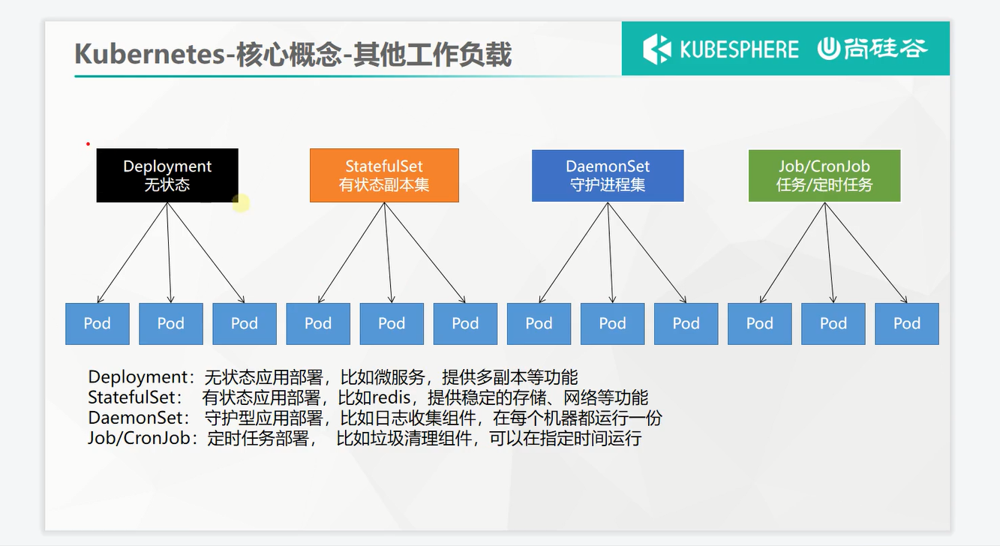
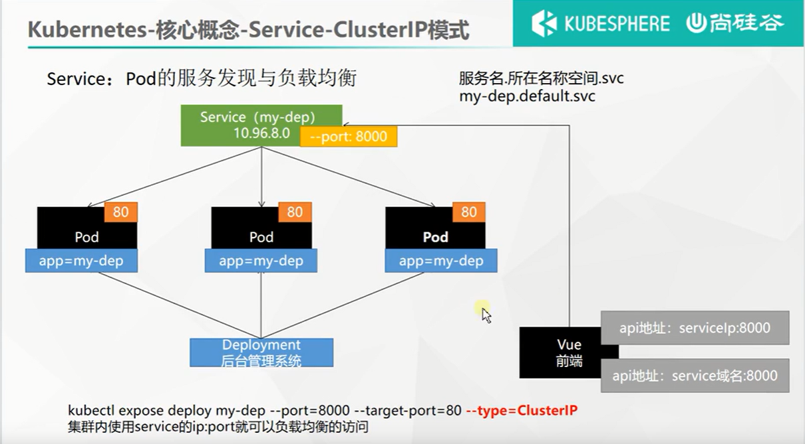
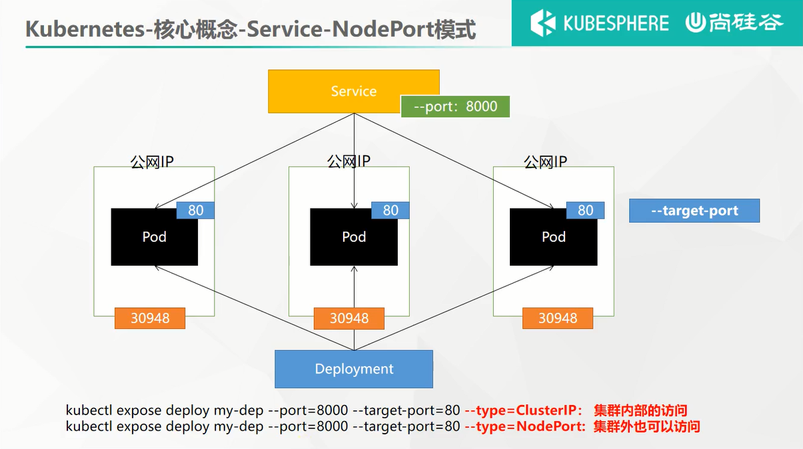
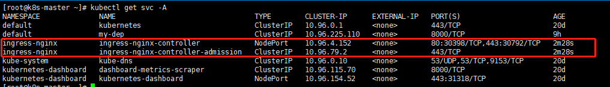
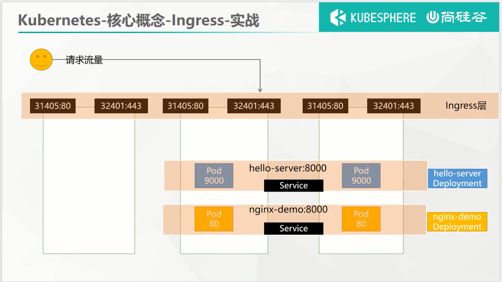
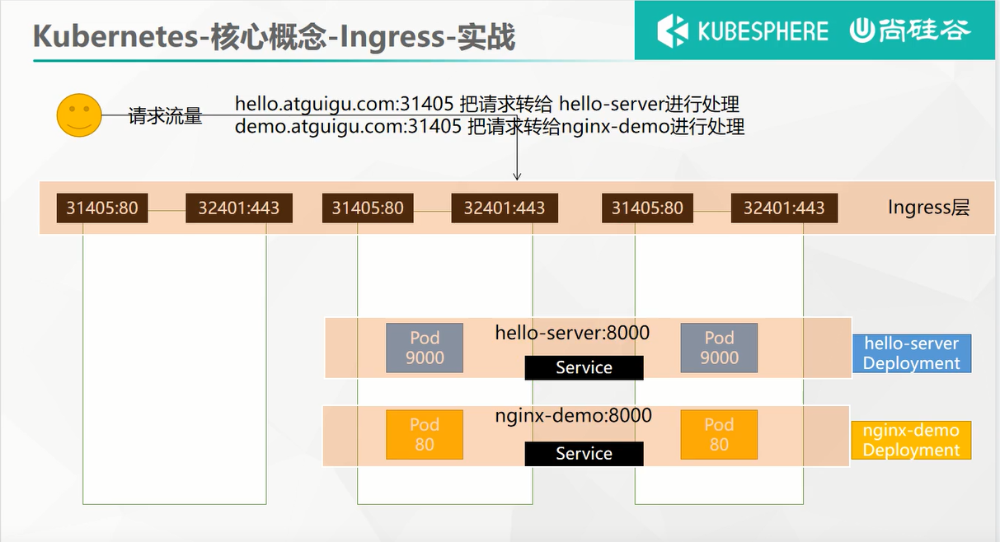
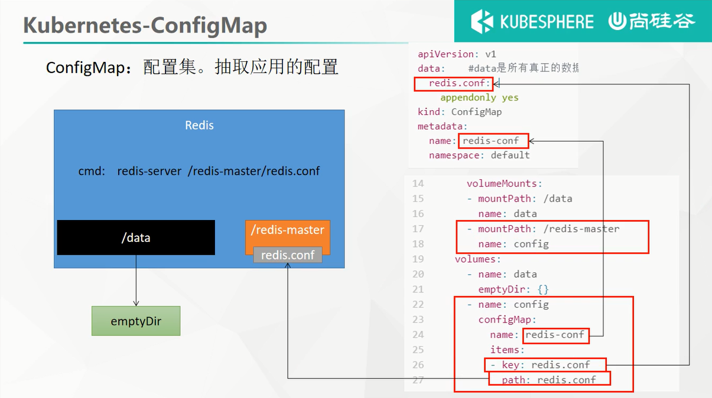
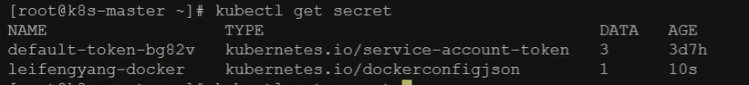

# Kubernetes核心实战

# 1、资源创建方式

- 命令行
- YAML 


# 2、Namespace

名称空间：用来对集群资源进行隔离划分。默认只隔离资源，不隔离网络。

```bash
kubectl create ns hello
kubectl delete ns hello
```

使用配置文件创建名称空间，以`hello.yaml`文件为例，内容如下：

```yaml
apiVersion: v1
kind: Namespace
metadata:
  name: hello
```

创建时使用命令：`kubectl apply -f hello.yaml`

删除时使用命令：`kubectl delete -f hello.yaml`


# 3、Pod

运行中的一组容器，Pod是kubernetes中应用的最小单位。


```bash
# 创建Pod
kubectl run mynginx --image=nginx

# 查看default名称空间下的Pod
kubectl get pod 
# 监控Pod
kubectl get pod -w

# 描述
kubectl describe pod 你自己的Pod名字
# 删除(默认空间下的Pod)
kubectl delete pod Pod名字
# 删除指定名称空间下的Pod
kubectl delete pod Pod名字 -n 名称空间

# 查看Pod的运行日志
kubectl logs Pod名字

# 每个Pod - k8s都会分配一个ip
kubectl get pod -owide
# 使用Pod的ip+pod里面运行容器的端口
curl 192.168.169.136

# 进入到Pod内部并进行交互
kubectl exec -it Pod名字 -- /bin/bash


```
使用配置文件创建Pod，集群中的任意一个机器以及任意的应用都能通过Pod分配的ip来访问这个Pod

```yaml
apiVersion: v1
kind: Pod
metadata:
  labels:
    run: mynginx
  name: mynginx
#  namespace: default
spec:
  containers:
  - image: nginx
    name: mynginx
```


创建一个Pod，并且Pod中包含多个容器。Pod中的多个容器，他们是共享网络空间和共享存储的。

```yaml
apiVersion: v1
kind: Pod
metadata:
  labels:
    run: myapp
  name: myapp
spec:
  containers:
  - image: nginx
    name: nginx
  - image: tomcat:8.5.68
    name: tomcat
```


***此时的应用还不能外部访问\***


# 4、Deployment

控制Pod，使Pod拥有多副本，自愈，扩缩容等能力

```bash
# 清除所有Pod，比较下面两个命令有何不同效果？
kubectl run mynginx --image=nginx

kubectl create deployment mytomcat --image=tomcat:8.5.68
# 使用Deployment部署产生的Pod，我们删除Pod后，系统会自动再创建一个Pod，也就是说Pod具有自愈能力
kubectl delete pod mytomcat-6f5f895f4f-dwtks
# 自愈能力
```

创建Deployment使用如下命令：

```bash
kubectl create deployment mytomcat --image=tomcat:8.5.68
```

查看Deployment

```bash
kubectl get deploy
```

删除Deployment使用如下命令：

```bash
kubectl delete deployment mytomcat
```


## 1、多副本

通过命令行方式创建：

```bash
kubectl create deployment my-dep --image=nginx --replicas=3
```

也可以通过配置文件方式来创建

```yaml
apiVersion: apps/v1
kind: Deployment
metadata:
  labels:
    app: my-dep
  name: my-dep
spec:
  replicas: 3
  selector:
    matchLabels:
      app: my-dep
  template:
    metadata:
      labels:
        app: my-dep
    spec:
      containers:
      - image: nginx
        name: nginx
```


## 2、扩缩容

```bash
#使用命令直接修改副本数
kubectl scale deployment/my-dep --replicas=5 

#也可以通过以下命令，来修改配置文件中的replicas，修改成想要的副本数
kubectl edit deployment my-dep
```


## 3、自愈&故障转移

- 停机
- 删除Pod

- 容器崩溃
- ....


## 4、滚动更新

可以使用以下命令查看指定的Deployment都使用了哪些镜像的哪些版本（以yaml文件的形式输出）

```bash
kubectl get deploy my-dep -oyaml
```

然后使用以下命令对Deployment中的镜像进行版本升级【nginx=nginx:1.16.1配置中的nginx这个key是该Deployment中的容器名称】

```bash
kubectl set image deployment/my-dep nginx=nginx:1.16.1 --record
kubectl rollout status deployment/my-dep
```

运行之后，就会看到K8s会先创建新的Pod，然后杀掉老的Pod，也就达到了滚动更新的效果。

```yaml
# 修改 kubectl edit deployment/my-dep
```


## 5、版本回退

```bash
#查看历史记录(主要就是查看REVISION)
kubectl rollout history deployment/my-dep


#查看某个历史详情
kubectl rollout history deployment/my-dep --revision=2

#回滚(回到上次)
kubectl rollout undo deployment/my-dep

#回滚(回到指定版本)
kubectl rollout undo deployment/my-dep --to-revision=2
```


更多：

除了Deployment，k8s还有 `StatefulSet` 、`DaemonSet` 、`Job`  等 类型资源。我们都称为 `工作负载`。

有状态应用使用  `StatefulSet`  部署，无状态应用使用 `Deployment` 部署。



更多关于工作负载的学习，可以参照以下文档：

https://kubernetes.io/zh/docs/concepts/workloads/controllers/


# 5、Service

将一组 [Pods](https://kubernetes.io/docs/concepts/workloads/pods/pod-overview/) 公开为网络服务的抽象方法。


有两种方式，将一组Deployment暴露为Service。

第1种方式：命令方式

```bash
#暴露Deploy
kubectl expose deployment my-dep --port=8000 --target-port=80
```

第2种方式：yaml配置文件方式

```yaml
apiVersion: v1
kind: Service
metadata:
  labels:
    app: my-dep
  name: my-dep
spec:
  selector:
    app: my-dep #选择将有哪些标签的Pod进行暴露成一组Service
  ports:
  - port: 8000
    protocol: TCP
    targetPort: 80
```

查询Service，可以获取到Service的IP地址。

```bash
#查询Service
kubectl get service
#删除Service
kubectl delete svc my-dep
```

执行命令后，获取以下结果：

```bash
NAME         TYPE        CLUSTER-IP      EXTERNAL-IP   PORT(S)    AGE
kubernetes   ClusterIP   10.96.0.1       <none>        443/TCP    20d
my-dep       ClusterIP   10.96.225.110   <none>        8000/TCP   36s
```

然后用该Service的IP:8000端口（`curl 10.96.225.110:8000 `），就可以访问对应的Deployment中的80端口了。


在集群内使用Service的IP:Port就可以负载均衡的访问Deployment，而且我们还可以Service域名的方式来访问。Service域名的规则为`服务名.所在命名空间.svc`。例如这里，我们就可以通过`curl my-dep.default.svc:8000 `进行访问。


```bash
#查询Pod的标签
kubectl get pod --show-labels
#使用标签检索Pod
kubectl get pod -l app=my-dep
```


## 1、ClusterIP

```bash
#等同于没有--type的
kubectl expose deployment my-dep --port=8000 --target-port=80 --type=ClusterIP

#配置文件的方式
apiVersion: v1
kind: Service
metadata:
  labels:
    app: my-dep
  name: my-dep
spec:
  ports:
  - port: 8000
    protocol: TCP
    targetPort: 80
  selector:
    app: my-dep
  type: ClusterIP
```



## 2、NodePort

```bash
#以NodePort方式暴露一组部署为Service
kubectl expose deployment my-dep --port=8000 --target-port=80 --type=NodePort

#配置文件的方式
apiVersion: v1
kind: Service
metadata:
  labels:
    app: my-dep
  name: my-dep
spec:
  ports:
  - port: 8000
    protocol: TCP
    targetPort: 80
  selector:
    app: my-dep
  type: NodePort
```
> NodePort的端口范围在 30000-32767 之间

查看Service `kubectl get svc`：

```bash
NAME         TYPE        CLUSTER-IP      EXTERNAL-IP   PORT(S)          AGE
kubernetes   ClusterIP   10.96.0.1       <none>        443/TCP          20d
my-dep       NodePort    10.96.225.110   <none>        8000:30948/TCP   43m
```

我们会发现，本次Service还暴露出了一个30948端口（这个端口是随机的，而且也有范围的，就是在30000-32767之间）。此时我们不仅可以使用之前的ServiceIP:Port的方式访问（`curl 10.96.225.110:8000`），还可以访问该Service下任意Pod的IP:30948这种方式访问，都是可以的。




# 6、Ingress

官网地址：https://kubernetes.github.io/ingress-nginx/  

Service的统一网关入口。

 Ingress就是nginx做的。

## 1、安装

下载Ingress的yaml配置文件，

```bash
wget https://raw.githubusercontent.com/kubernetes/ingress-nginx/controller-v0.47.0/deploy/static/provider/baremetal/deploy.yaml
```

如果下载不到，就使用附录中的<a href="#Ingress-Config">这个文件</a>中的内容。

```bash
#修改配置文件中的镜像下载地址为阿里云地址，下载速度会比较快
vi deploy.yaml
#将image的值改为如下值：
registry.cn-hangzhou.aliyuncs.com/lfy_k8s_images/ingress-nginx-controller:v0.46.0

#安装Ingress
kubectl apply -f deploy.yaml
```

安装完Ingress之后，会产生几个Pod以及两个Service。可以使用以下命令检查安装的结果：

```ba
kubectl get pod,svc -n ingress-nginx
```

这里需要着重注意的，就是产生的Service，我们可以使用`kubectl get svc -A`来查看，主要是看ingress-nginx这个Service，如下图所示：



该Service是以NodePort方式运行的，而且可以发现这里暴露出了`31405`这个端口。那么我们就可以使用浏览器在地址栏中输入 http://IP:31405  这个地址来访问了，如下图所示。可以看出Ingress其实就是基于Nginx来实现的。


> 最后别忘记把svc暴露的端口要放行。

## 2、使用

[http://139.198.163.211:31405/](https://139.198.163.211:31405/)
[https://139.198.163.211:32401/](https://139.198.163.211:32401/)


### 测试环境

应用如下yaml，准备好测试环境

`ingress_test.yaml`

```yaml
apiVersion: apps/v1
kind: Deployment
metadata:
  name: hello-server
spec:
  replicas: 2
  selector:
    matchLabels:
      app: hello-server
  template:
    metadata:
      labels:
        app: hello-server
    spec:
      containers:
      - name: hello-server
        image: registry.cn-hangzhou.aliyuncs.com/lfy_k8s_images/hello-server
        ports:
        - containerPort: 9000
---
apiVersion: apps/v1
kind: Deployment
metadata:
  labels:
    app: nginx-demo
  name: nginx-demo
spec:
  replicas: 2
  selector:
    matchLabels:
      app: nginx-demo
  template:
    metadata:
      labels:
        app: nginx-demo
    spec:
      containers:
      - image: nginx
        name: nginx
---
apiVersion: v1
kind: Service
metadata:
  labels:
    app: nginx-demo
  name: nginx-demo
spec:
  selector:
    app: nginx-demo
  ports:
  - port: 8000
    protocol: TCP
    targetPort: 80
---
apiVersion: v1
kind: Service
metadata:
  labels:
    app: hello-server
  name: hello-server
spec:
  selector:
    app: hello-server
  ports:
  - port: 8000
    protocol: TCP
    targetPort: 9000
```

这个测试环境的拓扑图如下所示：




### 1、域名访问

```yaml
apiVersion: networking.k8s.io/v1
kind: Ingress  
metadata:
  name: ingress-host-bar
spec:
  ingressClassName: nginx
  rules:
  - host: "hello.atguigu.com"
    http:
      paths:
      - pathType: Prefix
        path: "/"
        backend:
          service:
            name: hello-server
            port:
              number: 8000
  - host: "demo.atguigu.com"
    http:
      paths:
      - pathType: Prefix
        path: "/"
        backend:
          service:
            name: nginx-demo
            port:
              number: 8000
```

这里要实现的效果，就如下图所示：



访问hello.atguigu.com:31405时就由hello-server进行处理，而访问demo.atguigu.com:31405时就由nginx-demo来处理。


接下来，我们可以稍微修改一下配置文件。在下面的host配置中的path由原来的`/`修改为`/nginx`:

```yaml
apiVersion: networking.k8s.io/v1
kind: Ingress  
metadata:
  name: ingress-host-bar
spec:
  ingressClassName: nginx
  rules:
  - host: "hello.atguigu.com"
    http:
      paths:
      - pathType: Prefix
        path: "/"
        backend:
          service:
            name: hello-server
            port:
              number: 8000
  - host: "demo.atguigu.com"
    http:
      paths:
      - pathType: Prefix
        path: "/nginx"  # 把请求会转给下面的服务，下面的服务一定要能处理这个路径，不能处理就是404
        backend:
          service:
            name: nginx-demo  ## java，比如使用路径重写，去掉前缀nginx
            port:
              number: 8000
```

这里修改后的配置的意思，我们访问demo.atguigu.com:31405/nginx时，Ingress才能进行处理。

但当我们访问：demo.atguigu.com:31405/nginx这个路径时，却出现了404错误。为什么呢？

这是因为请求会先进入到Ingress网络，然后根据配置的规则，Ingress是能够处理`/nginx`这个请求的，于是就会将该请求分配给下面的Pod进行处理。而我们下面的这个部署有Ngxin的Pod接收到的是`***/nginx`这样的一个请求，并不是`***/`这样的请求，而我们的nginx下面是没有nginx这个资源的，所以会报404错误。


### 2、路径重写

```yaml
apiVersion: networking.k8s.io/v1
kind: Ingress  
metadata:
  annotations:
    nginx.ingress.kubernetes.io/rewrite-target: /$2
  name: ingress-host-bar
spec:
  ingressClassName: nginx
  rules:
  - host: "hello.atguigu.com"
    http:
      paths:
      - pathType: Prefix
        path: "/"
        backend:
          service:
            name: hello-server
            port:
              number: 8000
  - host: "demo.atguigu.com"
    http:
      paths:
      - pathType: Prefix
        path: "/nginx(/|$)(.*)"  # 把请求会转给下面的服务，下面的服务一定要能处理这个路径，不能处理就是404
        backend:
          service:
            name: nginx-demo  ## java，比如使用路径重写，去掉前缀nginx
            port:
              number: 8000
```

最主要就是配置的注解中加入nginx.ingress.kubernetes.io/rewrite-target: /$2。

这里的配置，就是将请求中的`nginx`这个前缀给去掉了。


### 3、流量限制

```yaml
apiVersion: networking.k8s.io/v1
kind: Ingress
metadata:
  name: ingress-limit-rate
  annotations:
    nginx.ingress.kubernetes.io/limit-rps: "1"
spec:
  ingressClassName: nginx
  rules:
  - host: "haha.atguigu.com"
    http:
      paths:
      - pathType: Exact
        path: "/"
        backend:
          service:
            name: nginx-demo
            port:
              number: 8000
```


# 7、存储抽象

## 环境准备

**1、所有节点**

```bash
#所有机器安装
yum install -y nfs-utils
```

**2、主节点**

```bash
#nfs主节点(命令的含义是主节点暴露/nfs/data/目录，星号是所有人都能同步，以非安全读写的方式。)
echo "/nfs/data/ *(insecure,rw,sync,no_root_squash)" > /etc/exports

mkdir -p /nfs/data
systemctl enable rpcbind --now
systemctl enable nfs-server --now
#配置生效
exportfs -r

#检查暴露的目录
exportfs
```

**3、从节点**

下面的`172.31.0.4`这个IP地址，是nfs主节点的IP地址。

```bash
#查看主节点机器上可挂载的目录
showmount -e 172.31.0.4

#执行以下命令挂载 nfs 服务器上的共享目录到本机路径 /nfs/data
mkdir -p /nfs/data

mount -t nfs 172.31.0.4:/nfs/data /nfs/data

# 写入一个测试文件
echo "hello nfs server" > /nfs/data/test.txt
```

**4、原生方式数据挂载**

`deploy.yaml`

```yaml
apiVersion: apps/v1
kind: Deployment
metadata:
  labels:
    app: nginx-pv-demo
  name: nginx-pv-demo
spec:
  replicas: 2
  selector:
    matchLabels:
      app: nginx-pv-demo
  template:
    metadata:
      labels:
        app: nginx-pv-demo
    spec:
      containers:
      - image: nginx
        name: nginx
        volumeMounts:
        - name: html
          mountPath: /usr/share/nginx/html
      volumes:
        - name: html
          nfs:
            server: 172.31.0.4
            path: /nfs/data/nginx-pv
```

> 以上配置重要的点就是containers下的volumeMounts配置，意思是将mountPath这个nginx内部路径挂载到外边的一个叫html的挂载上，而这个html挂载的具体配置就是对应volumes下名为html的这个配置，这个挂载是以nfs方式挂载，其中就配置了nfs服务器的IP地址以及对应挂载路径。

## 1、PV&PVC

*PV：持久卷（Persistent Volume），将应用需要持久化的数据保存到指定位置*

*PVC：持久卷申明（**Persistent Volume Claim**），申明需要使用的持久卷规格*

### 1、创建pv池

静态供应（静态供应的意思就是，我需要提前创建好固定空间的PV）

```bash
#nfs主节点
mkdir -p /nfs/data/01
mkdir -p /nfs/data/02
mkdir -p /nfs/data/03
```

创建PV `pv.yaml`

```yaml
apiVersion: v1
kind: PersistentVolume
metadata:
  name: pv01-10m
spec:
  capacity:
    storage: 10M
  accessModes:
    - ReadWriteMany
  storageClassName: nfs
  nfs:
    path: /nfs/data/01
    server: 172.31.0.4
---
apiVersion: v1
kind: PersistentVolume
metadata:
  name: pv02-1gi
spec:
  capacity:
    storage: 1Gi
  accessModes:
    - ReadWriteMany
  storageClassName: nfs
  nfs:
    path: /nfs/data/02
    server: 172.31.0.4
---
apiVersion: v1
kind: PersistentVolume
metadata:
  name: pv03-3gi
spec:
  capacity:
    storage: 3Gi
  accessModes:
    - ReadWriteMany
  storageClassName: nfs
  nfs:
    path: /nfs/data/03
    server: 172.31.0.4
```

>以上yaml文件中配置了3个PV，大小分别是10M、1G、3G。
>
>创建好PV后，可以通过 kubectl get pv 命令来查看PV资源。


### 2、PVC创建与绑定

创建PVC

```yaml
apiVersion: v1
kind: PersistentVolumeClaim
metadata:
  name: nginx-pvc
spec:
  accessModes:
    - ReadWriteMany
  resources:
    requests:
      storage: 200Mi
  storageClassName: nfs
```

> storageClassName配置的nfs可不能乱写，而是要与创建PV时的storageClassName对应的。


创建Pod绑定PVC

```yaml
apiVersion: apps/v1
kind: Deployment
metadata:
  labels:
    app: nginx-deploy-pvc
  name: nginx-deploy-pvc
spec:
  replicas: 2
  selector:
    matchLabels:
      app: nginx-deploy-pvc
  template:
    metadata:
      labels:
        app: nginx-deploy-pvc
    spec:
      containers:
      - image: nginx
        name: nginx
        volumeMounts:
        - name: html
          mountPath: /usr/share/nginx/html
      volumes:
        - name: html
          persistentVolumeClaim:
            claimName: nginx-pvc
```

>这里配置的Deployment与原生配置挂载的不同就是，我们volumes下html这个挂载不再是nfs服务器的配置，而是配置了一个PVC的名字。


## 2、ConfigMap

抽取应用配置，并且可以自动更新。


### redis示例

#### 1、把之前的配置文件创建为配置集

```bash
# 创建配置，redis保存到k8s的etcd；
kubectl create cm redis-conf --from-file=redis.conf
```

执行完上一句命令，就会产生一个ConfigMap配置集。可以通过以下命令查看该配置集的内容：
`kubectl get cm redis-conf -oyaml`

主要的配置内容如下：

```yaml
apiVersion: v1
data:    #data是所有真正的数据，key：默认是文件名   value：配置文件的内容
  redis.conf: |
    appendonly yes
kind: ConfigMap
metadata:
  name: redis-conf
  namespace: default
```


#### 2、创建Pod

```yaml
apiVersion: v1
kind: Pod
metadata:
  name: redis
spec:
  containers:
  - name: redis
    image: redis
    command:
      - redis-server
      - "/redis-master/redis.conf"  #指的是redis容器内部的位置
    ports:
    - containerPort: 6379
    volumeMounts:
    - mountPath: /data
      name: data
    - mountPath: /redis-master
      name: config
  volumes:
    - name: data
      emptyDir: {}
    - name: config
      configMap:
        name: redis-conf
        items:
        - key: redis.conf
          path: redis.conf
```

可以通过下面这个图来理解下




#### 3、检查默认配置

```bash
kubectl exec -it redis -- redis-cli

127.0.0.1:6379> CONFIG GET appendonly
127.0.0.1:6379> CONFIG GET requirepass
```

#### 4、修改ConfigMap

```yaml
apiVersion: v1
kind: ConfigMap
metadata:
  name: example-redis-config
data:
  redis-config: |
    maxmemory 2mb
    maxmemory-policy allkeys-lru 
```

#### 5、检查配置是否更新

```bash
kubectl exec -it redis -- redis-cli

127.0.0.1:6379> CONFIG GET maxmemory
127.0.0.1:6379> CONFIG GET maxmemory-policy
```

检查指定文件内容是否已经更新

修改了CM。Pod里面的配置文件会跟着变


***配置值未更改，因为需要重新启动 Pod 才能从关联的 ConfigMap 中获取更新的值。\*** 

***原因：我们的Pod部署的中间件自己本身没有热更新能力\***


## 3、Secret

Secret 对象类型用来保存敏感信息，例如密码、OAuth 令牌和 SSH 密钥。 将这些信息放在 secret 中比放在 [Pod](https://kubernetes.io/docs/concepts/workloads/pods/pod-overview/) 的定义或者 [容器镜像](https://kubernetes.io/zh/docs/reference/glossary/?all=true#term-image) 中来说更加安全和灵活。

```bash
#具体命令
kubectl create secret docker-registry leifengyang-docker \
--docker-username=leifengyang \
--docker-password=Lfy123456 \
--docker-email=534096094@qq.com

##命令格式
kubectl create secret docker-registry regcred \
  --docker-server=<你的镜像仓库服务器> \
  --docker-username=<你的用户名> \
  --docker-password=<你的密码> \
  --docker-email=<你的邮箱地址>
```

通过以上命令我们就创建了一个Secret，我们也可以通过以下命令来查看目前已有的Secret都有哪些：

```bash
kubectl get secret
```

结果如下图所示



我们也可以查看某个Secret的内容是什么，通过以下命令：

```bash
kubectl get secret leifengyang-docker -oyaml
```

结果如下所示：

```yaml
apiVersion: v1
data:
  .dockerconfigjson: eyJhdXRocyI6eyJodHRwczovL2luZGV4LmRvY2tlci5pby92MS8iOnsidXNlcm5hbWUiOiJsZWlmZW5neWFuZyIsInBhc3N3b3JkIjoiTGZ5MTIzNDU2IiwiZW1haWwiOiI1MzQwOTYwOTRAcXEuY29tIiwiYXV0aCI6ImJHVnBabVZ1WjNsaGJtYzZUR1o1TVRJek5EVTIifX19
kind: Secret
metadata:
  creationTimestamp: "2021-12-18T22:45:51Z"
  managedFields:
  - apiVersion: v1
    fieldsType: FieldsV1
    fieldsV1:
      f:data:
        .: {}
        f:.dockerconfigjson: {}
      f:type: {}
    manager: kubectl-create
    operation: Update
    time: "2021-12-18T22:45:51Z"
  name: leifengyang-docker
  namespace: default
  resourceVersion: "6130776"
  uid: 8883ad63-d4d7-4b7c-944a-143ef1d588bf
type: kubernetes.io/dockerconfigjson

```

> Secret中的内容主要就是在data中，是以key-value形式存放的，value的部分就是我们真正的数据，其实是经过Base64加密的，可以通过Base64解码工具进行测试。


接下来新建一个Pod来使用我们刚才创建的Secret，访问我们的私有仓库来下载镜像

`mypod.yaml`

```yaml
apiVersion: v1
kind: Pod
metadata:
  name: private-nginx
spec:
  containers:
  - name: private-nginx
    image: leifengyang/guignginx:v1.0
  imagePullSecrets:
  - name: leifengyang-docker
```


## 附录

#### <a name="Ingress-Config">安装Ingress的配置文件</a>

`deploy.yaml` 

```yaml
apiVersion: v1
kind: Namespace
metadata:
  name: ingress-nginx
  labels:
    app.kubernetes.io/name: ingress-nginx
    app.kubernetes.io/instance: ingress-nginx

---
# Source: ingress-nginx/templates/controller-serviceaccount.yaml
apiVersion: v1
kind: ServiceAccount
metadata:
  labels:
    helm.sh/chart: ingress-nginx-3.33.0
    app.kubernetes.io/name: ingress-nginx
    app.kubernetes.io/instance: ingress-nginx
    app.kubernetes.io/version: 0.47.0
    app.kubernetes.io/managed-by: Helm
    app.kubernetes.io/component: controller
  name: ingress-nginx
  namespace: ingress-nginx
automountServiceAccountToken: true
---
# Source: ingress-nginx/templates/controller-configmap.yaml
apiVersion: v1
kind: ConfigMap
metadata:
  labels:
    helm.sh/chart: ingress-nginx-3.33.0
    app.kubernetes.io/name: ingress-nginx
    app.kubernetes.io/instance: ingress-nginx
    app.kubernetes.io/version: 0.47.0
    app.kubernetes.io/managed-by: Helm
    app.kubernetes.io/component: controller
  name: ingress-nginx-controller
  namespace: ingress-nginx
data:
---
# Source: ingress-nginx/templates/clusterrole.yaml
apiVersion: rbac.authorization.k8s.io/v1
kind: ClusterRole
metadata:
  labels:
    helm.sh/chart: ingress-nginx-3.33.0
    app.kubernetes.io/name: ingress-nginx
    app.kubernetes.io/instance: ingress-nginx
    app.kubernetes.io/version: 0.47.0
    app.kubernetes.io/managed-by: Helm
  name: ingress-nginx
rules:
  - apiGroups:
      - ''
    resources:
      - configmaps
      - endpoints
      - nodes
      - pods
      - secrets
    verbs:
      - list
      - watch
  - apiGroups:
      - ''
    resources:
      - nodes
    verbs:
      - get
  - apiGroups:
      - ''
    resources:
      - services
    verbs:
      - get
      - list
      - watch
  - apiGroups:
      - extensions
      - networking.k8s.io   # k8s 1.14+
    resources:
      - ingresses
    verbs:
      - get
      - list
      - watch
  - apiGroups:
      - ''
    resources:
      - events
    verbs:
      - create
      - patch
  - apiGroups:
      - extensions
      - networking.k8s.io   # k8s 1.14+
    resources:
      - ingresses/status
    verbs:
      - update
  - apiGroups:
      - networking.k8s.io   # k8s 1.14+
    resources:
      - ingressclasses
    verbs:
      - get
      - list
      - watch
---
# Source: ingress-nginx/templates/clusterrolebinding.yaml
apiVersion: rbac.authorization.k8s.io/v1
kind: ClusterRoleBinding
metadata:
  labels:
    helm.sh/chart: ingress-nginx-3.33.0
    app.kubernetes.io/name: ingress-nginx
    app.kubernetes.io/instance: ingress-nginx
    app.kubernetes.io/version: 0.47.0
    app.kubernetes.io/managed-by: Helm
  name: ingress-nginx
roleRef:
  apiGroup: rbac.authorization.k8s.io
  kind: ClusterRole
  name: ingress-nginx
subjects:
  - kind: ServiceAccount
    name: ingress-nginx
    namespace: ingress-nginx
---
# Source: ingress-nginx/templates/controller-role.yaml
apiVersion: rbac.authorization.k8s.io/v1
kind: Role
metadata:
  labels:
    helm.sh/chart: ingress-nginx-3.33.0
    app.kubernetes.io/name: ingress-nginx
    app.kubernetes.io/instance: ingress-nginx
    app.kubernetes.io/version: 0.47.0
    app.kubernetes.io/managed-by: Helm
    app.kubernetes.io/component: controller
  name: ingress-nginx
  namespace: ingress-nginx
rules:
  - apiGroups:
      - ''
    resources:
      - namespaces
    verbs:
      - get
  - apiGroups:
      - ''
    resources:
      - configmaps
      - pods
      - secrets
      - endpoints
    verbs:
      - get
      - list
      - watch
  - apiGroups:
      - ''
    resources:
      - services
    verbs:
      - get
      - list
      - watch
  - apiGroups:
      - extensions
      - networking.k8s.io   # k8s 1.14+
    resources:
      - ingresses
    verbs:
      - get
      - list
      - watch
  - apiGroups:
      - extensions
      - networking.k8s.io   # k8s 1.14+
    resources:
      - ingresses/status
    verbs:
      - update
  - apiGroups:
      - networking.k8s.io   # k8s 1.14+
    resources:
      - ingressclasses
    verbs:
      - get
      - list
      - watch
  - apiGroups:
      - ''
    resources:
      - configmaps
    resourceNames:
      - ingress-controller-leader-nginx
    verbs:
      - get
      - update
  - apiGroups:
      - ''
    resources:
      - configmaps
    verbs:
      - create
  - apiGroups:
      - ''
    resources:
      - events
    verbs:
      - create
      - patch
---
# Source: ingress-nginx/templates/controller-rolebinding.yaml
apiVersion: rbac.authorization.k8s.io/v1
kind: RoleBinding
metadata:
  labels:
    helm.sh/chart: ingress-nginx-3.33.0
    app.kubernetes.io/name: ingress-nginx
    app.kubernetes.io/instance: ingress-nginx
    app.kubernetes.io/version: 0.47.0
    app.kubernetes.io/managed-by: Helm
    app.kubernetes.io/component: controller
  name: ingress-nginx
  namespace: ingress-nginx
roleRef:
  apiGroup: rbac.authorization.k8s.io
  kind: Role
  name: ingress-nginx
subjects:
  - kind: ServiceAccount
    name: ingress-nginx
    namespace: ingress-nginx
---
# Source: ingress-nginx/templates/controller-service-webhook.yaml
apiVersion: v1
kind: Service
metadata:
  labels:
    helm.sh/chart: ingress-nginx-3.33.0
    app.kubernetes.io/name: ingress-nginx
    app.kubernetes.io/instance: ingress-nginx
    app.kubernetes.io/version: 0.47.0
    app.kubernetes.io/managed-by: Helm
    app.kubernetes.io/component: controller
  name: ingress-nginx-controller-admission
  namespace: ingress-nginx
spec:
  type: ClusterIP
  ports:
    - name: https-webhook
      port: 443
      targetPort: webhook
  selector:
    app.kubernetes.io/name: ingress-nginx
    app.kubernetes.io/instance: ingress-nginx
    app.kubernetes.io/component: controller
---
# Source: ingress-nginx/templates/controller-service.yaml
apiVersion: v1
kind: Service
metadata:
  annotations:
  labels:
    helm.sh/chart: ingress-nginx-3.33.0
    app.kubernetes.io/name: ingress-nginx
    app.kubernetes.io/instance: ingress-nginx
    app.kubernetes.io/version: 0.47.0
    app.kubernetes.io/managed-by: Helm
    app.kubernetes.io/component: controller
  name: ingress-nginx-controller
  namespace: ingress-nginx
spec:
  type: NodePort
  ports:
    - name: http
      port: 80
      protocol: TCP
      targetPort: http
    - name: https
      port: 443
      protocol: TCP
      targetPort: https
  selector:
    app.kubernetes.io/name: ingress-nginx
    app.kubernetes.io/instance: ingress-nginx
    app.kubernetes.io/component: controller
---
# Source: ingress-nginx/templates/controller-deployment.yaml
apiVersion: apps/v1
kind: Deployment
metadata:
  labels:
    helm.sh/chart: ingress-nginx-3.33.0
    app.kubernetes.io/name: ingress-nginx
    app.kubernetes.io/instance: ingress-nginx
    app.kubernetes.io/version: 0.47.0
    app.kubernetes.io/managed-by: Helm
    app.kubernetes.io/component: controller
  name: ingress-nginx-controller
  namespace: ingress-nginx
spec:
  selector:
    matchLabels:
      app.kubernetes.io/name: ingress-nginx
      app.kubernetes.io/instance: ingress-nginx
      app.kubernetes.io/component: controller
  revisionHistoryLimit: 10
  minReadySeconds: 0
  template:
    metadata:
      labels:
        app.kubernetes.io/name: ingress-nginx
        app.kubernetes.io/instance: ingress-nginx
        app.kubernetes.io/component: controller
    spec:
      dnsPolicy: ClusterFirst
      containers:
        - name: controller
          image: registry.cn-hangzhou.aliyuncs.com/lfy_k8s_images/ingress-nginx-controller:v0.46.0
          imagePullPolicy: IfNotPresent
          lifecycle:
            preStop:
              exec:
                command:
                  - /wait-shutdown
          args:
            - /nginx-ingress-controller
            - --election-id=ingress-controller-leader
            - --ingress-class=nginx
            - --configmap=$(POD_NAMESPACE)/ingress-nginx-controller
            - --validating-webhook=:8443
            - --validating-webhook-certificate=/usr/local/certificates/cert
            - --validating-webhook-key=/usr/local/certificates/key
          securityContext:
            capabilities:
              drop:
                - ALL
              add:
                - NET_BIND_SERVICE
            runAsUser: 101
            allowPrivilegeEscalation: true
          env:
            - name: POD_NAME
              valueFrom:
                fieldRef:
                  fieldPath: metadata.name
            - name: POD_NAMESPACE
              valueFrom:
                fieldRef:
                  fieldPath: metadata.namespace
            - name: LD_PRELOAD
              value: /usr/local/lib/libmimalloc.so
          livenessProbe:
            failureThreshold: 5
            httpGet:
              path: /healthz
              port: 10254
              scheme: HTTP
            initialDelaySeconds: 10
            periodSeconds: 10
            successThreshold: 1
            timeoutSeconds: 1
          readinessProbe:
            failureThreshold: 3
            httpGet:
              path: /healthz
              port: 10254
              scheme: HTTP
            initialDelaySeconds: 10
            periodSeconds: 10
            successThreshold: 1
            timeoutSeconds: 1
          ports:
            - name: http
              containerPort: 80
              protocol: TCP
            - name: https
              containerPort: 443
              protocol: TCP
            - name: webhook
              containerPort: 8443
              protocol: TCP
          volumeMounts:
            - name: webhook-cert
              mountPath: /usr/local/certificates/
              readOnly: true
          resources:
            requests:
              cpu: 100m
              memory: 90Mi
      nodeSelector:
        kubernetes.io/os: linux
      serviceAccountName: ingress-nginx
      terminationGracePeriodSeconds: 300
      volumes:
        - name: webhook-cert
          secret:
            secretName: ingress-nginx-admission
---
# Source: ingress-nginx/templates/admission-webhooks/validating-webhook.yaml
# before changing this value, check the required kubernetes version
# https://kubernetes.io/docs/reference/access-authn-authz/extensible-admission-controllers/#prerequisites
apiVersion: admissionregistration.k8s.io/v1
kind: ValidatingWebhookConfiguration
metadata:
  labels:
    helm.sh/chart: ingress-nginx-3.33.0
    app.kubernetes.io/name: ingress-nginx
    app.kubernetes.io/instance: ingress-nginx
    app.kubernetes.io/version: 0.47.0
    app.kubernetes.io/managed-by: Helm
    app.kubernetes.io/component: admission-webhook
  name: ingress-nginx-admission
webhooks:
  - name: validate.nginx.ingress.kubernetes.io
    matchPolicy: Equivalent
    rules:
      - apiGroups:
          - networking.k8s.io
        apiVersions:
          - v1beta1
        operations:
          - CREATE
          - UPDATE
        resources:
          - ingresses
    failurePolicy: Fail
    sideEffects: None
    admissionReviewVersions:
      - v1
      - v1beta1
    clientConfig:
      service:
        namespace: ingress-nginx
        name: ingress-nginx-controller-admission
        path: /networking/v1beta1/ingresses
---
# Source: ingress-nginx/templates/admission-webhooks/job-patch/serviceaccount.yaml
apiVersion: v1
kind: ServiceAccount
metadata:
  name: ingress-nginx-admission
  annotations:
    helm.sh/hook: pre-install,pre-upgrade,post-install,post-upgrade
    helm.sh/hook-delete-policy: before-hook-creation,hook-succeeded
  labels:
    helm.sh/chart: ingress-nginx-3.33.0
    app.kubernetes.io/name: ingress-nginx
    app.kubernetes.io/instance: ingress-nginx
    app.kubernetes.io/version: 0.47.0
    app.kubernetes.io/managed-by: Helm
    app.kubernetes.io/component: admission-webhook
  namespace: ingress-nginx
---
# Source: ingress-nginx/templates/admission-webhooks/job-patch/clusterrole.yaml
apiVersion: rbac.authorization.k8s.io/v1
kind: ClusterRole
metadata:
  name: ingress-nginx-admission
  annotations:
    helm.sh/hook: pre-install,pre-upgrade,post-install,post-upgrade
    helm.sh/hook-delete-policy: before-hook-creation,hook-succeeded
  labels:
    helm.sh/chart: ingress-nginx-3.33.0
    app.kubernetes.io/name: ingress-nginx
    app.kubernetes.io/instance: ingress-nginx
    app.kubernetes.io/version: 0.47.0
    app.kubernetes.io/managed-by: Helm
    app.kubernetes.io/component: admission-webhook
rules:
  - apiGroups:
      - admissionregistration.k8s.io
    resources:
      - validatingwebhookconfigurations
    verbs:
      - get
      - update
---
# Source: ingress-nginx/templates/admission-webhooks/job-patch/clusterrolebinding.yaml
apiVersion: rbac.authorization.k8s.io/v1
kind: ClusterRoleBinding
metadata:
  name: ingress-nginx-admission
  annotations:
    helm.sh/hook: pre-install,pre-upgrade,post-install,post-upgrade
    helm.sh/hook-delete-policy: before-hook-creation,hook-succeeded
  labels:
    helm.sh/chart: ingress-nginx-3.33.0
    app.kubernetes.io/name: ingress-nginx
    app.kubernetes.io/instance: ingress-nginx
    app.kubernetes.io/version: 0.47.0
    app.kubernetes.io/managed-by: Helm
    app.kubernetes.io/component: admission-webhook
roleRef:
  apiGroup: rbac.authorization.k8s.io
  kind: ClusterRole
  name: ingress-nginx-admission
subjects:
  - kind: ServiceAccount
    name: ingress-nginx-admission
    namespace: ingress-nginx
---
# Source: ingress-nginx/templates/admission-webhooks/job-patch/role.yaml
apiVersion: rbac.authorization.k8s.io/v1
kind: Role
metadata:
  name: ingress-nginx-admission
  annotations:
    helm.sh/hook: pre-install,pre-upgrade,post-install,post-upgrade
    helm.sh/hook-delete-policy: before-hook-creation,hook-succeeded
  labels:
    helm.sh/chart: ingress-nginx-3.33.0
    app.kubernetes.io/name: ingress-nginx
    app.kubernetes.io/instance: ingress-nginx
    app.kubernetes.io/version: 0.47.0
    app.kubernetes.io/managed-by: Helm
    app.kubernetes.io/component: admission-webhook
  namespace: ingress-nginx
rules:
  - apiGroups:
      - ''
    resources:
      - secrets
    verbs:
      - get
      - create
---
# Source: ingress-nginx/templates/admission-webhooks/job-patch/rolebinding.yaml
apiVersion: rbac.authorization.k8s.io/v1
kind: RoleBinding
metadata:
  name: ingress-nginx-admission
  annotations:
    helm.sh/hook: pre-install,pre-upgrade,post-install,post-upgrade
    helm.sh/hook-delete-policy: before-hook-creation,hook-succeeded
  labels:
    helm.sh/chart: ingress-nginx-3.33.0
    app.kubernetes.io/name: ingress-nginx
    app.kubernetes.io/instance: ingress-nginx
    app.kubernetes.io/version: 0.47.0
    app.kubernetes.io/managed-by: Helm
    app.kubernetes.io/component: admission-webhook
  namespace: ingress-nginx
roleRef:
  apiGroup: rbac.authorization.k8s.io
  kind: Role
  name: ingress-nginx-admission
subjects:
  - kind: ServiceAccount
    name: ingress-nginx-admission
    namespace: ingress-nginx
---
# Source: ingress-nginx/templates/admission-webhooks/job-patch/job-createSecret.yaml
apiVersion: batch/v1
kind: Job
metadata:
  name: ingress-nginx-admission-create
  annotations:
    helm.sh/hook: pre-install,pre-upgrade
    helm.sh/hook-delete-policy: before-hook-creation,hook-succeeded
  labels:
    helm.sh/chart: ingress-nginx-3.33.0
    app.kubernetes.io/name: ingress-nginx
    app.kubernetes.io/instance: ingress-nginx
    app.kubernetes.io/version: 0.47.0
    app.kubernetes.io/managed-by: Helm
    app.kubernetes.io/component: admission-webhook
  namespace: ingress-nginx
spec:
  template:
    metadata:
      name: ingress-nginx-admission-create
      labels:
        helm.sh/chart: ingress-nginx-3.33.0
        app.kubernetes.io/name: ingress-nginx
        app.kubernetes.io/instance: ingress-nginx
        app.kubernetes.io/version: 0.47.0
        app.kubernetes.io/managed-by: Helm
        app.kubernetes.io/component: admission-webhook
    spec:
      containers:
        - name: create
          image: docker.io/jettech/kube-webhook-certgen:v1.5.1
          imagePullPolicy: IfNotPresent
          args:
            - create
            - --host=ingress-nginx-controller-admission,ingress-nginx-controller-admission.$(POD_NAMESPACE).svc
            - --namespace=$(POD_NAMESPACE)
            - --secret-name=ingress-nginx-admission
          env:
            - name: POD_NAMESPACE
              valueFrom:
                fieldRef:
                  fieldPath: metadata.namespace
      restartPolicy: OnFailure
      serviceAccountName: ingress-nginx-admission
      securityContext:
        runAsNonRoot: true
        runAsUser: 2000
---
# Source: ingress-nginx/templates/admission-webhooks/job-patch/job-patchWebhook.yaml
apiVersion: batch/v1
kind: Job
metadata:
  name: ingress-nginx-admission-patch
  annotations:
    helm.sh/hook: post-install,post-upgrade
    helm.sh/hook-delete-policy: before-hook-creation,hook-succeeded
  labels:
    helm.sh/chart: ingress-nginx-3.33.0
    app.kubernetes.io/name: ingress-nginx
    app.kubernetes.io/instance: ingress-nginx
    app.kubernetes.io/version: 0.47.0
    app.kubernetes.io/managed-by: Helm
    app.kubernetes.io/component: admission-webhook
  namespace: ingress-nginx
spec:
  template:
    metadata:
      name: ingress-nginx-admission-patch
      labels:
        helm.sh/chart: ingress-nginx-3.33.0
        app.kubernetes.io/name: ingress-nginx
        app.kubernetes.io/instance: ingress-nginx
        app.kubernetes.io/version: 0.47.0
        app.kubernetes.io/managed-by: Helm
        app.kubernetes.io/component: admission-webhook
    spec:
      containers:
        - name: patch
          image: docker.io/jettech/kube-webhook-certgen:v1.5.1
          imagePullPolicy: IfNotPresent
          args:
            - patch
            - --webhook-name=ingress-nginx-admission
            - --namespace=$(POD_NAMESPACE)
            - --patch-mutating=false
            - --secret-name=ingress-nginx-admission
            - --patch-failure-policy=Fail
          env:
            - name: POD_NAMESPACE
              valueFrom:
                fieldRef:
                  fieldPath: metadata.namespace
      restartPolicy: OnFailure
      serviceAccountName: ingress-nginx-admission
      securityContext:
        runAsNonRoot: true
        runAsUser: 2000
```

