# 12-整合MinIO

## 1.MinIO简介


MinIO 是一个基于 Go 实现的高性能、兼容 S3 协议的对象存储。它采用 GNU AGPL v3 开源协议，项目地址是 https://github.com/minio/minio，官网是 https://min.io。


它适合存储海量的非结构化的数据，例如说图片、音频、视频等常见文件，备份数据、容器、虚拟机镜像等等，小到 1 KB，大到 5 TB 都可以支持。

国内阿里巴巴、腾讯、百度、华为、中国移动、中国联通等企业在使用 MinIO，甚至不少商业公司二次开发 MinIO 来提供商业化的云存储产品。

> 疑问：为什么越来越少使用 FastDFS 实现文件存储服务呢？
>
> 部署运维复杂、无官方文档、缺乏长期维护的团队、性能较差、未提供 Docker & Kubernetes 集成方案等等原因。

本文，将带你使用 MinIO 来自建一个文件存储服务，并在 Spring Boot 项目中上传图片到 MinIO 中。

## 2. MinIO Server 安装

由于 MinIO 是 Go 写的，所以就一个运行程序，因此安装部署 MinIO 就非常简单。

在文档 https://min.io/download 中，有 Windows、Linux、MacOS、Docker、Kubernetes、Source 六种安装方式。

下面，我们来安装下 MinIO，你可以选择适合你的方式。

### [2.1 快速安装](https://mp.weixin.qq.com/s?__biz=MzUzMTA2NTU2Ng==&mid=2247487551&idx=1&sn=18f64ba49f3f0f9d8be9d1fdef8857d9&scene=21#wechat_redirect)

#### 2.1.1 Windows

需要在 Windows PowerShell 中执行。

```shell
Invoke-WebRequest -Uri "https://dl.min.io/server/minio/release/windows-amd64/minio.exe" -OutFile "C:\minio.exe" ## 国外资源，龟速下载
setx MINIO_ROOT_USER admin
setx MINIO_ROOT_PASSWORD password
C:\minio.exe server F:\Data --console-address ":9001" ## F:\Data 存储目录；--console-address 是 UI 界面的端口
```

#### 2.1.2 Linux

```shell
wget https://dl.min.io/server/minio/release/linux-amd64/minio ## 国外资源，龟速下载
chmod +x minio
MINIO_ROOT_USER=admin MINIO_ROOT_PASSWORD=password ./minio server /Users/yunai/minio --console-address ":9001" ## /Users/yunai/minio 存储目录；--console-address 是 UI 界面的端口
```

#### 2.1.3 MacOS

```shell
wget https://dl.min.io/server/minio/release/darwin-amd64/minio ## 国外资源，龟速下载
chmod +x minio
MINIO_ROOT_USER=admin MINIO_ROOT_PASSWORD=password ./minio server F:\Data --console-address ":9001" ## F:\Data 存储目录；--console-address 是 UI 界面的端口
```

#### 2.1.4 Docker

① Windows：

```shell
docker run -p 9000:9000 -p 9001:9001 -e "MINIO_ACCESS_KEY=admin" -e "MINIO_SECRET_KEY=password" minio/minio server /data --console-address ":9001" # /Users/yunai/minio 存储目录；--console-address 是 UI 界面的端口
```

② Linux 或 MacOS：

```shell
docker run -p 9000:9000 -p 9001:9001 -e "MINIO_ACCESS_KEY=admin" -e "MINIO_SECRET_KEY=password" minio/minio server /Users/yunai/minio --console-address ":9001" ## /Users/yunai/minio 存储目录；--console-address 是 UI 界面的端口
```

### 2.2 访问 UI 界面

使用浏览器访问 http://127.0.0.1:9001 地址，访问 MinIO 内置的 UI 界面。

输入账号 admin，密码 password 进行登录，成功进入首页。

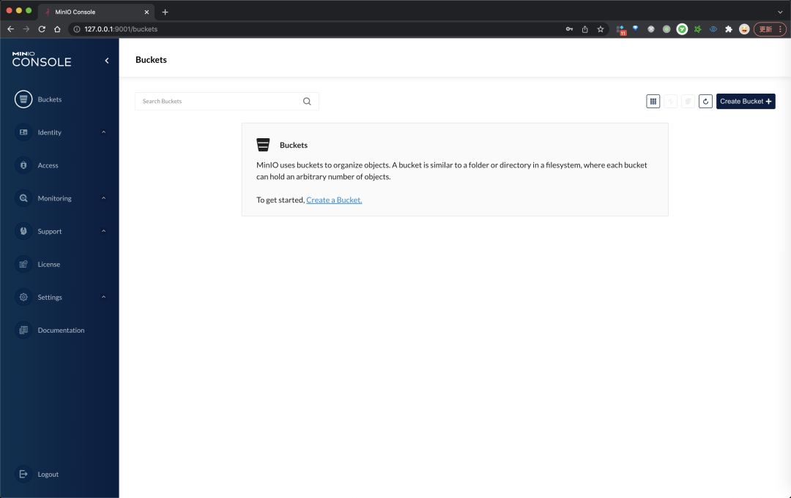

### 2.3 新建存储桶

点击 [Create Bucket] 按钮，新建一个 Bucket 存储桶，用于稍后文件的上传。

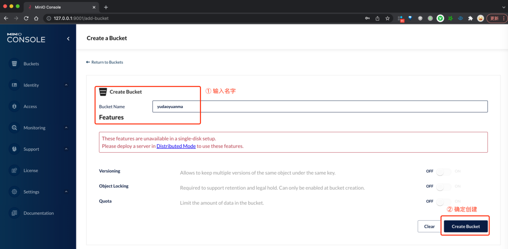

### 2.4 添加 readonly 访问规则

默认配置下，访问存储桶是需要请求授权的。但是在实际场景下，我们往往希望允许直接访问，此时就需要添加一条 readonly 访问规则。

① 点击右上角的 [Configure Bucket] 设置图标，然后选择 [Access Rules] 菜单。

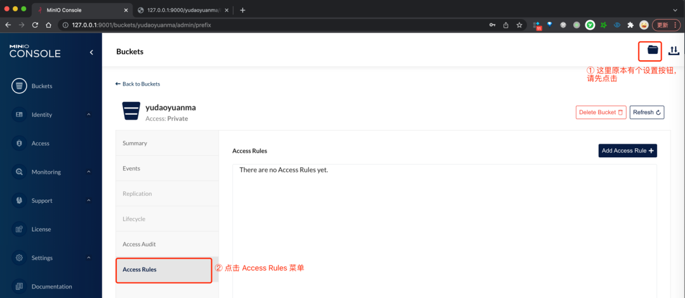

② 点击 [Add Access Rule] 按钮，添加一条 Prefix 为 `/` Access 为 `readonly` 的规则。

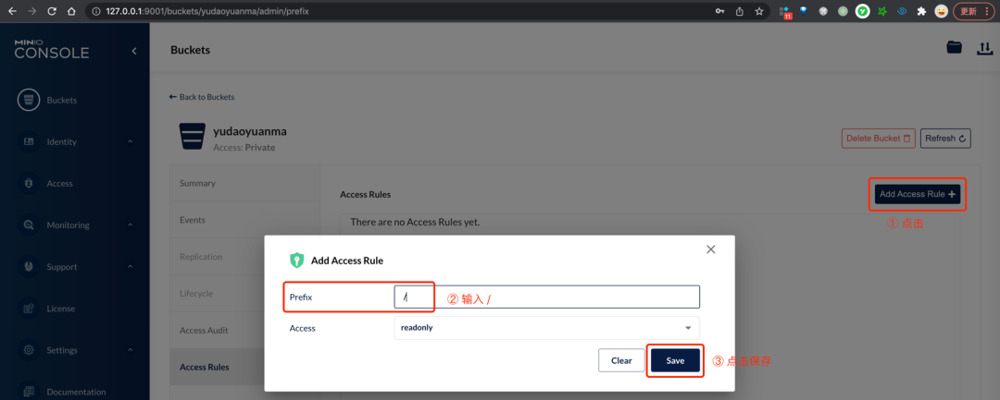

### 2.5 上传文件

点击 [Upload] 按钮，点击 [Upload File] 选项，选择一个图片上传。

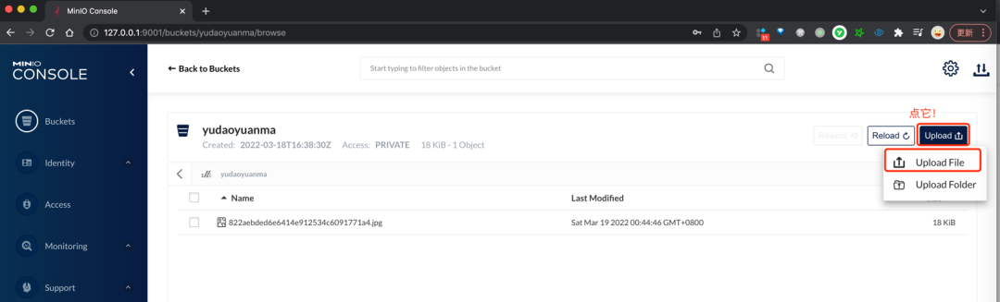

### 2.6 访问文件

文件的访问地址的格式为 `<http://127.0.0.1:9000/{bucket}/{name}>`，注意是 9000 端口。

我们刚上传的文件 `{bucket}` 是 yudaoyuanma，`{name}` 是 822aebded6e6414e912534c6091771a4.jpg，所以最终的访问路径是 http://127.0.0.1:9000/yudaoyuanma/822aebded6e6414e912534c6091771a4.jpg。

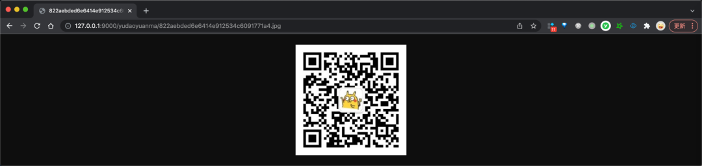


## 3. MinIO Client 命令行工具

MinIO Client (mc) 是 MinIO 提供的命令行工具，用于访问 MinIO Server。它的命令设计的非常棒，和我们在使用 ls、cat、cp、mirror、diff、find 等 Unix 命令基本接近，主要如下：

```shell
ls       列出文件和文件夹
mb       创建一个存储桶或一个文件夹
cat      显示文件和对象内容
pipe     将一个 STDIN 重定向到一个对象或者文件或者 STDOUT
share    生成用于共享的 URL
cp       拷贝文件和对象
mirror   给存储桶和文件夹做镜像
find     基于参数查找文件
diff     对两个文件夹或者存储桶比较差异
rm       删除文件和对象
events   管理对象通知
watch    监听文件和对象的事件
policy   管理访问策略
session  为 cp 命令管理保存的会话
config   管理 mc 配置文件
update   检查软件更新
version  输出版本信息
```

例如说，使用 `mc ls` 列出有哪些 Bucket 存储桶：

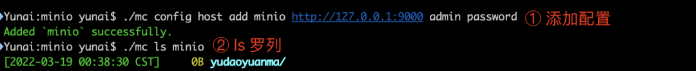

考虑到你对 MinIO Client 可能不是很感兴趣，艿艿就暂时不过多啰嗦。感兴趣的话，可以看看如下文档：

- MinIO Client 安装：https://min.io/download
- MinIO Client 命令：https://docs.min.io/minio/baremetal/reference/minio-mc.html

## 4. Spring Boot 集成实战

> 完整示例代码示例，可见 https://github.com/YunaiV/SpringBoot-Labs 的 lab-72-minio 目录。

接下来，我们来新建一个 Spring Boot 项目 lab-72-minio ，实现文件的上传与删除的功能。

### 4.1 引入依赖

在 `pom.xml` 文件中，引入 MinIO 相关依赖。

```xml
<?xml version="1.0" encoding="UTF-8"?>
<project xmlns="http://maven.apache.org/POM/4.0.0"
         xmlns:xsi="http://www.w3.org/2001/XMLSchema-instance"
         xsi:schemaLocation="http://maven.apache.org/POM/4.0.0 http://maven.apache.org/xsd/maven-4.0.0.xsd">
    <parent>
        <groupId>org.springframework.boot</groupId>
        <artifactId>spring-boot-starter-parent</artifactId>
        <version>2.6.4</version>
        <relativePath/> <!-- lookup parent from repository -->
    </parent>
    <modelVersion>4.0.0</modelVersion>

    <artifactId>lab-72-minio</artifactId>

    <dependencies>
        <!-- 实现对 Spring MVC 的自动化配置 -->
        <dependency>
            <groupId>org.springframework.boot</groupId>
            <artifactId>spring-boot-starter-web</artifactId>
        </dependency>

        <!-- MinIO 客户端 -->
        <dependency>
            <groupId>io.minio</groupId>
            <artifactId>minio</artifactId>
            <version>8.2.2</version>
        </dependency>
    </dependencies>

</project>
```

注意，如果引入的 Minio 的版本过高，例如说 `8.3.7`，会报依赖的冲突：

```shell
2022-03-19 11:29:59.954 ERROR 77692 --- [           main] o.s.b.d.LoggingFailureAnalysisReporter   : 

***************************
APPLICATION FAILED TO START
***************************

Description:

An attempt was made to call a method that does not exist. The attempt was made from the following location:

    io.minio.S3Base.<clinit>(S3Base.java:98)

The following method did not exist:

    okhttp3.RequestBody.create([BLokhttp3/MediaType;)Lokhttp3/RequestBody;

The calling method's class, io.minio.S3Base, was loaded from the following location:

    jar:file:/Users/yunai/.m2/repository/io/minio/minio/8.3.7/minio-8.3.7.jar!/io/minio/S3Base.class

The called method's class, okhttp3.RequestBody, is available from the following locations:

    jar:file:/Users/yunai/.m2/repository/com/squareup/okhttp3/okhttp/3.14.9/okhttp-3.14.9.jar!/okhttp3/RequestBody.class

The called method's class hierarchy was loaded from the following locations:

    okhttp3.RequestBody: file:/Users/yunai/.m2/repository/com/squareup/okhttp3/okhttp/3.14.9/okhttp-3.14.9.jar


Action:

Correct the classpath of your application so that it contains compatible versions of the classes io.minio.S3Base and okhttp3.RequestBody
```

### 4.2 MinIOConfiguration

新建 MinIOConfiguration 配置类，创建 MinioClient Bean。代码如下：

```java
package cn.iocoder.springboot.lab72.config;

import io.minio.MinioClient;
import org.springframework.context.annotation.*;

@Configuration
public class MinIOConfiguration {

    @Bean
    public MinioClient minioClient() {
        // Minio 配置。实际项目中，定义到 application.yml 配置文件中
        String endpoint = "http://127.0.0.1:9000";
        String accessKey = "admin";
        String secretKey = "password";

        // 创建 MinioClient 客户端
        return MinioClient.builder()
                .endpoint(endpoint)
                .credentials(accessKey, secretKey)
                .build();
    }

}
```

### 4.3 FileController

新建 FileController 类，实现文件上传与删除的 RESTful API 接口。代码如下：

```java
package cn.iocoder.springboot.lab72.controller;

import io.minio.*;
import org.springframework.web.bind.annotation.*;
import org.springframework.web.multipart.MultipartFile;

import javax.annotation.Resource;
import java.util.UUID;

@RestController
@RequestMapping("/file")
public class FileController {

    @Resource
    private MinioClient minioClient;

    // Minio 配置。实际项目中，定义到 application.yml 配置文件中
    private String endpoint = "http://127.0.0.1:9000";
    private String bucket = "yudaoyuanma";

    /**
     * 上传文件
     */
    @PostMapping("/upload")
    public String upload(@RequestParam("file") MultipartFile file) throws Exception {
        // 上传
        String path = UUID.randomUUID().toString(); // 文件名，使用 UUID 随机
        minioClient.putObject(PutObjectArgs.builder()
                .bucket(bucket) // 存储桶
                .object(path) // 文件名
                .stream(file.getInputStream(), file.getSize(), -1) // 文件内容
                .contentType(file.getContentType()) // 文件类型
                .build());
        // 拼接路径
        return String.format("%s/%s/%s", endpoint, bucket, path);
    }

    /**
     * 删除文件
     */
    @DeleteMapping("/delete")
    public void delete(@RequestParam("path") String path) throws Exception {
        minioClient.removeObject(RemoveObjectArgs.builder()
                .bucket(bucket) // 存储桶
                .object(path) // 文件名
                .build());
    }

}
```

### 4.4 MinIOApplication

新建 MinIOApplication 启动类。代码如下：

```java
package cn.iocoder.springboot.lab72;

import org.springframework.boot.SpringApplication;
import org.springframework.boot.autoconfigure.SpringBootApplication;

@SpringBootApplication
public class MinIOApplication {

    public static void main(String[] args) {
        SpringApplication.run(MinIOApplication.class, args);
    }

}
```

### 4.5 简单测试

① 执行 MinIOApplication 启动 Spring Boot 项目。

② 使用 Postman 调用 `/file/upload` 接口，进行文件的上传。

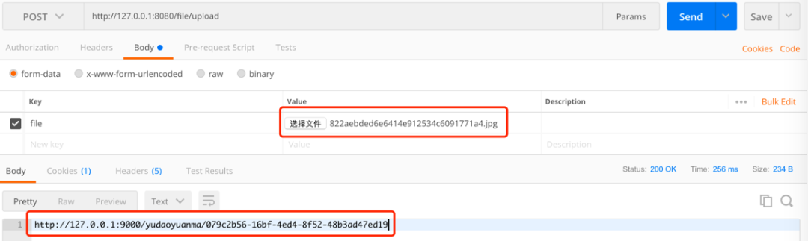

上传成功后，我们获得了文件的访问 URL 地址，可以使用浏览器直接访问。

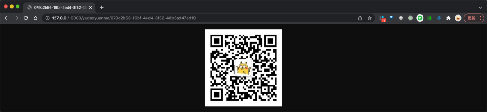

同时在 MinIO 后台界面，也可以查询到该文件。

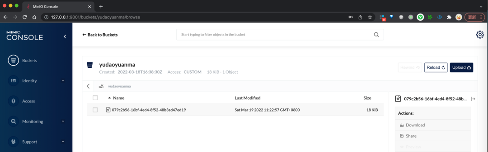

③ 使用 Postman 调用 `/file/delete` 接口，进行文件的删除。

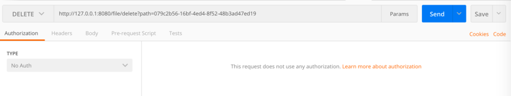

## 彩蛋

未来是过去历史的一再重演，技术圈也是一样。

- 2009 年，Oracle 公司收购 Sun，将 MySQL 收入囊中；同年，MySQL 之父 Widenius 离开 Sun，发布 MariaDB 产品。
- 2011 年，RedHat 公司收购 Gluster，将 GlusterFS 纳入麾下；2014 年，Gluster 创始人发布 Minio 产品。


