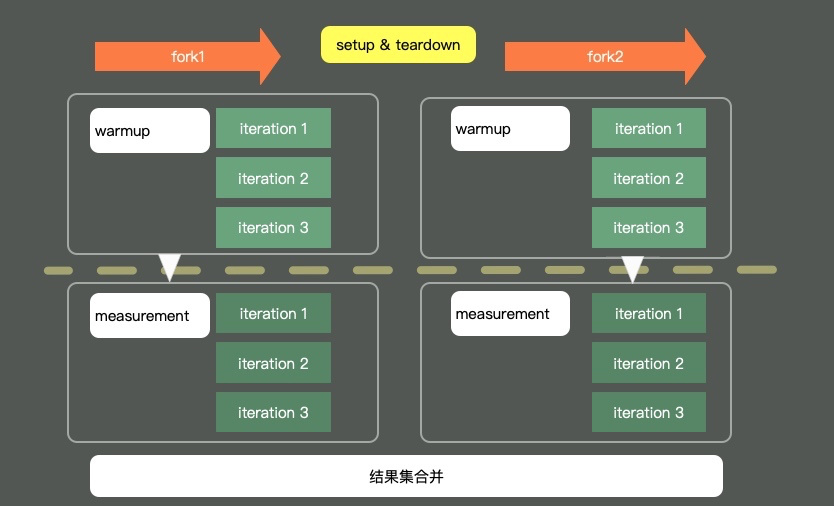

# Jackson的正确使用方式

## 前言

自从国产之光 fastjson 频频暴雷，Jackson Json 的使用是越来越广泛了。尤其是 Spring 家族把它搞成了默认的 JSON 处理包，jackson 的使用数量更是呈爆炸式发展。

很多同学发现，jackson 并没有类似 fastjson 的 JSON.parseObjec 这样的，确实看起来很快的方法。要想解析 json，你不得不 new 一个 ObjectMapper，来处理真正的解析动作。

就像下面这样：

```java
public String getCarString(Car car){
    ObjectMapper objectMapper = new ObjectMapper();
    String str = objectMapper.writeValueAsString(car);
    return str;
}
```

这种代码就在 CV 工程师手中遍地开了花，神奇！！！


## 这代码有问题么

你要说它有问题，它确实能正确的执行。你要说它没问题，在追求性能的同学眼里，这肯定是一段十恶不赦的代码。

一般的工具类，都是单例的，同时是线程安全的。ObjectMapper 也不例外，它也是线程安全的，你可以并发的执行它，不会产生任何问题。

这段代码，ObjectMapper 在每次方法调用的时候，都会生成一个。那它除了造成一定的年轻代内存浪费之外，在执行时间上有没有什么硬伤呢？

new 和不 new，真的区别有那么大么？

有一次，我隐晦的指出某段被频繁调用的代码问题，被小伙伴怒吼着拿出证据。

证据？这得搬出 Java 中的基准测试工具 JMH，才能一探究竟。

`JMH`(the Java Microbenchmark Harness) 就是这样一个能够做基准测试的工具。如果你通过我们一系列的工具，定位到了热点代码，要测试它的性能数据，评估改善情况，就可以交给JMH。它的测量精度非常高，最高可达到纳秒的级别。

`JMH`是一个jar包，它和单元测试框架`JUnit`非常的像，可以通过注解进行一些基础配置。这部分配置有很多是可以通过main方法的`OptionsBuilder`进行设置的。



上图是一个典型的JMH程序执行的内容。通过开启多个进程，多个线程，首先执行预热，然后执行迭代，最后汇总所有的测试数据进行分析。在执行前后，还可以根据粒度处理一些前置和后置操作。


## JMH测试结果

为了测试上面的场景，我们创造了下面的基准测试类。分为三个测试场景：

1. 直接在方法里new ObjectMapper
2. 在全局共享一个ObjectMapper
3. 使用ThreadLocal，每个线程一个ObjectMapper

这样的测试属于cpu密集型的。我的cpu有10核，直接就分配了10个线程的并发，cpu在测试期间跑的满满的。

```java
@BenchmarkMode({Mode.Throughput})
@OutputTimeUnit(TimeUnit.SECONDS)
@State(Scope.Thread)
@Warmup(iterations = 5, time = 1, timeUnit = TimeUnit.SECONDS)
@Measurement(iterations = 5, time = 1, timeUnit = TimeUnit.SECONDS)
@Fork(1)
@Threads(10)
public class ObjectMapperTest {
    String json = "{ \"color\" : \"Black\", \"type\" : \"BMW\" }";

    @State(Scope.Benchmark)
    public static class BenchmarkState {
        ObjectMapper GLOBAL_MAP = new ObjectMapper();
        ThreadLocal<ObjectMapper> GLOBAL_MAP_THREAD = new ThreadLocal<>();
    }

    @Benchmark
    public Map globalTest(BenchmarkState state) throws Exception{
        Map map = state.GLOBAL_MAP.readValue(json, Map.class);
        return map;
    }


    @Benchmark
    public Map globalTestThreadLocal(BenchmarkState state) throws Exception{
        if(null == state.GLOBAL_MAP_THREAD.get()){
            state.GLOBAL_MAP_THREAD.set(new ObjectMapper());
        }
        Map map = state.GLOBAL_MAP_THREAD.get().readValue(json, Map.class);
        return map;
    }

    @Benchmark
    public Map localTest() throws Exception{
        ObjectMapper objectMapper = new ObjectMapper();
        Map map = objectMapper.readValue(json, Map.class);
        return map;
    }

    public static void main(String[] args) throws Exception {
        Options opts = new OptionsBuilder()
                .include(ObjectMapperTest.class.getSimpleName())
                .resultFormat(ResultFormatType.CSV)
                .build();

        new Runner(opts).run();
    }
}
```

测试结果如下：

```shell
Benchmark                                Mode  Cnt         Score         Error  Units
ObjectMapperTest.globalTest             thrpt    5  25125094.559 ± 1754308.010  ops/s
ObjectMapperTest.globalTestThreadLocal  thrpt    5  31780573.549 ± 7779240.155  ops/s
ObjectMapperTest.localTest              thrpt    5   2131394.345 ±  216974.682  ops/s
```

从测试结果可以看出，如果我们每次调用都 new 一个 ObjectMapper，每秒可以执行 200 万次 JSON 解析；如果全局使用一个 ObjectMapper，则每秒可以执行 2000 多万次，速度足足快了 10 倍。

如果使用 ThreadLocal 的方式，每个线程给它分配一个解析器，则性能会有少许上升，但也没有达到非常夸张的地步。

所以在项目中写代码的时候，我们只需要保证有一个全局的 ObjectMapper 就可以了。

当然，由于 ObjectMapper 有很多的特性需要配置，你可能会为不同的应用场景分配一个单独使用的 ObjectMapper。总之，它的数量不需要太多，因为它是线程安全的。

## 总结

所以结论就比较清晰了，我们只需要在整个项目里使用一个ObjectMapper就可以了，没必要傻不拉几的每次都new一个，毕竟性能差了10倍。如果你的JSON有很多自定义的配置，使用全局的变量更能凸显它的优势。

不要觉得这样做没有必要，保持良好的编码习惯永远是好的。高性能的代码都是点点滴滴积累起来的。不积跬步,无以至千里。不积小流,无以成江海，说的就是这个道理。


