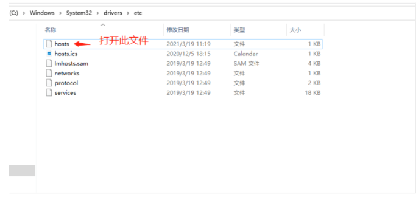

# Github无法打开解决方法

> 本文今天介绍两种方法来解决 Github连接超时的问题，在网上查阅很多大部分都是修改本机的 hosts文件。

## 方法一 ：修改Hosts文件

1，打开hosts目录：`C:\Windows\System32\drivers\etc`，如下图：

2，打开文件，添加以下信息：

`注意：如果遇到权限不够可以复制桌面进行修改，然后再替换到原处`

> 140.82.112.4 github.com
>
> 199.232.69.194 github.global.ssl.fastly.net

本人只添加上面两条就可以使用，网上也有添加很多的如下

> 

3，由于每台机器在这两个网站上对应的IP可能不同，所以需要自行查询IP，而不是直接复制IP，查询方法如下

腾讯 DNS：119.29.29.29、182.254.116.116

阿里 DNS：223.5.5.5、223.6.6.6

百度 DNS：180.76.76.76

测评下来，百度速度最快。

