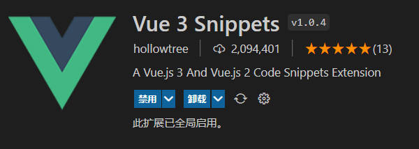

# VS Code 常用插件汇总


## 常用插件

### [Auto Close Tag插件](https://marketplace.visualstudio.com/items?itemName=formulahendry.auto-close-tag)


自动添加HTML / XML关闭标记，与Visual Studio IDE或Sublime Text相同。


### [Auto Rename Tag插件](https://marketplace.visualstudio.com/items?itemName=formulahendry.auto-rename-tag)


这是一个修改标签对的插件。


**特征：**

重命名一个HTML/XML标签时，自动重命名配对的HTML/XML标签。

**配置：**

在其中添加条目 `auto-rename-tag.activationOnLanguage` 以设置扩展名将被激活的语言。默认情况下，它是`["*"]` ，表示为所有语言激活。

```json
{
  "auto-rename-tag.activationOnLanguage": ["html", "xml", "php", "javascript"]
}
```


### [open in browser插件](https://marketplace.visualstudio.com/items?itemName=techer.open-in-browser)


把编辑的HTML文件等用浏览器打开，查看效果。

1. 使用快捷键 Alt+B

2. 右键在浏览器中查看


### [Live Server插件](https://marketplace.visualstudio.com/items?itemName=ritwickdey.LiveServer)


这是一个为静态和动态页面启动具有实时重新加载功能的开发本地服务器。


**使用**

启动/停止服务器的快捷方式

> [注意：如果工作空间中没有文件.html或.htm文件，则必须按照方法4和5来启动服务器。

1. 打开一个项目，然后Go Live从状态栏中单击以打开/关闭服务器。 上线控制预览
2. 右键单击HTML资源管理器窗口中的文件，然后单击Open with Live Server。 资源管理器窗口控件。
3. 打开一个HTML文件，右键单击编辑器，然后单击Open with Live Server。 编辑菜单选项预览
4. 点击(alt+L, alt+O)打开服务器，然后(alt+L, alt+C)停止服务器（您可以更改快捷方式窗体的键盘绑定）。[在MAC上，cmd+L, cmd+O和cmd+L, cmd+C]
5. 通过按F1或打开命令面板，ctrl+shift+P然后键入Live Server: Open With Live Server 以启动服务器或键入Live Server: Stop Live Server以停止服务器。


### [Vetur](https://marketplace.visualstudio.com/items?itemName=octref.vetur)


语法高亮、智能感知、Emmet等, 包含格式化功能， Alt+Shift+F （格式化全文），Ctrl+K Ctrl+F（格式化选中代码，两个Ctrl需要同时按着）。


### [vscode-fileheader](https://marketplace.visualstudio.com/items?itemName=mikey.vscode-fileheader)


添加注释到文件头，并支持自动更新文件修改时间。

这是一个给`js`文件（html、css也可以使用，但是没意义！！！）生成头部注释的插件，每次修改js文件之后会自动插入修改时间和作者。

示例:

```javascript
/*
 * @Author: mikey.zhaopeng
 * @Date:   2016-07-29 15:57:29
 * @Last Modified by: mikey.zhaopeng
 * @Last Modified time: 2016-08-09 13:29:41
 */
```

> 提示: 你可以使用ctrl+alt+i 在文件头部添加注释，然后ctrl+s 保存文件之后，自动更新时间和作者。

**生成这个注释的快捷键是**

```
ctrl+alt+i
```

用户在`settings.json`中配置用户名和最后修改用户名即可使用

```
"fileheader.Author": "tom",
"fileheader.LastModifiedBy": "jerry"
```

保存一下，然后去ctrl+alt+i使用就可以使用了。


### [Prettier - Code formatter插件](https://marketplace.visualstudio.com/items?itemName=esbenp.prettier-vscode)


用来做代码格式化，有了Prettier之后，它能去掉原始的代码风格，确保团队的代码使用统一相同的格式，用官网的原话是"Building and enforcing a style guide"。它能支持很多格式

- JavaScript
- JSX
- Angular
- Vue
- Flow
- TypeScript
- CSS, Less, SCSS
- HTML
- JSON
- GraphQL
- Markdown
- YAML

它和Linter系列比如ESLint的区别在于Prettier是一个专注于代码格式化的工具，对代码不做质量检查。


### [Turbo Console Log插件](https://marketplace.visualstudio.com/items?itemName=ChakrounAnas.turbo-console-log)


这个扩展通过自动插入有意义的日志消息，使调试更容易。

只要将想打印的变量选中，按住`ctrl + option + L`(windows: `ctrl + alt + L`)，就能在变量下方自动插入一个console.log。


### [vscode-icons插件](https://marketplace.visualstudio.com/items?itemName=vscode-icons-team.vscode-icons)


VsCode的图标插件，可以控制vscode中的文件管理的树目录显示图标。


## Vue开发插件

### [Vue 3 Snippets插件](https://marketplace.visualstudio.com/items?itemName=hollowtree.vue-snippets)



这个插件基于最新的 Vue 2 及 Vue 3 的 API 添加了 Code Snippets。


这个插件包含了所有的 Vue.js 2 和 Vue.js 3 的 api 对应的代码片段。插件的代码片段如下表格所示，你不需要记住什么snippets，就像往常一样在 vscode 里写代码就好了。比如你可以键入 `vcom` 然后按上下键选中 `VueConfigOptionMergeStrategies` 再按Enter键，就输入了`Vue.config.optionMergeStrategies`了。

如下表所示，`vmData` 的内容是 `${this, vm}.$data`，这表明这个 snippet 会提供 `this.$data` and `vm.$data` 两种选项供你选择。


#### Vue 3 Snippets

| Prefix              | JavaScript Snippet Content    |
| ------------------- | ----------------------------- |
| `importFromVue`     | `import ... from 'vue'`       |
| `reactive`          | `const obj = reactive()`      |
| `readonly`          | `const obj = readonly()`      |
| `setup`             | `setup() { }`                 |
| `onBeforeMount`     | `onBeforeMount(() => {})`     |
| `onMounted`         | `onMounted(() => {})`         |
| `onBeforeUpdate`    | `onBeforeUpdate(() => {})`    |
| `onUpdated`         | `onUpdated(() => {})`         |
| `onBeforeUnmount`   | `onBeforeUnmount(() => {})`   |
| `onUnmounted`       | `onUnmounted(() => {})`       |
| `onErrorCaptured`   | `onErrorCaptured(() => {})`   |
| `onRenderTracked`   | `onRenderTracked(() => {})`   |
| `onRenderTriggered` | `onRenderTriggered(() => {})` |


| Prefix        | HTML Snippet Content             |
| ------------- | -------------------------------- |
| `teleport`    | `<teleport to='' />`             |
| `componentIs` | `<component :is=''></component>` |

#### Vue 2 Snippets

| Prefix                           | JavaScript Snippet Content                                   |
| -------------------------------- | ------------------------------------------------------------ |
| `import`                         | `import ... from ...`                                        |
| `newVue`                         | `new Vue({...})`                                             |
| `VueConfigSilent`                | `Vue.config.silent = true`                                   |
| `VueConfigOptionMergeStrategies` | `Vue.config.optionMergeStrategies`                           |
| `VueConfigDevtools`              | `Vue.config.devtools = true`                                 |
| `VueConfigErrorHandler`          | `Vue.config.errorHandler = function (err, vm, info) {...}`   |
| `VueConfigWarnHandler`           | `Vue.config.warnHandler = function (msg, vm, trace) {...}`   |
| `VueConfigIgnoredElements`       | `Vue.config.ignoredElements = ['']`                          |
| `VueConfigKeyCodes`              | `Vue.config.keyCodes`                                        |
| `VueConfigPerformance`           | `Vue.config.performance = true`                              |
| `VueConfigProductionTip`         | `Vue.config.productionTip = false`                           |
| `vueExtend`                      | `Vue.extend( options )`                                      |
| `VueNextTick`                    | `Vue.nextTick( callback, [context] )`                        |
| `VueNextTickThen`                | `Vue.nextTick( callback, [context] ).then(function(){ })`    |
| `VueSet`                         | `Vue.set( target, key, value )`                              |
| `VueDelete`                      | `Vue.delete( target, key )`                                  |
| `VueDirective`                   | `Vue.directive( id, [definition] )`                          |
| `VueFilter`                      | `Vue.filter( id, [definition] )`                             |
| `VueComponent`                   | `Vue.component( id, [definition] )`                          |
| `VueUse`                         | `Vue.use( plugin )`                                          |
| `VueMixin`                       | `Vue.mixin({ mixin })`                                       |
| `VueCompile`                     | `Vue.compile( template )`                                    |
| `VueVersion`                     | `Vue.version`                                                |
| `data`                           | `data() { return {} }`                                       |
| `watchWithOptions`               | `key: { deep: true, immediate: true, handler: function () { } }` |
| `vmData`                         | `${this, vm}.$data`                                          |
| `vmProps`                        | `${this, vm}.$props`                                         |
| `vmEl`                           | `${this, vm}.$el`                                            |
| `vmOptions`                      | `${this, vm}.$options`                                       |
| `vmParent`                       | `${this, vm}.$parent`                                        |
| `vmRoot`                         | `${this, vm}.$root`                                          |
| `vmChildren`                     | `${this, vm}.$children`                                      |
| `vmSlots`                        | `${this, vm}.$slots`                                         |
| `vmScopedSlots`                  | `${this, vm}.$scopedSlots.default({})`                       |
| `vmRefs`                         | `${this, vm}.$refs`                                          |
| `vmIsServer`                     | `${this, vm}.$isServer`                                      |
| `vmAttrs`                        | `${this, vm}.$attrs`                                         |
| `vmListeners`                    | `${this, vm}.listeners`                                      |
| `vmWatch`                        | `${this, vm}.$watch( expOrFn, callback, [options] )`         |
| `vmSet`                          | `${this, vm}.$set( object, key, value )`                     |
| `vmDelete`                       | `${this, vm}.$delete( object, key )`                         |
| `vmOn`                           | `${this, vm}.$on( event, callback )`                         |
| `vmOnce`                         | `${this, vm}.$once( event, callback )`                       |
| `vmOff`                          | `${this, vm}.$off( [event, callback] )`                      |
| `vmEmit`                         | `${this, vm}.$emit( event, […args] )`                        |
| `vmMount`                        | `${this, vm}.$mount( [elementOrSelector] )`                  |
| `vmForceUpdate`                  | `${this, vm}.$forceUpdate()`                                 |
| `vmNextTick`                     | `${this, vm}.$nextTick( callback )`                          |
| `vmDestroy`                      | `${this, vm}.$destroy()`                                     |
| `renderer`                       | `const renderer = require('vue-server-renderer').createRenderer()` |
| `createRenderer`                 | `createRenderer({ })`                                        |
| `preventDefault`                 | `preventDefault();`                                          |
| `stopPropagation`                | `stopPropagation();`                                         |


| Prefix                 | HTML Snippet Content                    |
| ---------------------- | --------------------------------------- |
| `template`             | `<template></template>`                 |
| `script`               | `<script></script>`                     |
| `style`                | `<style></style>`                       |
| `vText`                | `v-text=msg`                            |
| `vHtml`                | `v-html=html`                           |
| `vShow`                | `v-show`                                |
| `vIf`                  | `v-if`                                  |
| `vElse`                | `v-else`                                |
| `vElseIf`              | `v-else-if`                             |
| `vForWithoutKey`       | `v-for`                                 |
| `vFor`                 | `v-for="" :key=""`                      |
| `vOn`                  | `v-on`                                  |
| `vBind`                | `v-bind`                                |
| `vModel`               | `v-model`                               |
| `vPre`                 | `v-pre`                                 |
| `vCloak`               | `v-cloak`                               |
| `vOnce`                | `v-once`                                |
| `key`                  | `:key`                                  |
| `ref`                  | `ref`                                   |
| `slotA`                | `slot=""`                               |
| `slotE`                | `<slot></slot>`                         |
| `slotScope`            | `slot-scope=""`                         |
| `component`            | `<component :is=''></component>`        |
| `keepAlive`            | `<keep-alive></keep-alive>`             |
| `transition`           | `<transition></transition>`             |
| `transitionGroup`      | `<transition-group></transition-group>` |
| `enterClass`           | `enter-class=''`                        |
| `leaveClass`           | `leave-class=''`                        |
| `appearClass`          | `appear-class=''`                       |
| `enterToClass`         | `enter-to-class=''`                     |
| `leaveToClass`         | `leave-to-class=''`                     |
| `appearToClass`        | `appear-to-class=''`                    |
| `enterActiveClass`     | `enter-active-class=''`                 |
| `leaveActiveClass`     | `leave-active-class=''`                 |
| `appearActiveClass`    | `appear-active-class=''`                |
| `beforeEnterEvent`     | `@before-enter=''`                      |
| `beforeLeaveEvent`     | `@before-leave=''`                      |
| `beforeAppearEvent`    | `@before-appear=''`                     |
| `enterEvent`           | `@enter=''`                             |
| `leaveEvent`           | `@leave=''`                             |
| `appearEvent`          | `@appear=''`                            |
| `afterEnterEvent`      | `@after-enter=''`                       |
| `afterLeaveEvent`      | `@after-leave=''`                       |
| `afterAppearEvent`     | `@after-appear=''`                      |
| `enterCancelledEvent`  | `@enter-cancelled=''`                   |
| `leaveCancelledEvent`  | `@leave-cancelled=''`                   |
| `appearCancelledEvent` | `@appear-cancelled=''`                  |


| Prefix                       | Vue Router Snippet Content                     |
| ---------------------------- | ---------------------------------------------- |
| `routerLink`                 | `<router-link></router-link>`                  |
| `routerView`                 | `<router-view></router-view>`                  |
| `to`                         | `to=""`                                        |
| `tag`                        | `tag=""`                                       |
| `newVueRouter`               | `const router = newVueRouter({ })`             |
| `routerBeforeEach`           | `router.beforeEach((to, from, next) => { }`    |
| `routerBeforeResolve`        | `router.beforeResolve((to, from, next) => { }` |
| `routerAfterEach`            | `router.afterEach((to, from) => { }`           |
| `routerPush`                 | `router.push()`                                |
| `routerReplace`              | `router.replace()`                             |
| `routerGo`                   | `router.back()`                                |
| `routerBack`                 | `router.push()`                                |
| `routerForward`              | `router.forward()`                             |
| `routerGetMatchedComponents` | `router.getMatchedComponents()`                |
| `routerResolve`              | `router.resolve()`                             |
| `routerAddRoutes`            | `router.addRoutes()`                           |
| `routerOnReady`              | `router.onReady()`                             |
| `routerOnError`              | `router.onError()`                             |
| `routes`                     | `routes: []`                                   |
| `beforeEnter`                | `beforeEnter: (to, from, next) => { }`         |
| `beforeRouteEnter`           | `beforeRouteEnter (to, from, next) { }`        |
| `beforeRouteLeave`           | `beforeRouteLeave (to, from, next) { }`        |
| `scrollBehavior`             | `scrollBehavior (to, from, savedPosition) { }` |


| Prefix         | Vuex Snippet Content                |
| -------------- | ----------------------------------- |
| `newVuexStore` | `const store = new Vuex.Store({ })` |

| Prefix      | Nuxt.js Snippet Content |
| ----------- | ----------------------- |
| `nuxt`      | `<nuxt/>`               |
| `nuxtChild` | `<nuxt-child/>`         |
| `nuxtLink`  | `<nuxt-link to=""/>`    |
| `asyncData` | `asyncData() {}`        |

