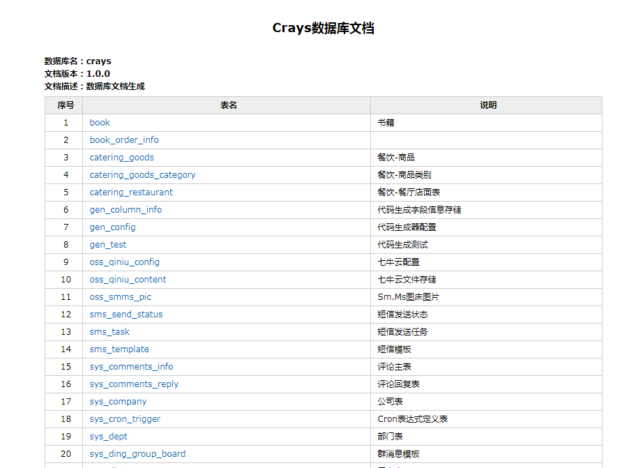
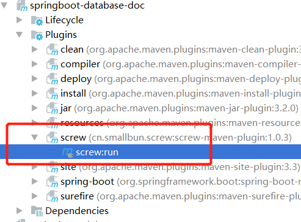
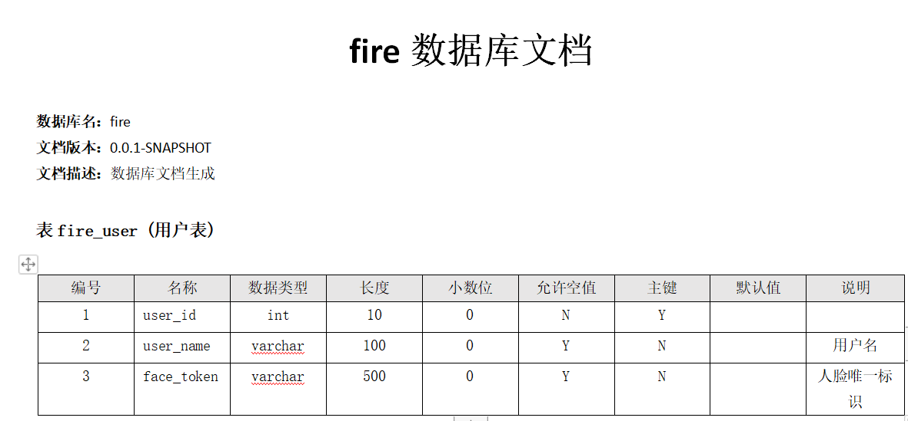
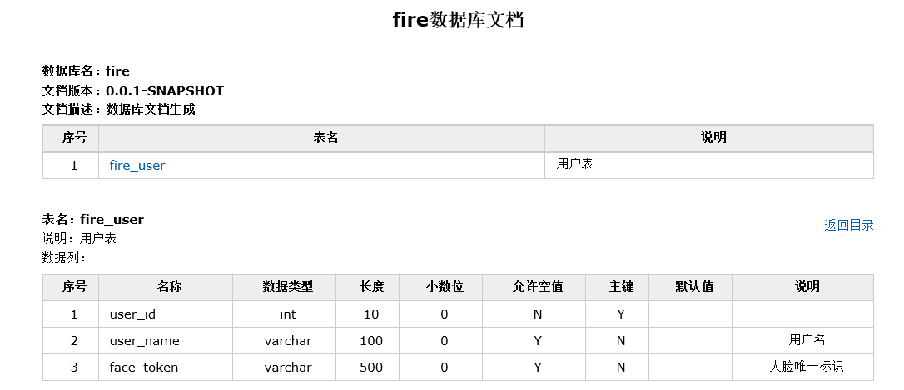
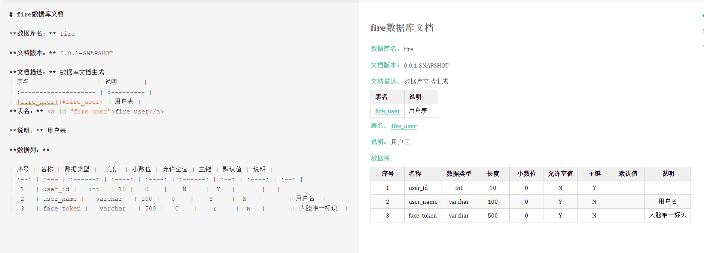

# 使用screw生成数据库文档

最近部门订单业务调整，收拢其他业务线的下单入口，做个统一大订单平台。需要梳理各业务线的数据表，但每个业务线库都有近百张和订单相关的表，挨个表一个一个字段的弄脑瓜子嗡嗡的。

为了不重复 CV 操作，抱着一丝希望开始在`GitHub`里找，看看有没有什么工具可以用，结果就真的发现了宝藏，`screw`（螺丝钉），居然可以生成数据库文档，实在是太方便了。




## 一、数据库支持

- MySQL
- MariaDB
- TIDB
- Oracle
- SqlServer
- PostgreSQL
- Cache DB


## 二、配置

### 1、pom文件中引入依赖

引入`screw`核心包，`HikariCP`数据库连接池，`HikariCP`号称性能最出色的数据库连接池。

```xml
<!-- screw核心 -->
<dependency>
    <groupId>cn.smallbun.screw</groupId>
    <artifactId>screw-core</artifactId>
    <version>1.0.3</version>
</dependency>

<!-- HikariCP -->
<dependency>
    <groupId>com.zaxxer</groupId>
    <artifactId>HikariCP</artifactId>
    <version>3.4.5</version>
</dependency>

<!--mysql driver-->
<dependency>
    <groupId>mysql</groupId>
    <artifactId>mysql-connector-java</artifactId>
    <version>8.0.20</version>
</dependency>
```


### 2、配置数据源

配置数据源，设置 `useInformationSchema` 可以获取`tables`注释信息。

```properties
spring.datasource.url=jdbc:mysql://45.93.1.5:3306/fire?useUnicode=true&characterEncoding=UTF-8&useSSL=false
spring.datasource.username=root
spring.datasource.password=123456
spring.datasource.driver-class-name=com.mysql.cj.jdbc.Driver
spring.datasource.xa.properties.useInformationSchema=true
```


### 3、screw 核心配置

`screw`有两种执行方式，第一种是`pom`文件配置，另一种是代码执行。

```xml
 <build>
    <plugins>
        <plugin>
            <groupId>org.springframework.boot</groupId>
            <artifactId>spring-boot-maven-plugin</artifactId>
        </plugin>
        <plugin>
            <groupId>cn.smallbun.screw</groupId>
            <artifactId>screw-maven-plugin</artifactId>
            <version>1.0.3</version>
            <dependencies>
                <!-- HikariCP -->
                <dependency>
                    <groupId>com.zaxxer</groupId>
                    <artifactId>HikariCP</artifactId>
                    <version>3.4.5</version>
                </dependency>
                <!--mysql driver-->
                <dependency>
                    <groupId>mysql</groupId>
                    <artifactId>mysql-connector-java</artifactId>
                    <version>8.0.20</version>
                </dependency>
            </dependencies>
            <configuration>
                <!--username-->
                <username>root</username>
                <!--password-->
                <password>123456</password>
                <!--driver-->
                <driverClassName>com.mysql.cj.jdbc.Driver</driverClassName>
                <!--jdbc url-->
                <jdbcUrl>jdbc:mysql://41.92.6.5:3306/fire</jdbcUrl>
                <!--生成文件类型-->
                <fileType>HTML</fileType>
                <!--打开文件输出目录-->
                <openOutputDir>false</openOutputDir>
                <!--生成模板-->
                <produceType>freemarker</produceType>
                <!--文档名称 为空时:将采用[数据库名称-描述-版本号]作为文档名称-->
                <!--<docName>测试文档名称</docName>-->
                <!--描述-->
                <description>数据库文档生成</description>
                <!--版本-->
                <version>${project.version}</version>
                <!--标题-->
                <title>fire数据库文档</title>
            </configuration>
            <executions>
                <execution>
                    <phase>compile</phase>
                    <goals>
                        <goal>run</goal>
                    </goals>
                </execution>
            </executions>
        </plugin>
    </plugins>
</build>
```

配置完以后在 `maven project`->`screw` 双击执行就可以了。




代码生成方式也非常简单。

```java
@SpringBootTest
public class ScrewApplicationTests {

    @Autowired
    ApplicationContext applicationContext;

    @Test
    void contextLoads() {
        DataSource dataSourceMysql = applicationContext.getBean(DataSource.class);
        // 生成文件配置
        EngineConfig engineConfig = EngineConfig.builder()
                // 生成文件路径，自己mac本地的地址，这里需要自己更换下路径
                .fileOutputDir("D:/")
                // 打开目录
                .openOutputDir(false)
                // 文件类型
                .fileType(EngineFileType.HTML)
                // 生成模板实现
                .produceType(EngineTemplateType.freemarker).build();
        // 生成文档配置（包含以下自定义版本号、描述等配置连接）
        Configuration config = Configuration.builder()
                .version("1.0.3")
                .description("生成文档信息描述")
                .dataSource(dataSourceMysql)
                .engineConfig(engineConfig)
                .produceConfig(getProcessConfig())
                .build();
        // 执行生成
        new DocumentationExecute(config).execute();
    }

    /**
     * 配置想要生成的表+ 配置想要忽略的表
     *
     * @return 生成表配置
     */
    public static ProcessConfig getProcessConfig() {
        // 忽略表名
        List<String> ignoreTableName = Arrays.asList("a", "test_group");
        // 忽略表前缀，如忽略a开头的数据库表
        List<String> ignorePrefix = Arrays.asList("a", "t");
        // 忽略表后缀
        List<String> ignoreSuffix = Arrays.asList("_test", "czb_");
        return ProcessConfig.builder()
                //根据名称指定表生成
                .designatedTableName(Arrays.asList("fire_user"))
                //根据表前缀生成
                .designatedTablePrefix(new ArrayList<>())
                //根据表后缀生成
                .designatedTableSuffix(new ArrayList<>())
                //忽略表名
                .ignoreTableName(ignoreTableName)
                //忽略表前缀
                .ignoreTablePrefix(ignorePrefix)
                //忽略表后缀
                .ignoreTableSuffix(ignoreSuffix).build();
    }
}
```

### 4、导出的文档格式

`screw` 有 `HTML`、`DOC`、`MD`  三种格式的文档。

代码中的修改

```java
.fileType(EngineFileType.HTML)
```

或者`pom`文件

```xml
<fileType>MD</fileType>
```


`DOC`文档样式




`HTML`文档样式

在这里


`MD`文档样式



