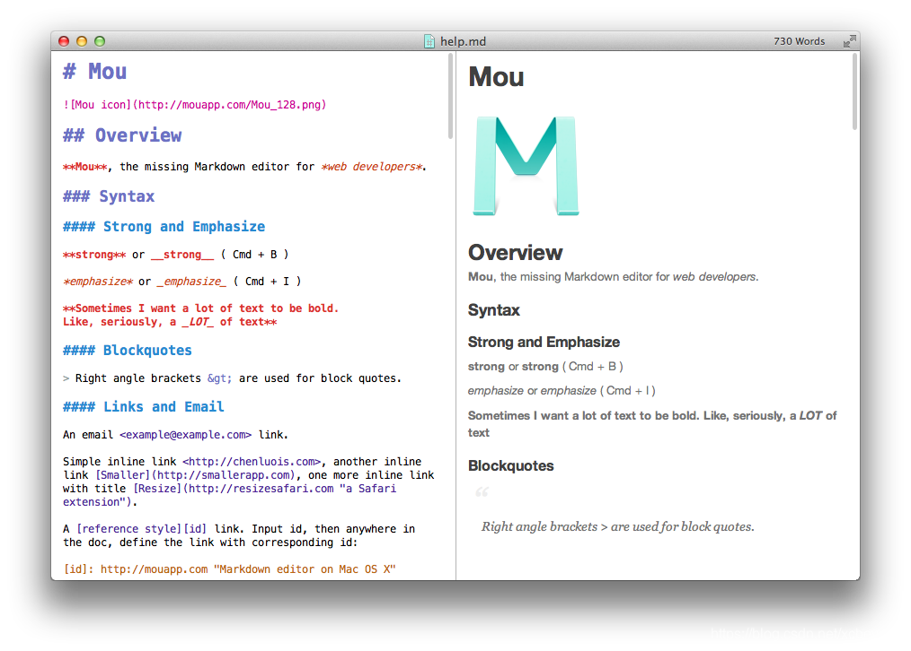

# 文档写作利器：Markdown


# 一、前言

无论你是软件开发者，还是互联网写作者，为了使自己写的文档或作品更好的流通，便于在不同场合、不同环境、不同人群的查看，亟需寻求一种通用、便于扭转、留存的文档格式。

在这之前、现在或者今后，你可能会存在以下这些困扰：

- 作为软件开发者、架构师，写的设计文档到底应该以什么样的格式来保存呢？是word、txt、pdf，还是html呢？这些文档格式，在不同情况下，可能都会存在。有时为了便于评审、修改，会采用word格式；有时为了防止文档篡改，会采用pdf格式；有时为了便于网页浏览(如：GitLib)，会采用html格式。难道要针对不同格式进行不同的编写吗？
- 作为互联网写作者，写的文章希望能够在不同的平台能够发表，分享给更多的人。而在不同互联网平台，如：微信公众号、CSND、知乎、有道云笔记等，文章的排版会花费你大量的时间，不同平台排版上也会存在一些差异性，甚至让你抓狂。难道不同平台要进行不同排版的调整吗？

**办法总比困难多！** 上述的这些困扰，Markdown就能很好的解决，接下来我们一起来了解下它吧。

# 二、Markdown是什么

Markdown是一种可以使用普通文本编辑器编写的标记语言，通过简单的标记语法，它可以使普通文本内容具有一定的格式。

Markdown具有一系列衍生版本，用于扩展Markdown的功能（如表格、脚注、内嵌HTML等等），这些功能原初的Markdown尚不具备，它们能让Markdown转换成更多的格式，例如LaTeX，Docbook。Markdown增强版中比较有名的有Markdown Extra、MultiMarkdown、 Maruku等。这些衍生版本要么基于工具，如Pandoc；要么基于网站，如GitHub和Wikipedia，在语法上基本兼容，但在一些语法和渲染效果上有改动。

Markdown也是最受欢迎的写作"标记语言"，它的简洁语法代替了排版，而不像一般我们用的字处理软件Word有大量的排版、字体设置等。它使我们**更专心于码字，用"标记"语法，来替代常见的排版格式**。

目前，支持Markdown语法的编辑器、平台、工具有很多，如：CSDN、简书、GitLab等，有的还支持了Markdown的导入、常见格式的导出，都十分的方便、高效。

## 优点

- 专注你的文字内容而不是排版样式，安心写作。
- 轻松的导出 HTML、PDF 和本身的 .md 文件。
- 纯文本内容，兼容所有的文本编辑器与字处理软件。
- 随时修改你的文章版本，不必像字处理软件生成若干文件版本导致混乱。
- 可读、直观、学习成本低。

## 误区

> We believe that writing is about content, about what you want to say – not about fancy formatting.

我们坚信写作写的是内容，所思所想，而不是花样格式。

Markdown旨在简洁、高效，也由于Markdown的易读易写，人们用不同的编程语言实现了多个版本的解析器和生成器，这就导致了目前不同的Markdown工具集成了不同的功能（基础功能大致相同），例如流程图与时序图，复杂表格与复杂公式的呈现，虽然功能的丰富并没有什么本质的缺点，但终归有些背离初衷，何况在编写的过程中很费神，不如使用专业的工具撰写来的更有效率，所以如果你需实现复杂功能，专业的图形界面工具会更加方便。当然，如果你对折腾这些不同客户端对 Markdown 的定制所带来高阶功能感到愉悦的话，那也是无可厚非的。

# 三、Markdown语法

下面介绍的是最常用的Markdown语法，包括语法说明、效果展示。其中，同一种类效果可能会有多种写法，第一种为标准语法，不同Markdown编辑器，会支持不同的特殊语法，并且展示效果上有细微差异。

## 1、标题

使用`#`标签表示标题，`#`和标题之间必须有空格。一级标题使用一个`#`，二级标题使用两个`##`，以此类推，共有六级标题。

语法如下：

```markdown
# 标题H1
## 标题H2
### 标题H3
#### 标题H4
##### 标题H5
###### 标题H6
```

效果如下： 

## 2、字符效果

- 删除线：使用`~~删除线~~`或`<s>删除线</s>`标签
- 斜体字：使用`*斜体字*`或`_斜体字_`标签
- 粗体字：使用`**粗体字**`或`__粗体字__`标签
- 上标：使用`O<sup>2</sup>`标签
- 下标：使用`X<sub>2</sub>`标签
- 缩写：使用HTML中的abbr标签，如：<abbr title="Hyper Text Markup Language">HTML</abbr>

语法如下：

```markdown
~~删除线1~~ <s>删除线2</s>  
*斜体字1* _斜体字2_  
**粗体字1** __粗体字2__  
X<sub>2</sub>  
O<sup>2</sup>  
The <abbr title="Hyper Text Markup Language">HTML</abbr> specification is maintained by the <abbr title="World Wide Web Consortium">W3C</abbr>.
```

效果如下： 

## 3、引用

使用`>`标签表示引用，`>>`标签表示引用里面再套一层引用，依次类推。

语法如下：

```markdown
>这是一级引用文本内容  
>>这是二级引用文本内容  
>>>这是三级引用文本内容
```

效果如下： 

## 4、代码高亮

**代码块：**

使用3个连续的` 标签包围起来。

语法如下：  效果如下： 

**行内代码：**

使用``标签表示行内代码。

语法如下：

```markdown
执行命令：`npm install marked`
```

效果如下： 

## 5、链接

使用`[](link)`标签表示链接。其中，`[]`内的内容为要添加链接的文字，`link`为链接地址。

语法如下：

```markdown
[普通链接](https://blog.csdn.net/xcbeyond)  
[普通链接带标题](https://blog.csdn.net/xcbeyond "普通链接带标题")  
直接链接：<https://blog.csdn.net/xcbeyond>
```

效果如下： 

## 6、图片

使用``标签导入图片。其中，`Alt text`为如果图片无法显示时显示的文字，`/path/to/img.jpg`为图片所在路径。

语法如下：

```markdown

```

效果如下： 

## 7、列表

列表分为有序列表、无序列表，如下：

- 有序列表：使用`1. 2. 3. `标签表示，其中`.`后面有一个空格的。
- 无序列表：使用`*`或`-`或`+`标签表示。

**有序列表:**

语法如下：

```markdown
1. 第一行
2. 第二行
3. 第三行
```

效果如下：  **无序列表:**

语法如下：

```markdown
+ 列表一
+ 列表二
    + 列表二-1
    + 列表二-2
    + 列表二-3
* 列表三
    * 列表三-1
    * 列表三-2
    * 列表三-3
```

效果如下： 

## 8、分割线

使用`---`、`***`或者`* * *`标签表示水平分割线，其中大于三个。

语法如下：

```markdown
---
***
* * *
```

效果如下： 

## 9、表格

语法如下：

```markdown
| Heading | Heading | Heading |
| ------- | ------- | ------- |
|   Cell  |   Cell  |   Cell  |
|   Cell  |   Cell  |   Cell  |

| Heading | Heading | Heading |
| :----- | :----: | ------: |
| 左对齐 | 居中 | 右对齐 |
| 左对齐 | 居中 | 右对齐 |
```

效果如下： 

## 10、流程图

流程图常用的有一般流程图、序列图，不同Markdown编辑器，语法也是不同的。如下分别说明了其中一种写法，其他写法可自行具体查阅相关资料。

（注：个别编辑器可能无法正常显示效果。）

**流程图：**

语法如下： 

效果如下： 

**序列图：** 语法如下：  效果如下： 

# 四、Markdown常用编辑器及工具

如何更好的使用Markdown，工具必不可少，在此介绍我用过的几款工具，分享给大家，以满足不同使用场景。

**对于工具而言，只要自己用着顺手，就是最好的**

## 1、Typora

Typora是一款轻便简洁的Markdown编辑器，支持即时渲染技术，这也是与其他Markdown编辑器最显著的区别。即时渲染使得你写Markdown就想是写Word文档一样流畅自如，不像其他编辑器的有编辑栏和显示栏。并且支持多种主题以供选择，如：GitHub、Newsprint等，如下图所示。

官方地址：[https://www.typora.io/](https://www.oschina.net/action/GoToLink?url=https%3A%2F%2Fwww.typora.io%2F) 

## 2、MarkdownPad2

MarkdownPad2是一个windows上的Markdown编辑器，需下载安装，便于离线使用，如下图所示。

官方地址：[http://markdownpad.com/](https://www.oschina.net/action/GoToLink?url=http%3A%2F%2Fmarkdownpad.com%2F) 

## 3、Mou

Mou是Mac上的Markdown编辑器，两栏界面，直观清爽，功能简洁到位，而且免费，如小图所示。

不仅如此，Mou还有一些有趣的偏好设置（Preference），例如主题（Themes）与样式（CSS），它们可以配置出定制化的文本编辑效果与导出效果，如果你对自带的主题与样式不满意还可以到 GitHub上搜索其它爱好者为Mou编写的更多主题样式，导入的方式可以在偏好设置的Themes或CSS选项中选择reload。

官方地址：[http://25.io/mou/](https://www.oschina.net/action/GoToLink?url=http%3A%2F%2F25.io%2Fmou%2F) 

## 4、MdEditor

mdeditor是一个在线编辑markdown的工具，无需本地安装，在线随时编辑、直接预览、随时导出，还提供对应标签的图标快捷操作，如下图所示。

在线编辑完后，可导出保存到本地`.md`文件即可。

官方地址：[https://www.mdeditor.com/](https://www.oschina.net/action/GoToLink?url=https%3A%2F%2Fwww.mdeditor.com%2F) 

## 5、coolaf md

我姑且就叫它为coolaf md，它是一款在线Markdown编辑、各种格式导出的工具，支持导出Word、HTML、PDF格式的文档，非常好用，强烈推荐使用，如下图所示。

官方地址：[http://coolaf.com/tool/md](https://www.oschina.net/action/GoToLink?url=http%3A%2F%2Fcoolaf.com%2Ftool%2Fmd) 

## 6、Md2All

Md2All是一款在线Markdown编辑，方便复制粘贴，一键排版，自定义CSS，80多种代码高亮，所有的样式渲染非常完美，包括图片加字也有方案支持。无需作任何调整就能**一键复制**到微信公众号、博客园、掘金、知乎、csdn、51cto等平台，如下图所示。

官方地址：[http://md.aclickall.com/](https://www.oschina.net/action/GoToLink?url=http%3A%2F%2Fmd.aclickall.com%2F) 

------

*参考文章：*

1. [https://zhuanlan.zhihu.com/p/92312642](https://www.oschina.net/action/GoToLink?url=https%3A%2F%2Fzhuanlan.zhihu.com%2Fp%2F92312642)
2. [https://www.jianshu.com/p/1e402922ee32](https://www.oschina.net/action/GoToLink?url=https%3A%2F%2Fwww.jianshu.com%2Fp%2F1e402922ee32)
3. [http://markdownpad.com/](https://www.oschina.net/action/GoToLink?url=http%3A%2F%2Fmarkdownpad.com%2F)
4. [http://25.io/mou/](https://www.oschina.net/action/GoToLink?url=http%3A%2F%2F25.io%2Fmou%2F)

# 原文地址

[文档写作利器：Markdown]: https://my.oschina.net/xcbeyond/blog/5122602

