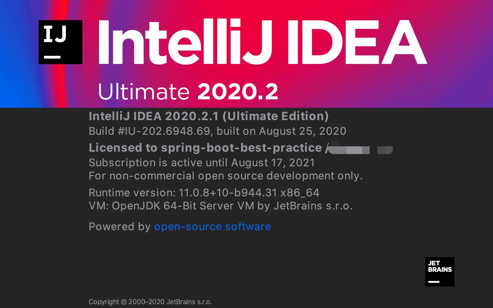
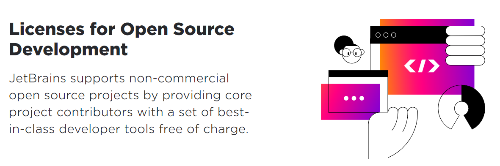
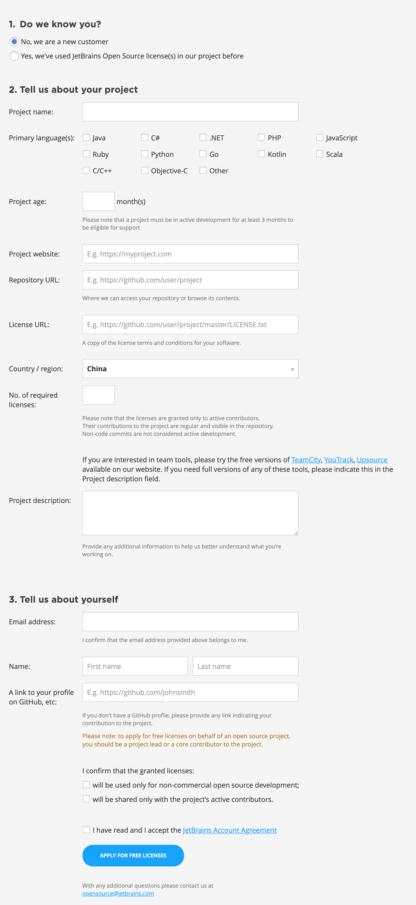
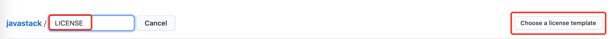
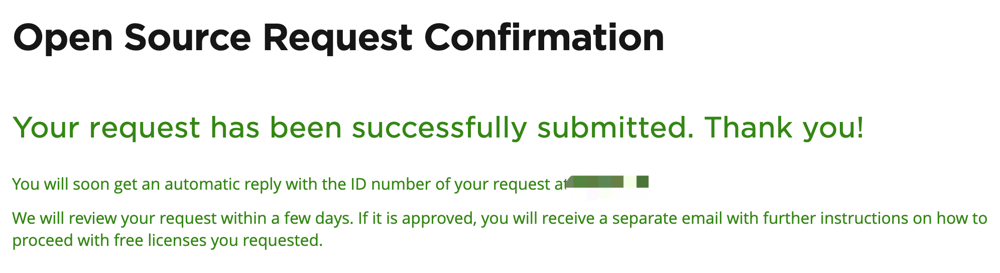
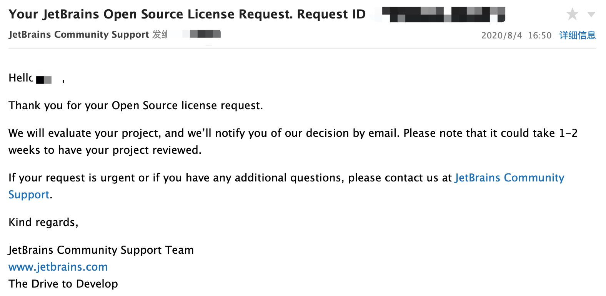
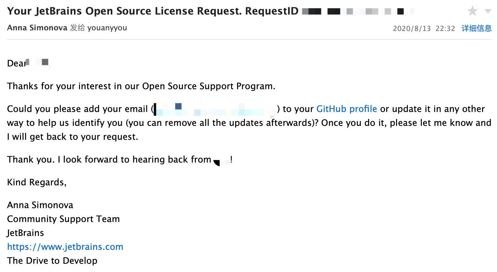
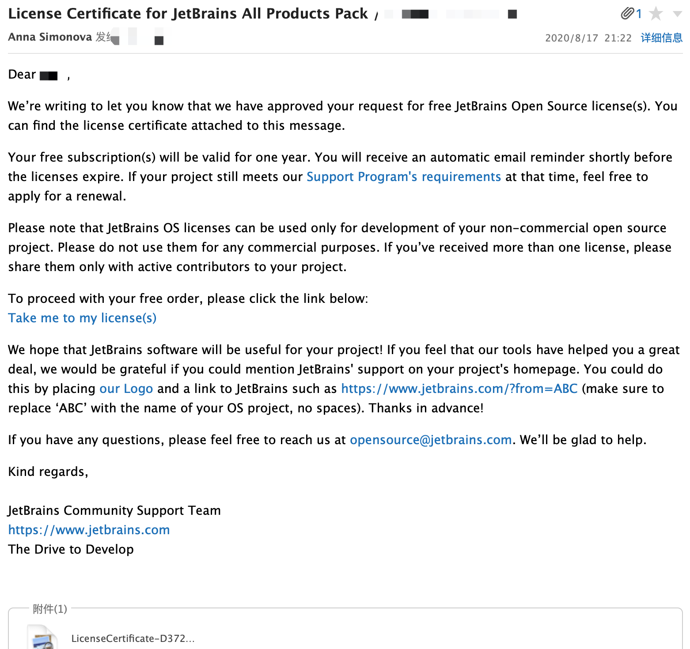
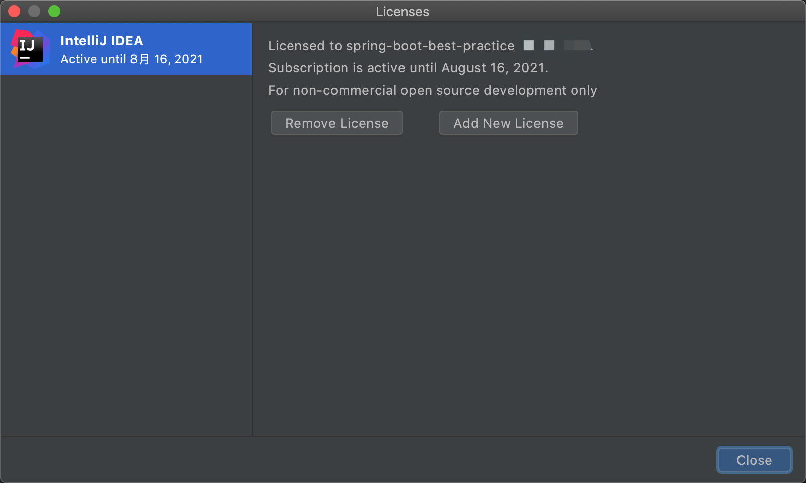

# 靠开源项目弄到 IntelliJ IDEA 激活码

上次，栈长分享了《[免费获取 IntelliJ IDEA 激活码的 6 种方式！](https://mp.weixin.qq.com/s/5JSORIDwdmWMzxPGSWD2AA)》，反响热烈，其中有一项是靠开源项目获取免费激活码，栈长也尝试了下，成功靠开源项目获取到了激活码，真香！！

申请过程也并不是 100% 顺利，其中还是有一些曲折的。

所以，这篇就是分享下如何靠开源项目获取到正规激活码的过程及注意的地方，如果你照着做，你也能够拿到。

下面是激活详情：

栈长就是通过下面这个 Spring Boot 实战开源项目申请到的一年的免费使用权。

> https://github.com/javastacks/spring-boot-best-practice

一年之后，如果这个项目还在维持，还可以继续申请。

## 开源项目的条件

非商业开源项目可以获得所有 JetBrains 工具的免费许可证，前提是项目需要满足支持计划的要求：

1）符合开源的要求；

> https://opensource.org/docs/osd

2）正在开发状态，并且最近 3 个月内有新代码提交，也就是说这个开源项目必须维护了三个月；

3）不提供有开源代码的付费版本，也不能有任何围绕开源项目的商业服务；

4）不是由商业公司、机构发行的；

5）不付费给开源项目开发人员；

这个许可证仅供开源项目使用，并且只提供给开源项目的创建者和核心开发人员。

## 开始申请

如果你已经有一个开源项目有了三个月并且最近有在维护，那么可以马上去申请，如果没有，现在开始搞一个，三个月之后再申请。

申请入口：

> https://www.jetbrains.com/shop/eform/opensource

申请表单：

申请表单很简单，大多都是项目和个人的基本信息，挑几个重要的说吧！

**1、Project age（项目年龄）**

这里也说了：

> Please note that a project must be in active development for at least 3 months to be eligible for support

请注意，一个项目必须在积极开发至少 3 个月才能获取支持资格。

> https://github.com/javastacks/spring-boot-best-practice

栈长申请的这个项目就已经是远远超过了 3 个月，填写实际项目年龄即可。

**2、License URL（许可证地址）**

需要在你的项目中创建一个开源许可证，比如我在 Spring Boot 示例项目中用的是 Apache License 2.0。

创建很简单，以 Github 为例，点击创建文件，然后在文件名输入框中输入 “**LICENSE**“，然后右边就会自动出现一个按钮：

点击该按钮可供你选择开源许可证模板：

然后选择一个适合你的开源许可证，按提示完成许可证创建操作即可。

**3、No. of required licenses（申请许可证数量）**

关于这个条件的说明：

> Please note that the licenses are granted only to active contributors.
> Their contributions to the project are regular and visible in the repository.
> Non-code commits are not considered active development.

请注意，许可证只授予活跃贡献者。他们对项目的贡献是正常的并且能够在代码存储库中看到，没有代码的提交不会认为是活跃开发者。

必须要有代码提交才行，意味着你不能通过强制 `push` 蒙混过关。

了解规则之后，再看看你的项目活跃贡献者有几个，填入对应的申请数量即可。

**4、其他要求**

1）利用开源项目申请许可证，申请人必须是开源项目的拥有者或者核心贡献成员；

2）许可证只能用于非商业的开源项目开发；

3）许可证只能分享给开源项目的活跃贡献成员；

填完所有必要信息之后，点击按钮完成提交申请：

你所填的邮箱中会得到一封申请确认邮件：

JetBrains 需要 1-2 周时间来评估项目，评估完后会邮件通知结果。

## 申请结果

过了 9 天之后，JetBrains 终于来信了：

我的项目评估出问题了，说不能识别 “我是我”，需要我把 XX 邮箱更新到 Github Profile 上面，或者任何其他方式帮助识别 “我是我”，比如移除所有的 `updates` 操作。

原来是项目代码的提交人邮箱和我提交许可证申请的邮箱不一致造成的，既然知道原因了就好办了，我把所有历史提交人的邮箱全部改成了提交申请时候的邮箱，然后再邮件回复了 JetBrains。（修改 Git 历史信息也是复杂操作，后续再另外出一篇，公众号Java技术栈第一时间推送）

4天后，我获取到激活码了……

最后根据邮件链接获取到了一年免费的许可证（JetBrains 所有产品），激活方式和其他渠道一样，可以通过 JetBrains 账户、激活码的方式进行激活。

许可证过期前还会收到续期提醒，如果开源项目还符合上面所说的条件，那么还能继续申请。

## 总结

栈长成功通过开源项目申请到了免费许可证，一点小小的经验分享给大家了，希望能帮到那些到处找激活码的小伙伴了。

其实也并不难，有一个超过 3 个月的开源项目即可，要确保成功率，文中提到的一些细节就要注意了，栈长从申请到拿证也就 13 天，其中反复沟通也是拖慢了申请进度。

需要注意的是，开源项目申请的许可证只能开发开源项目，不能用于商业用途，如果用了会怎么样，我也不知道，被发现可能就再也申请不了了（我猜的，具体看授权协议）。

最后，关注Java技术栈微信公众号，栈长将继续分享好玩的 Java 技术，公众号第一时间推送，在公众号后台回复：IDEA，可以获取历史 IDEA 教程，都是干货。

如果有帮助，点个在看鼓励一下哦！也欢迎分享转发给更多有需要的朋友～

## 原文地址

[靠开源项目弄到 IntelliJ IDEA 激活码]: https://www.javastack.cn/article/2020/intellij-idea-by-open-source-project/

