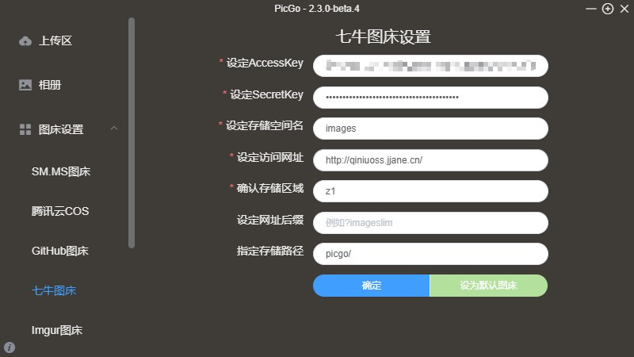
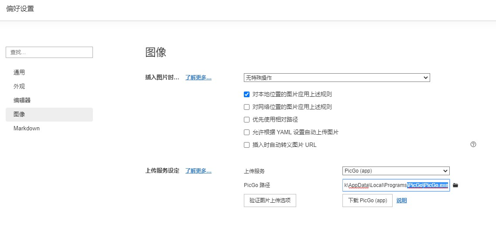
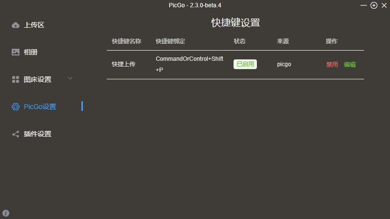

# Typora+PicGo+七牛云实现图片上传

> 用过 Markdown 的朋友一定会深深爱上这种优雅的写作方式。
>
> 本人作为一个 Markdown 的忠实爱好者，推荐使用Typora，再搭配一个免费图床，保证分享 Markdown 文件时，也可以看到图片。
>
> **解决方案是：七牛云（免费）+ Picgo + Typora**
>
> 可以把本地的图片上传到服务器，在 Typora（或其他Markdown软件） 里显示出来。

## 七牛云注册

1. 点击[七牛云官网](https://www.qiniu.com/) → 点击**免费注册**

2. **填写注册信息( 填写手机号、真实姓名，后面需要进行实名认证)**

3. **实名认证**

## 七牛云配置存储空间

> 实名认证审核成功后，你需要在七牛云新建配置一个存储空间，用来存储你的图片。

1.点击**对象存储Kodo** →点击**空间管理** →  点击**新建空间** → 填写配置信息（如图）

- **存储空间名称**可以自己命名
- **存储区域**选一个离自己近的即可
- **访问控制** **公开**

2.填写好之后，在**文件管理**这里可以上传自己的图片

3.上传完成后，可以在这里**复制外链**。

但每次添加个本地图片都要打开七牛云也太难过了，所以 PicGo 来了。

## 配置 PicGo

1.下载安装 [PicGo](https://github.com/Molunerfinn/PicGo/releases)[根据自己的电脑平台来选择相应的安装文件进行下载]

2.打开**PicGo**

3.点击**图床设置** → 点击**七牛图床** → 填写配置信息

另外，七牛云的存储对象的存储区域对应表如下：

- **AccessKey** 和 **SecretKey** 可以从**右上角头像**的**个人中心**，**密钥管理**复制获得。

  

- **存储空间名**和你七牛云存储上设置的保持一致。

- **访问地址**在 **空间概览** 里的 **CDN 加速域名** 中获取（记得前面加`http://`）。

  

## 配置Typora

设置 → 偏好设置 → 图像，选择上传服务和PicGo路径

完成后，点击**验证图片上传选项**验证一下

## 上传图片测试

### 第一种方式

使用快捷键复制图片 `Ctrl+C` → 上传图片到七牛云 `Ctrl+Shift+P` → Typora 里粘贴图片 `Ctrl+V`

- 上传图片的快捷键可以在这里修改

  

- 上传好图片自动复制了 Markdown 格式的链接，你只需粘贴即可。当然，也可以在这里修改。

  

### 第二种方式

拖拽图片到状态栏的图片 → Markdown 里粘贴图片 ctrl+v

### 第三种方式

直接粘贴剪切板中的图片到Typora中，按下面步骤，右键上传到PicGo

