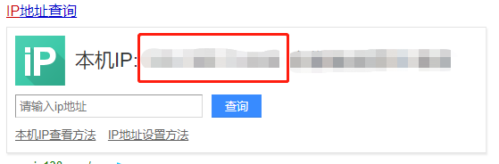

# 使用快递鸟进行电子面单的获取以及打印

> 快递鸟连接多家物流公司，一次接入即可对接主流20多家物流公司电子面单下单通道，为订单信息化、标准化提供保障服务。 并实时反向推送揽件前接单信息、揽件后轨迹信息、签收后快递员评价等功能，发货后短信通知等功能。下面就使用快递鸟接入顺丰电子面单跟大家分享一下经验。
>
> 框架用的是SpringBoot，参考若依。

## 准备
### 下载打印组件

先到快递鸟官网下载所需的打印组件 [下载打印组件](http://www.kdniao.com/documents-instrument)


### 准备要使用的Java工具类

```java
import com.alibaba.fastjson.JSON;
import com.alibaba.fastjson.JSONObject;
import com.sun.org.apache.xerces.internal.impl.dv.util.Base64;
import javax.servlet.http.HttpServletRequest;
import java.io.BufferedReader;
import java.io.IOException;
import java.io.InputStreamReader;
import java.io.OutputStreamWriter;
import java.io.UnsupportedEncodingException;
import java.net.HttpURLConnection;
import java.net.URL;
import java.net.URLEncoder;
import java.security.MessageDigest;
import java.util.HashMap;
import java.util.Map;

public class PrintTemplateUtils {
    /**
     * 电商ID 请到快递鸟官网申请http://kdniao.com/reg'
     */
    private final static String E_BUSINESS_ID = "";
    
    /**
     * AppKey 电商加密私钥，快递鸟提供，注意保管，不要泄漏
     * 请到快递鸟官网申请http://kdniao.com/reg
     */
    private final static String APP_KEY = "";

    /**
     * 正式请求地址
     * 测试地址可以到快递鸟官网查找
     */
    private final static String REQ_URL ="http://api.kdniao.com/api/EOrderService";
    
    /**
     * 是否预览 0-不预览 1-预览
     */
    private final static Integer IS_PREVIEW = 0;

    /**
    * 获取电子面单
    */
    public static String orderOnlineByJson(String requestData) throws Exception{
        Map<String, String> params = new HashMap<String, String>();
        params.put("RequestData", URLEncoder.encode(requestData, "UTF-8"));
        params.put("EBusinessID", E_BUSINESS_ID);
        params.put("RequestType", "1007");
        String dataSign=encrypt(requestData, APP_KEY, "UTF-8");
        params.put("DataSign", URLEncoder.encode(dataSign, "UTF-8"));
        params.put("DataType", "2");
		//发送请求，获取面单
        String result=sendPost(REQ_URL, params);
        //根据公司业务处理返回的信息......
        return result;
    }

   /**
     * 电商Sign签名生成
     * 把(请求内容(未编码)+AppKey)进行MD5加密，然后Base64编码，最后 进行URL(utf-8)编码
     * @param content 内容   
     * @param keyValue Appkey  
     * @param charset 编码方式
	 * @throws UnsupportedEncodingException ,Exception
	 * @return DataSign签名
     */
   private static String encrypt (String content, String keyValue, String charset) throws UnsupportedEncodingException, Exception {
        if (keyValue != null)
        {
            return base64(md5(content + keyValue, charset), charset);
        }
        return base64(md5(content, charset), charset);
    }

    /**
     * base64编码
     * @param str 内容       
     * @param charset 编码方式
	 * @throws UnsupportedEncodingException 
     */
    private static String base64(String str, String charset) throws UnsupportedEncodingException{
        String encoded = Base64.encode(str.getBytes(charset));
        return encoded;
    }

    /**
     * 向指定 URL 发送POST方法的请求     
     * @param url 发送请求的 URL    
     * @param params 请求的参数集合     
     * @return 远程资源的响应结果
     */
    private static String sendPost(String url, Map<String, String> params) {
        OutputStreamWriter out = null;
        BufferedReader in = null;
        StringBuilder result = new StringBuilder();
        try {
            URL realUrl = new URL(url);
            HttpURLConnection conn =(HttpURLConnection) realUrl.openConnection();
            // 发送POST请求必须设置如下两行
            conn.setDoOutput(true);
            conn.setDoInput(true);
            // POST方法
            conn.setRequestMethod("POST");
            // 设置通用的请求属性
            conn.setRequestProperty("accept", "*/*");
            conn.setRequestProperty("connection", "Keep-Alive");
            conn.setRequestProperty("user-agent",
                    "Mozilla/4.0 (compatible; MSIE 6.0; Windows NT 5.1;SV1)");
            conn.setRequestProperty("Content-Type", "application/x-www-form-urlencoded");
            conn.connect();
            // 获取URLConnection对象对应的输出流
            out = new OutputStreamWriter(conn.getOutputStream(), "UTF-8");
            // 发送请求参数
            if (params != null) {
                StringBuilder param = new StringBuilder();
                for (Map.Entry<String, String> entry : params.entrySet()) {
                    if(param.length()>0){
                        param.append("&");
                    }
                    param.append(entry.getKey());
                    param.append("=");
                    param.append(entry.getValue());
                    System.out.println(entry.getKey()+":"+entry.getValue());
                }
                System.out.println("param:"+param.toString());
                out.write(param.toString());
            }
            // flush输出流的缓冲
            out.flush();
            // 定义BufferedReader输入流来读取URL的响应
            in = new BufferedReader(
                    new InputStreamReader(conn.getInputStream(), "UTF-8"));
            String line;
            while ((line = in.readLine()) != null) {
                result.append(line);
            }
        } catch (Exception e) {
            e.printStackTrace();
        }
        //使用finally块来关闭输出流、输入流
        finally{
            try{
                if(out!=null){
                    out.close();
                }
                if(in!=null){
                    in.close();
                }
            }
            catch(IOException ex){
                ex.printStackTrace();
            }
        }
        return result.toString();
    }

    /**
     * MD5加密
     * @param str 内容       
     * @param charset 编码方式
	 * @throws Exception 
     */
    private static String md5(String str, String charset) throws Exception {
        MessageDigest md = MessageDigest.getInstance("MD5");
        md.update(str.getBytes(charset));
        byte[] result = md.digest();
        StringBuffer sb = new StringBuffer(32);
        for (int i = 0; i < result.length; i++) {
            int val = result[i] & 0xff;
            if (val <= 0xf) {
                sb.append("0");
            }
            sb.append(Integer.toHexString(val));
        }
        return sb.toString().toLowerCase();
    }
    
	/*以上便是获取电子面单所用到的方法了*/
	
    /**
     * 获取数据并打印
     * @param ip 客户端IP(非用户服务器IP)
     * @param data 请求数据
     */
    public static JSONObject getPrintParam(String ip,String data){
        String requestData= null;
        String result = "";
        try {
            requestData = URLEncoder.encode(data, "UTF-8");
            String dataSign=encrypt(ip + data, APP_KEY,"UTF-8");
            result = "{\"RequestData\": \"" + requestData + "\"," +
                    " \"EBusinessID\":\"" + E_BUSINESS_ID + "\"," +
                    " \"DataSign\":\"" + dataSign + "\", " +
                    "\"IsPreview\":\"" + IS_PREVIEW + "\"}";
        } catch (UnsupportedEncodingException e) {
            e.printStackTrace();
        } catch (Exception e) {
            e.printStackTrace();
        }
        JSONObject jsonObject=JSON.parseObject(result);
        return jsonObject;
    }


    /**
     * 获取请求主机IP地址,如果通过代理进来，则透过防火墙获取真实IP地址;
     * 获取客户端IP(非用户服务器IP)
     * @param request
     * @return
     * @throws IOException
     */
    public static String getIpAddress(HttpServletRequest request) {
        // 获取请求主机IP地址,如果通过代理进来，则透过防火墙获取真实IP地址

        String ip = request.getHeader("X-Forwarded-For");

        if (ip == null || ip.length() == 0 || "unknown".equalsIgnoreCase(ip)) {
            if (ip == null || ip.length() == 0 || "unknown".equalsIgnoreCase(ip)) {
                ip = request.getHeader("Proxy-Client-IP");
            }
            if (ip == null || ip.length() == 0 || "unknown".equalsIgnoreCase(ip)) {
                ip = request.getHeader("WL-Proxy-Client-IP");
            }
            if (ip == null || ip.length() == 0 || "unknown".equalsIgnoreCase(ip)) {
                ip = request.getHeader("HTTP_CLIENT_IP");
            }
            if (ip == null || ip.length() == 0 || "unknown".equalsIgnoreCase(ip)) {
                ip = request.getHeader("HTTP_X_FORWARDED_FOR");
            }
            if (ip == null || ip.length() == 0 || "unknown".equalsIgnoreCase(ip)) {
                ip = request.getRemoteAddr();
            }
        } else if (ip.length() > 15) {
            String[] ips = ip.split(",");
            for (int index = 0; index < ips.length; index++) {
                String strIp = (String) ips[index];
                if (!("unknown".equalsIgnoreCase(strIp))) {
                    ip = strIp;
                    break;
                }
            }
        }
        return ip;
    }

}
```


**注意：**

代码中获取IP的方法，如果是在本地内网测试用的话，到百度直接百度ip来获取



## Controller 代码

```java
@Controller
@RequestMapping(value = "/order")
public class OrderController extends BaseController {
	@Autowired
    OrderService orderService;
    @Autowired
    WaybillService waybillService;
    @Autowired
    SenderService senderService;
    @Autowired
    PrinterService printerService;
    
	/**
	*批量获取电子面单
	*/
	@RequestMapping("/getWaybill/{ids}")
    @ResponseBody
    public AjaxResult toPrint(@PathVariable("ids") String ids){
    	//查找寄货地址 一般就一个，所以就get(0),可根据自己需求获取
        List<Sender> senders=senderService.selectSenderList();
        /**
        *以下是为了防止没有获取到寄件地址，参数为空的情况
        *具体requestData 中参数的说明参考快递鸟官方文档
        *http://www.kdniao.com/api-eorder
        */
        String company=senders.size()>0?senders.get(0).getCompany():"xxxxx";
        String name=senders.size()>0?senders.get(0).getSenderName():"xxxx";
        String mobile=senders.size()>0?senders.get(0).getMobile():"xxxx";
        String province=senders.size()>0?senders.get(0).getProvince():"xxxx";
        String city=senders.size()>0?senders.get(0).getCity():"xxxx";
        String expArea=senders.size()>0?senders.get(0).getExpArea():"xxxxx";
        String address=senders.size()>0?senders.get(0).getAddress():"xxxx";
        List<Order> list = orderService.selectOrderListByIds(ids);
        for(Order order:list){
            //要请求的数据
            String requestData;
            if (null != order && null != order.getProduct()) {
                requestData = "{'OrderCode': '" + order.getOrderNo() + "'," +
                        /*"'CustomerName':'testyd'," +
                        "'CustomerPwd':'testydpwd'," +*/
                        "'ShipperCode':'SF'," +
                        "'PayType':1," +
                        "'ExpType':1," +
                        /*"'Cost':0.0," +*/
                        "'OtherCost':"+order.getPayment()+"," +
                        "'Sender':" +
                        "{" +
                        "'Company':'"+company+"','Name':'"+name+"','Mobile':'"+mobile+"','ProvinceName':'"+province+"','CityName':'"+city+"','ExpAreaName':'"+expArea+"','Address':'"+address+"'}," +
                        "'Receiver':" +
                        "{" +
                        "'Company':'','Name':'" + order.getConsignee() + "','Mobile':'" + order.getConsigneePhone() +
                        "','ProvinceName':'" + order.getProvince() + "','CityName':'" + order.getCity() + "','ExpAreaName':'" + order.getDistrict() + "','Address':'" + order.getAddress() + "'}," +
                        "'Commodity':" +
                        "[{" +
                        "'GoodsName':'" + order.getProduct().getProName() + "','Goodsquantity':1,'GoodsWeight':0}]," +
                        "'Weight':0," +
                        "'Quantity':1," +
                        "'Volume':0.0," +
                        "'Remark':''," +
                        "'IsReturnPrintTemplate':1}";
                try {
                    //根据请求数据获取电子面单
                    String result = PrintTemplateUtils.orderOnlineByJson(requestData);
                    JSONObject jsonObject = JSON.parseObject(result);
                    
                    JSONObject jsonOrder = (JSONObject) jsonObject.get("Order");
                    //输出看一下面单的内容（就是一整个html）
                    System.out.println(jsonObject.getString("PrintTemplate"));
                    /**
                    *jsonOrder.getString("LogisticCode");
                    *更改订单状态，存运单号，根据自己业务需求改变
                    */
                   
                } catch (Exception e) {
                    e.printStackTrace();
                }
            }
        }
        //返回的消息提示，这里就不贴出AjaxResult了，返回map也行，只要自己知道就行
        return AjaxResult.success();
    }

	/**
	*批量打印电子面单
	*@param ids 选择的订单id拼接的字符串
	*@param printId 打印机id
	*/
	@RequestMapping("/printOrder")
    public String printOrder(String ids,Long printId, HttpServletRequest request,ModelMap map) throws Exception {
        //选择的订单
        List<Order> list = orderService.selectOrderListByIds(ids);
        //请求数据
        String data="[";
        //获取打印机名
        Printer printer=printerService.get(printId);
        String portName="";
        if(null!=printer){
            portName=printer.getPortName();
        }
        for(int i=0;i<list.size();i++){
        	/**
        	*这里的OrderCode就是你订单的单号，不是运单号，切记
        	*是order.getOrderNo() 不是jsonOrder.getString("LogisticCode");
        	*/
            data += "{\"OrderCode\":\""+ list.get(i).getOrderNo()+"\",\"PortName\":\""+portName+"\"}";
            if(i!=list.size()-1){
                data+=",";
            }
        }
        data+="]";
        //再次说一下，内网测试，到百度直接搜ip
        String ip=PrintTemplateUtils.getIpAddress(request);
        JSONObject jsonObject=PrintTemplateUtils.getPrintParam(ip,data);

        //写一个页面存一下这四个参数
        map.put("RequestData",jsonObject.getString("RequestData"));
        map.put("EBusinessID",jsonObject.getString("EBusinessID"));
        map.put("DataSign",jsonObject.getString("DataSign"));
        map.put("IsPreview",jsonObject.getString("IsPreview"));
        return prefix+"/printOrder";
    }
}
```

## 面单打印提交页面

```html
<!DOCTYPE html>
<html lang="zh" xmlns:th="http://www.thymeleaf.org" xmlns:shiro="http://www.pollix.at/thymeleaf/shiro">
<head>
    <th:block th:include="include :: header('参数预览')" />
</head>
<body class="white-bg">
<div class="wrapper wrapper-content animated fadeInRight ibox-content">
    
    <form class="form-horizontal m" id="form-print" action="http://www.kdniao.com/External/PrintOrder.aspx" method="post" target="_self">
        <div class="form-group">
            <label class="col-sm-3 control-label">请求数据：</label>
            <div class="col-sm-8">
                <input id="RequestData" name="RequestData" th:value="${RequestData}" class="form-control" type="text" readonly required>
            </div>
        </div>
        <div class="form-group">
            <label class="col-sm-3 control-label">用户ID：</label>
            <div class="col-sm-8">
                <input id="EBusinessID" name="EBusinessID" th:value="*{EBusinessID}" class="form-control" type="text" readonly required>
            </div>
        </div>
        <div class="form-group">
            <label class="col-sm-3 control-label">签名：</label>
            <div class="col-sm-8">
                <input id="DataSign" name="DataSign" th:value="*{DataSign}" class="form-control" type="text" readonly required>
            </div>
        </div>

        <div class="form-group" style="display: none">
            <label class="col-sm-3 control-label">是否预览：</label>
            <div class="col-sm-8">
                <input id="IsPreview" name="IsPreview" th:value="*{IsPreview}" class="form-control" type="text" readonly required>
            </div>
        </div>
    </form>
</div>

<th:block th:include="include :: footer" />
<script th:inline="javascript">
    //表单提交
    function submitHandler() {
        if ($.validate.form()) {
            $.modal.loading("正在处理中，请稍后...");
            $.modal.disable();
            $("#form-print").submit();
        }
    }
</script>
</body>
</html>
```


参考链接：[https://blog.csdn.net/weixin_43645266/article/details/102621137](https://blog.csdn.net/weixin_43645266/article/details/102621137)
