# Vue 核心

## 初识 Vue

`html`代码如下：

```html
<!DOCTYPE html>
<html>
	<head>
		<meta charset="UTF-8" />
		<title>初识Vue</title>
		<!-- 引入Vue -->
		<script type="text/javascript" src="../js/vue.js"></script>
	</head>
	<body>
		<!-- 准备好一个容器 -->
		<div id="demo">
			<h1>Hello，{{name.toUpperCase()}}，{{address}}</h1>
		</div>

		<script type="text/javascript" >
			Vue.config.productionTip = false //阻止 vue 在启动时生成生产提示。

			//创建Vue实例
			new Vue({
				el:'#demo', //el用于指定当前Vue实例为哪个容器服务，值通常为css选择器字符串。
				data:{ //data中用于存储数据，数据供el所指定的容器去使用，值我们暂时先写成一个对象。
					name:'atguigu',
					address:'北京'
				}
			})

		</script>
	</body>
</html>
```

在浏览器中的效果如下：


> 初识Vue：
>
> ​        1.想让Vue工作，就必须创建一个Vue实例，且要传入一个配置对象；
>
> ​        2.root容器里的代码依然符合html规范，只不过混入了一些特殊的Vue语法；
>
> ​        3.root容器里的代码被称为【Vue模板】；
>
> ​        4.Vue实例和容器是一一对应的；
>
> ​        5.真实开发中只有一个Vue实例，并且会配合着组件一起使用；
>
> ​        6.{{xxx}}中的xxx要写js表达式，且xxx可以自动读取到data中的所有属性；
>
> ​        7.一旦data中的数据发生改变，那么页面中用到该数据的地方也会自动更新；
>
> 
>
> ​        注意区分：js表达式 和 js代码(语句)
>
> ​            1.表达式：一个表达式会产生一个值，可以放在任何一个需要值的地方：
>
> ​                  (1). a
>
> ​                  (2). a+b
>
> ​                  (3). demo(1)
>
> ​                  (4). x === y ? 'a' : 'b'
>
> 
>
> ​            2.js代码(语句)
>
> ​                  (1). if(){}
>
> ​                  (2). for(){}


## 模板语法

Vue.js 使用了基于 HTML 的模板语法，允许开发者声明式地将 DOM 绑定至底层组件实例的数据。所有 Vue.js 的模板都是合法的 HTML，所以能被遵循规范的浏览器和 HTML 解析器解析。

在底层的实现上，Vue 将模板编译成虚拟 DOM 渲染函数。结合响应性系统，Vue 能够智能地计算出最少需要重新渲染多少组件，并把 DOM 操作次数减到最少。

如果你熟悉虚拟 DOM 并且偏爱 JavaScript 的原始力量，你也可以不用模板，[直接写渲染 (render) 函数](https://v3.cn.vuejs.org/guide/render-function.html)，使用可选的 JSX 语法。


Vue模板语法有2大类：     

###  1. 插值语法：

功能：用于解析标签体内容。

写法：{{xxx}}，xxx是js表达式，且可以直接读取到data中的所有属性。          

### 2. 指令语法：

功能：用于解析标签（包括：标签属性、标签体内容、绑定事件.....）。

举例：v-bind:href="xxx" 或  简写为 :href="xxx"，xxx同样要写js表达式，且可以直接读取到data中的所有属性。

备注：Vue中有很多的指令，且形式都是：v-????，此处我们只是拿v-bind举个例子。


```html
<!DOCTYPE html>
<html>
	<head>
		<meta charset="UTF-8" />
		<title>模板语法</title>
		<!-- 引入Vue -->
		<script type="text/javascript" src="../js/vue.js"></script>
	</head>
	<body>		
		<!-- 准备好一个容器-->
		<div id="root">
			<h1>插值语法</h1>
			<h3>你好，{{name}}</h3>
			<hr/>
			<h1>指令语法</h1>
			<a v-bind:href="school.url.toUpperCase()" x="hello">点我去{{school.name}}学习1</a>
			<a :href="school.url" x="hello">点我去{{school.name}}学习2</a>
		</div>
	</body>

	<script type="text/javascript">
		Vue.config.productionTip = false //阻止 vue 在启动时生成生产提示。

		new Vue({
			el:'#root',
			data:{
				name:'jack',
				school:{
					name:'尚硅谷',
					url:'http://www.atguigu.com',
				}
			}
		})
	</script>
</html>
```

## 数据绑定

### 示例

页面效果：

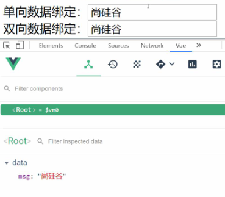

`html`代码：

```html
<!DOCTYPE html>
<html>
	<head>
		<meta charset="UTF-8" />
		<title>数据绑定</title>
		<!-- 引入Vue -->
		<script type="text/javascript" src="../js/vue.js"></script>
	</head>
	<body>		
		<!-- 准备好一个容器-->
		<div id="root">
			<!-- 普通写法 -->
			<!-- 单向数据绑定：<input type="text" v-bind:value="name"><br/>
			双向数据绑定：<input type="text" v-model:value="name"><br/> -->

			<!-- 简写 -->
			单向数据绑定：<input type="text" :value="name"><br/>
			双向数据绑定：<input type="text" v-model="name"><br/>

			<!-- 如下代码是错误的，因为v-model只能应用在表单类元素（输入类元素）上 -->
			<!-- <h2 v-model:x="name">你好啊</h2> -->
		</div>
	</body>

	<script type="text/javascript">
		Vue.config.productionTip = false //阻止 vue 在启动时生成生产提示。

		new Vue({
			el:'#root',
			data:{
				name:'尚硅谷'
			}
		})
	</script>
</html>
```


### 单向数据绑定

1. 语法：v-bind:href ="xxx" 或简写为 :href
2. 特点：数据只能从 data 流向页面

###  双向数据绑定

1. 语法：v-mode:value="xxx" 或简写为 v-model="xxx"

2. 特点：数据不仅能从 data 流向页面，还能从页面流向 data

3. 备注：

   ​         1.双向绑定一般都应用在表单类元素上（如：input、select等）

   ​         2.v-model:value 可以简写为 v-model，因为v-model默认收集的就是value值。


### el 与 data 的两种写法

准备`html`文件

```html
<!DOCTYPE html>
<html>
	<head>
		<meta charset="UTF-8" />
		<title>el与data的两种写法</title>
		<!-- 引入Vue -->
		<script type="text/javascript" src="../js/vue.js"></script>
	</head>
	<body>		
		<!-- 准备好一个容器-->
		<div id="root">
			<h1>你好，{{name}}</h1>
		</div>
	</body>

	<script type="text/javascript">
		Vue.config.productionTip = false //阻止 vue 在启动时生成生产提示。		
	</script>
</html>
```


**el有2种写法：**

第一种写法：new Vue时候配置el属性。

```javascript
const v = new Vue({
    el:'#root', //
    data:{
        name:'尚硅谷'
    }
})
console.log(v)
```

第二种写法：先创建Vue实例，随后再通过vm.$mount('#root')指定 el 的值。

```javascript
const v = new Vue({
    data:{
        name:'尚硅谷'
    }
})
console.log(v)
v.$mount('#root')
```


**data有2种写法**

> 如何选择：目前哪种写法都可以，以后学习到组件时，data必须使用函数式，否则会报错。

(1).对象式

```javascript
new Vue({
    el:'#root',
    //data的第一种写法：对象式
    data:{
        name:'尚硅谷'
    }   
})
```

(2).函数式
```javascript
new Vue({
    el:'#root',
    //data的第二种写法：函数式
    data(){
        console.log('@@@',this) //此处的this是Vue实例对象
        return{
            name:'尚硅谷'
        }
    }
})
```


**注意：**

> **一个重要的原则：**
>
> 由Vue管理的函数，一定不要写箭头函数，一旦写了箭头函数，this就不再是Vue实例了。


## MVVM 模型

1. **M**：模型(Model) ：对应 data 中的数据
2. **V**：视图(View) ：模板
3. **VM**：视图模型(ViewModel) ： Vue 实例对象


`html`示例：

```html
<!DOCTYPE html>
<html>
	<head>
		<meta charset="UTF-8" />
		<title>理解MVVM</title>
		<!-- 引入Vue -->
		<script type="text/javascript" src="../js/vue.js"></script>
	</head>
	<body>		
		<!-- 准备好一个容器-->
		<div id="root">
			<h1>学校名称：{{name}}</h1>
			<h1>学校地址：{{address}}</h1>
			<!-- <h1>测试一下1：{{1+1}}</h1>
			<h1>测试一下2：{{$options}}</h1>
			<h1>测试一下3：{{$emit}}</h1>
			<h1>测试一下4：{{_c}}</h1> -->
		</div>
	</body>

	<script type="text/javascript">
		Vue.config.productionTip = false //阻止 vue 在启动时生成生产提示。

		const vm = new Vue({
			el:'#root',
			data:{
				name:'尚硅谷',
				address:'北京',
			}
		})
		console.log(vm)
	</script>
</html>
```

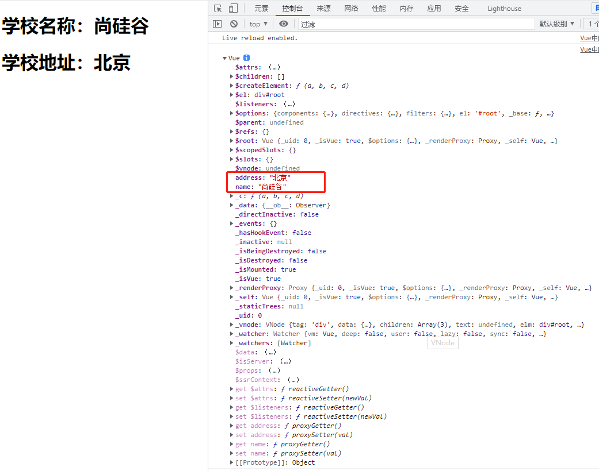

> MVVM模型
> 			1. M：模型(Model) ：data中的数据
> 			2. V：视图(View) ：模板代码
> 			3. VM：视图模型(ViewModel)：Vue实例
> 				观察发现：
> 					1.data中所有的属性，最后都出现在了vm身上。
> 					2.vm身上所有的属性 及 Vue原型上所有属性，在Vue模板中都可以直接使用。

## 数据代理

### 回顾Object.defineproperty方法

Object.defineproperty这个方法，顾名思义，就是给一个对象定义属性用的。


首先我们定义一个person对象，有name和sex属性，现在我想给这个person设置年龄age属性，我们就可以使用Object.defineproperty这个方法来实现：

```javascript
let person = {
    name:'张三',
    sex:'男',
}

Object.defineProperty(person,'age',{
    value:18
})

console.log(person)
```

我们最直接的想法就是，为什么要通过这种方式来添加属性，而不是直接在定义对象时设置属性：

```javascript
let person = {
    name:'张三',
    sex:'男',
    age: 18
}
```

这样不是更方便吗？ 我们之所以不采用这种写法，是因为使用Object.defineproperty这个方式更加的高级，我们可以在定义一个属性时，对其进行很多高级的限制。


下面就通过示例来看看都有哪些可配置项，来对定义的属性进行限制吧。

```javascript
let person = {
    name:'张三',
    sex:'男',
}

Object.defineProperty(person,'age',{
    value:18
})

//打印对象属性的key
console.log(Object.keys(person))
//或者使用下面这种方式打印对象数据
for (let key in person){
    console.log('@'+person[key])
}
```

我们发现打印的结果中没有age属性相关的数据。如果我们想让其能打印出age相关的属性呢？我们只需要加一个`enumerable`配置项就可以了，代码如下：

```javascript
Object.defineProperty(person,'age',{
    value:18,
    enumerable:true
})
```


**基本的配置项**

（1）控制属性是否可以枚举

（2）控制属性是否可以被修改

（3）控制属性是否可以被删除

```javascript
Object.defineProperty(person,'age',{
    value:18,
    enumerable:true, //控制属性是否可以枚举，默认值是false
    writable:true, //控制属性是否可以被修改，默认值是false
    configurable:true //控制属性是否可以被删除，默认值是false
})
```

**高级的配置项（getter和setter）**

```javascript
Object.defineProperty(person,'age',{
    // value:18,
    // enumerable:true, //控制属性是否可以枚举，默认值是false
    // writable:true, //控制属性是否可以被修改，默认值是false
    // configurable:true //控制属性是否可以被删除，默认值是false

    //当有人读取person的age属性时，get函数(getter)就会被调用，且返回值就是age的值
    get(){
        console.log('有人读取age属性了')
        return number
    },

    //当有人修改person的age属性时，set函数(setter)就会被调用，且会收到修改的具体值
    set(value){
        console.log('有人修改了age属性，且值是',value)
        number = value
    }

})
```


最终的`html`示例代码如下：

```html
<!DOCTYPE html>
<html>
	<head>
		<meta charset="UTF-8" />
		<title>回顾Object.defineproperty方法</title>
	</head>
	<body>
		<script type="text/javascript" >
			let number = 18
			let person = {
				name:'张三',
				sex:'男',
			}

			Object.defineProperty(person,'age',{
				// value:18,
				// enumerable:true, //控制属性是否可以枚举，默认值是false
				// writable:true, //控制属性是否可以被修改，默认值是false
				// configurable:true //控制属性是否可以被删除，默认值是false

				//当有人读取person的age属性时，get函数(getter)就会被调用，且返回值就是age的值
				get(){
					console.log('有人读取age属性了')
					return number
				},

				//当有人修改person的age属性时，set函数(setter)就会被调用，且会收到修改的具体值
				set(value){
					console.log('有人修改了age属性，且值是',value)
					number = value
				}

			})

			// console.log(Object.keys(person))

			console.log(person)
		</script>
	</body>
</html>
```

### 何为数据代理

数据代理：通过一个对象代理对另一个对象中属性的操作（读/写）

```html
<!DOCTYPE html>
<html>
	<head>
		<meta charset="UTF-8" />
		<title>何为数据代理</title>
	</head>
	<body>
		<!-- 数据代理：通过一个对象代理对另一个对象中属性的操作（读/写）-->
		<script type="text/javascript" >
			let obj = {x:100}
			let obj2 = {y:200}

			Object.defineProperty(obj2,'x',{
				get(){
					return obj.x
				},
				set(value){
					obj.x = value
				}
			})
		</script>
	</body>
</html>
```

> 我们通过修改obj2的x属性值，就可以修改obj的x属性值。我们获取obj2的x属性值，就可以获取到obj的x属性值。这里我们就实现了通过obj2对obj对象中x属性的操作。

### Vue中的数据代理

```html
<!DOCTYPE html>
<html>
	<head>
		<meta charset="UTF-8" />
		<title>Vue中的数据代理</title>
		<!-- 引入Vue -->
		<script type="text/javascript" src="../js/vue.js"></script>
	</head>
	<body>		
		<!-- 准备好一个容器-->
		<div id="root">
			<h2>学校名称：{{name}}</h2>
			<h2>学校地址：{{address}}</h2>
		</div>
	</body>

	<script type="text/javascript">
		Vue.config.productionTip = false //阻止 vue 在启动时生成生产提示。
		
		const vm = new Vue({
			el:'#root',
			data:{
				name:'尚硅谷',
				address:'宏福科技园'
			}
		})
	</script>
</html>
```

效果如图：

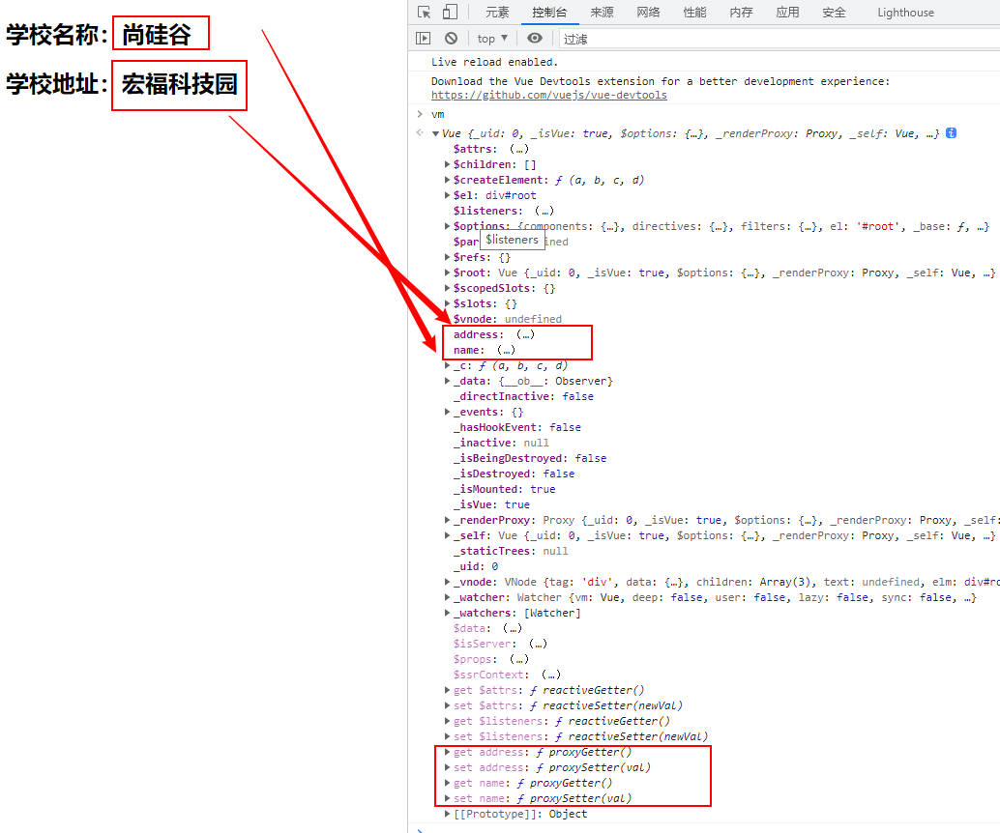


通过下面这张示意图，来了解下Vue完成数据代理的一个简单流程

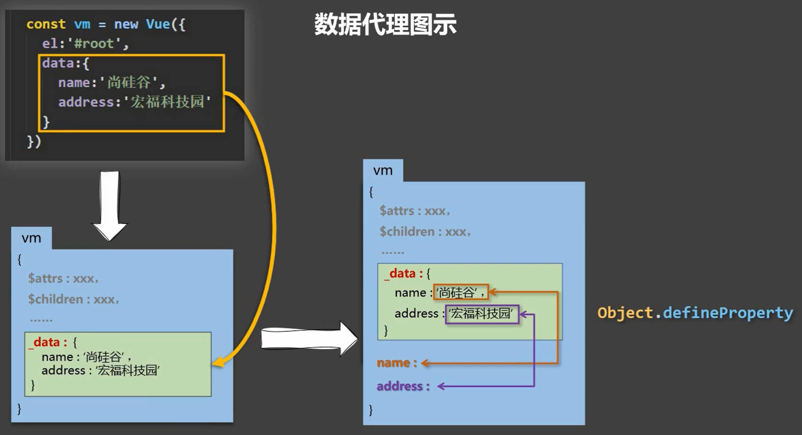

**总结：**

> 1.Vue中的数据代理：
> 			             通过vm对象来代理data对象中属性的操作（读/写）
> 2.Vue中数据代理的好处：
> 			             更加方便的操作data中的数据
> 3.基本原理：
> 							通过Object.defineProperty()把data对象中所有属性添加到vm上。
> 							为每一个添加到vm上的属性，都指定一个getter/setter。
> 							在getter/setter内部去操作（读/写）data中对应的属性。


## 事件处理


### 事件的基本使用

我们可以使用 `v-on` 指令 (通常缩写为 `@` 符号) 来监听 DOM 事件，并在触发事件时执行一些 JavaScript。用法为 `v-on:click="methodName"` 或使用快捷方式 `@click="methodName"`

示例代码如下：

```html
<!DOCTYPE html>
<html>
	<head>
		<meta charset="UTF-8" />
		<title>事件的基本使用</title>
		<!-- 引入Vue -->
		<script type="text/javascript" src="../js/vue.js"></script>
	</head>
	<body>
		<!-- 准备好一个容器-->
		<div id="root">
			<h2>欢迎来到{{name}}学习</h2>
			<!-- <button v-on:click="showInfo">点我提示信息</button> -->
			<button @click="showInfo1">点我提示信息1（不传参）</button>
			<button @click="showInfo2($event,66)">点我提示信息2（传参）</button>
		</div>
	</body>

	<script type="text/javascript">
		Vue.config.productionTip = false //阻止 vue 在启动时生成生产提示。

		const vm = new Vue({
			el:'#root',
			data:{
				name:'尚硅谷',
			},
			methods:{
                showInfo(){
                    alert('同学你好！')
                },
				showInfo1(event){
					// console.log(event.target.innerText)
					// console.log(this) //此处的this是vm
					alert('同学你好！')
				},
				showInfo2(event,number){
					console.log(event,number)
					// console.log(event.target.innerText)
					// console.log(this) //此处的this是vm
					alert('同学你好！！')
				}
			}
		})
	</script>
</html>
```

小结：

> **事件的基本使用：**
>
> ​              1.使用v-on:xxx 或 @xxx 绑定事件，其中xxx是事件名；
>
> ​              2.事件的回调需要配置在methods对象中，最终会在vm上；
>
> ​              3.methods中配置的函数，不要用箭头函数！否则this就不是vm了；
>
> ​              4.methods中配置的函数，都是被Vue所管理的函数，this的指向是vm 或 组件实例对象；
>
> ​              5.@click="methodName" 和 @click="methodName($event)" 效果一致，但后者可以传参；

### 事件修饰符

在事件处理程序中调用 `event.preventDefault()` 或 `event.stopPropagation()` 是非常常见的需求。尽管我们可以在方法中轻松实现这点，但更好的方式是：方法只有纯粹的数据逻辑，而不是去处理 DOM 事件细节。

- 为了解决这个问题，Vue.js 为 `v-on` 提供了**事件修饰符**。之前提过，修饰符是由点开头的指令后缀来表示的。

  - `.stop` 阻止事件冒泡（常用）；
  - `.prevent` 阻止默认事件（常用）
  - `.once` 事件只触发一次（常用）；
  - `.capture `使用事件的捕获模式；
  - `.self `  只有event.target是当前操作的元素时才触发事件；
  - `.passive` 事件的默认行为立即执行，无需等待事件回调执行完毕；

  ```html
  <!-- 阻止单击事件继续冒泡 -->
  <a @click.stop="doThis"></a>
  
  <!-- 提交事件不再重载页面 -->
  <form @submit.prevent="onSubmit"></form>
  
  <!-- 修饰符可以串联 -->
  <a @click.stop.prevent="doThat"></a>
  
  <!-- 只有修饰符 -->
  <form @submit.prevent></form>
  
  <!-- 添加事件监听器时使用事件捕获模式 -->
  <!-- 即内部元素触发的事件先在此处理，然后才交由内部元素进行处理 -->
  <div @click.capture="doThis">...</div>
  
  <!-- 只当在 event.target 是当前元素自身时触发处理函数 -->
  <!-- 即事件不是从内部元素触发的 -->
  <div @click.self="doThat">...</div>
  ```

  使用修饰符时，顺序很重要；相应的代码会以同样的顺序产生。因此，用 `v-on:click.prevent.self` 会阻止所有的点击，而 `v-on:click.self.prevent` 只会阻止对元素自身的点击。

  ```html
  <!-- 点击事件将只会触发一次 -->
  <a @click.once="doThis"></a>
  ```

  不像其它只能对原生的 DOM 事件起作用的修饰符，`.once` 修饰符还能被用到自定义的[组件事件](https://v3.cn.vuejs.org/guide/component-custom-events.html)上。如果你还没有阅读关于组件的文档，现在大可不必担心。


示例代码：

```html
<!DOCTYPE html>
<html>
	<head>
		<meta charset="UTF-8" />
		<title>事件修饰符</title>
		<!-- 引入Vue -->
		<script type="text/javascript" src="../js/vue.js"></script>
		<style>
			*{
				margin-top: 20px;
			}
			.demo1{
				height: 50px;
				background-color: skyblue;
			}
			.box1{
				padding: 5px;
				background-color: skyblue;
			}
			.box2{
				padding: 5px;
				background-color: orange;
			}
			.list{
				width: 200px;
				height: 200px;
				background-color: peru;
				overflow: auto;
			}
			li{
				height: 100px;
			}
		</style>
	</head>
	<body>
		<!-- 准备好一个容器-->
		<div id="root">
			<h2>欢迎来到{{name}}学习</h2>
			<!-- 阻止默认事件（常用） -->
			<a href="http://www.atguigu.com" @click.prevent="showInfo">点我提示信息</a>

			<!-- 阻止事件冒泡（常用） -->
			<div class="demo1" @click="showInfo">
				<button @click.stop="showInfo">点我提示信息</button>
				<!-- 修饰符可以连续写 -->
				<!-- <a href="http://www.atguigu.com" @click.prevent.stop="showInfo">点我提示信息</a> -->
			</div>

			<!-- 事件只触发一次（常用） -->
			<button @click.once="showInfo">点我提示信息</button>

			<!-- 使用事件的捕获模式 -->
			<div class="box1" @click.capture="showMsg(1)">
				div1
				<div class="box2" @click="showMsg(2)">
					div2
				</div>
			</div>

			<!-- 只有event.target是当前操作的元素时才触发事件； -->
			<div class="demo1" @click.self="showInfo">
				<button @click="showInfo">点我提示信息</button>
			</div>

			<!-- 事件的默认行为立即执行，无需等待事件回调执行完毕； -->
			<ul @wheel.passive="demo" class="list">
				<li>1</li>
				<li>2</li>
				<li>3</li>
				<li>4</li>
			</ul>

		</div>
	</body>

	<script type="text/javascript">
		Vue.config.productionTip = false //阻止 vue 在启动时生成生产提示。

		new Vue({
			el:'#root',
			data:{
				name:'尚硅谷'
			},
			methods:{
				showInfo(e){
					alert('同学你好！')
					// console.log(e.target)
				},
				showMsg(msg){
					console.log(msg)
				},
				demo(){
					for (let i = 0; i < 100000; i++) {
						console.log('#')
					}
					console.log('累坏了')
				}
			}
		})
	</script>
</html>
```


### 键盘事件

在监听键盘事件时，我们经常需要检查特定的按键。Vue 允许为 `v-on` 或者 `@` 在监听键盘事件时添加按键修饰符。

示例代码：

```html
<!DOCTYPE html>
<html>
	<head>
		<meta charset="UTF-8" />
		<title>键盘事件</title>
		<!-- 引入Vue -->
		<script type="text/javascript" src="../js/vue.js"></script>
	</head>
	<body>		
		<!-- 准备好一个容器-->
		<div id="root">
			<h2>欢迎来到{{name}}学习</h2>
			<input type="text" placeholder="按下回车提示输入" @keydown.huiche="showInfo">
		</div>
	</body>

	<script type="text/javascript">
		Vue.config.productionTip = false //阻止 vue 在启动时生成生产提示。
		Vue.config.keyCodes.huiche = 13 //定义了一个别名按键

		new Vue({
			el:'#root',
			data:{
				name:'尚硅谷'
			},
			methods: {
				showInfo(e){
					// console.log(e.key,e.keyCode)
					console.log(e.target.value)
				}
			},
		})
	</script>
</html>
```

小结：

> 1. Vue中常用的按键别名：
>
> ​              回车 => enter
>
> ​              删除 => delete (捕获“删除”和“退格”键)
>
> ​              退出 => esc
>
> ​              空格 => space
>
> ​              换行 => tab (特殊，必须配合keydown去使用)
>
> ​              上 => up
>
> ​              下 => down
>
> ​              左 => left
>
> ​              右 => right
>
> 
>
> 2. Vue未提供别名的按键，可以使用按键原始的key值去绑定，但注意要转为kebab-case（短横线命名）
>
> 
>
> 3. 系统修饰键（用法特殊）：ctrl、alt、shift、meta
>
> ​              (1).配合keyup使用：按下修饰键的同时，再按下其他键，随后释放其他键，事件才被触发。
>
> ​              (2).配合keydown使用：正常触发事件。
>
> 
>
> 4. 也可以使用keyCode去指定具体的按键（不推荐，[因为已经从 Web 标准中删除了](https://developer.mozilla.org/zh-CN/docs/Web/API/KeyboardEvent/keyCode)）
>
> 
>
> 5. Vue.config.keyCodes.自定义键名 = 键码，可以去定制按键别名


## 计算属性

### 姓名案例

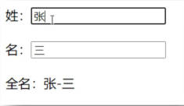


### 插值语法实现

```html
<!DOCTYPE html>
<html>
	<head>
		<meta charset="UTF-8" />
		<title>姓名案例_插值语法实现</title>
		<!-- 引入Vue -->
		<script type="text/javascript" src="../js/vue.js"></script>
	</head>
	<body>
		<!-- 准备好一个容器-->
		<div id="root">
			姓：<input type="text" v-model="firstName"> <br/><br/>
			名：<input type="text" v-model="lastName"> <br/><br/>
			全名：<span>{{firstName}}-{{lastName}}</span>
		</div>
	</body>

	<script type="text/javascript">
		Vue.config.productionTip = false //阻止 vue 在启动时生成生产提示。

		new Vue({
			el:'#root',
			data:{
				firstName:'张',
				lastName:'三'
			}
		})
	</script>
</html>
```

### methods实现

```html
<!DOCTYPE html>
<html>
	<head>
		<meta charset="UTF-8" />
		<title>姓名案例_methods实现</title>
		<!-- 引入Vue -->
		<script type="text/javascript" src="../js/vue.js"></script>
	</head>
	<body>
		<!-- 准备好一个容器-->
		<div id="root">
			姓：<input type="text" v-model="firstName"> <br/><br/>
			名：<input type="text" v-model="lastName"> <br/><br/>
			全名：<span>{{fullName()}}</span>
		</div>
	</body>

	<script type="text/javascript">
		Vue.config.productionTip = false //阻止 vue 在启动时生成生产提示。

		new Vue({
			el:'#root',
			data:{
				firstName:'张',
				lastName:'三'
			},
			methods: {
				fullName(){
					console.log('@---fullName')
					return this.firstName + '-' + this.lastName
				}
			},
		})
	</script>
</html>
```

> 只要data中的数据发生改变，Vue就会重新解析模板。而在重新解析模板时，只要遇到了插值语法里边写方法，这个方法就一定会被重新调用。
>
> 这种方式，效率就会比较差。

### 计算属性实现

模板内的表达式非常便利，但是设计它们的初衷是用于简单运算的。在模板中放入太多的逻辑会让模板过重且难以维护。例如：

```html
<div id="example">
  {{ message.split('').reverse().join('') }}
</div>
```

在这个地方，模板不再是简单的声明式逻辑。你必须看一段时间才能意识到，这里是想要显示变量 `message` 的翻转字符串。当你想要在模板中的多处包含此翻转字符串时，就会更加难以处理。

所以，对于任何复杂逻辑，你都应当使用**计算属性**。


示例代码

```html
<!DOCTYPE html>
<html>
	<head>
		<meta charset="UTF-8" />
		<title>姓名案例_计算属性实现</title>
		<!-- 引入Vue -->
		<script type="text/javascript" src="../js/vue.js"></script>
	</head>
	<body>		
		<!-- 准备好一个容器-->
		<div id="root">
			姓：<input type="text" v-model="firstName"> <br/><br/>
			名：<input type="text" v-model="lastName"> <br/><br/>
			测试：<input type="text" v-model="x"> <br/><br/>
			全名：<span>{{fullName}}</span> <br/><br/>
			<!-- 全名：<span>{{fullName}}</span> <br/><br/>
			全名：<span>{{fullName}}</span> <br/><br/>
			全名：<span>{{fullName}}</span> -->
		</div>
	</body>

	<script type="text/javascript">
		Vue.config.productionTip = false //阻止 vue 在启动时生成生产提示。

		const vm = new Vue({
			el:'#root',
			data:{
				firstName:'张',
				lastName:'三',
				x:'你好'
			},
			methods: {
				demo(){
					
				}
			},
			computed:{
				fullName:{
					//get有什么作用？当有人读取fullName时，get就会被调用，且返回值就作为fullName的值
					//get什么时候调用？1.初次读取fullName时。2.所依赖的数据发生变化时。
					get(){
						console.log('get被调用了')
						// console.log(this) //此处的this是vm
						return this.firstName + '-' + this.lastName
					},
					//set什么时候调用? 当fullName被修改时。
					set(value){
						console.log('set',value)
						const arr = value.split('-')
						this.firstName = arr[0]
						this.lastName = arr[1]
					}
				}
			}
		})
	</script>
</html>
```

小结：

> 计算属性：
>
> ​          1.定义：要用的属性不存在，要通过已有属性计算得来。
>
> ​          2.原理：底层借助了Objcet.defineproperty方法提供的getter和setter。
>
> ​          3.get函数什么时候执行？
>
> ​                (1).初次读取时会执行一次。
>
> ​                (2).当依赖的数据发生改变时会被再次调用。
>
> ​          4.优势：与methods实现相比，内部有缓存机制（复用），效率更高，调试方便。
>
> ​          5.备注：
>
> ​              1.计算属性最终会出现在vm上，直接读取使用即可。
>
> ​              2.如果计算属性要被修改，那必须写set函数去响应修改，且set中要引起计算时依赖的数据发生改变。

### 计算属性简写

```html
<!DOCTYPE html>
<html>

<head>
	<meta charset="UTF-8" />
	<title>姓名案例_计算属性简写</title>
	<!-- 引入Vue -->
	<script type="text/javascript" src="../js/vue.js"></script>
</head>

<body>
	<!-- 准备好一个容器-->
	<div id="root">
		姓：<input type="text" v-model="firstName"> <br /><br />
		名：<input type="text" v-model="lastName"> <br /><br />
		全名：<span>{{fullName}}</span> <br /><br />
	</div>
</body>

<script type="text/javascript">
	Vue.config.productionTip = false //阻止 vue 在启动时生成生产提示。

	const vm = new Vue({
		el: '#root',
		data: {
			firstName: '张',
			lastName: '三',
		},
		computed: {
			//完整写法
			/* fullName:{
				get(){
					console.log('get被调用了')
					return this.firstName + '-' + this.lastName
				},
				set(value){
					console.log('set',value)
					const arr = value.split('-')
					this.firstName = arr[0]
					this.lastName = arr[1]
				}
			} */
			//简写
			fullName() {
				console.log('get被调用了')
				return this.firstName + '-' + this.lastName
			}
		}
	})
</script>

</html>
```


## 监视属性(侦听器)

虽然计算属性在大多数情况下更合适，但有时也需要一个自定义的侦听器。这就是为什么 Vue 通过 `watch` 选项提供了一个更通用的方法，来响应数据的变化。当需要在数据变化时执行异步或开销较大的操作时，这个方式是最有用的。


### 天气案例

实现效果如下：

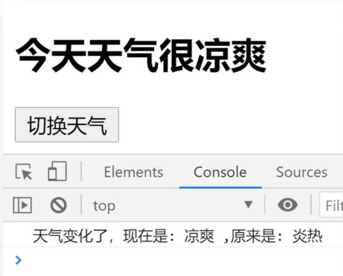


使用【计算属性】实现代码如下：

```html
<!DOCTYPE html>
<html>
	<head>
		<meta charset="UTF-8" />
		<title>天气案例</title>
		<!-- 引入Vue -->
		<script type="text/javascript" src="../js/vue.js"></script>
	</head>
	<body>
		<!-- 准备好一个容器-->
		<div id="root">
			<h2>今天天气很{{info}}</h2>
			<!-- 绑定事件的时候：@xxx="yyy" yyy可以写一些简单的语句 -->
			<!-- <button @click="isHot = !isHot">切换天气</button> -->
			<button @click="changeWeather">切换天气</button>
		</div>
	</body>

	<script type="text/javascript">
		Vue.config.productionTip = false //阻止 vue 在启动时生成生产提示。
		
		const vm = new Vue({
			el:'#root',
			data:{
				isHot:true,
			},
			computed:{
				info(){
					return this.isHot ? '炎热' : '凉爽'
				}
			},
			methods: {
				changeWeather(){
					this.isHot = !this.isHot
				}
			},
		})
	</script>
</html>
```

### 监视属性


```html
<!DOCTYPE html>
<html>
	<head>
		<meta charset="UTF-8" />
		<title>天气案例_监视属性</title>
		<!-- 引入Vue -->
		<script type="text/javascript" src="../js/vue.js"></script>
	</head>
	<body>
		<!-- 准备好一个容器-->
		<div id="root">
			<h2>今天天气很{{info}}</h2>
			<button @click="changeWeather">切换天气</button>
		</div>
	</body>

	<script type="text/javascript">
		Vue.config.productionTip = false //阻止 vue 在启动时生成生产提示。
		
		const vm = new Vue({
			el:'#root',
			data:{
				isHot:true,
			},
			computed:{
				info(){
					return this.isHot ? '炎热' : '凉爽'
				}
			},
			methods: {
				changeWeather(){
					this.isHot = !this.isHot
				}
			},
            //监视的第一种写法
			/* watch:{
				isHot:{
					immediate:true, //初始化时让handler调用一下
					//handler什么时候调用？当isHot发生改变时。
					handler(newValue,oldValue){
						console.log('isHot被修改了',newValue,oldValue)
					}
				}
			} */
		})

        //监视的第二种写法
		vm.$watch('isHot',{
			immediate:true, //初始化时让handler调用一下
			//handler什么时候调用？当isHot发生改变时。
			handler(newValue,oldValue){
				console.log('isHot被修改了',newValue,oldValue)
			}
		})
	</script>
</html>
```

> 监视属性watch：
> 					1.当被监视的属性变化时, 回调函数自动调用, 进行相关操作
> 					2.监视的属性必须存在，才能进行监视！！
> 					3.监视的两种写法：
> 							(1).new Vue时传入watch配置
> 							(2).通过vm.$watch监视


### 深度监视

示例代码：

```html
<!DOCTYPE html>
<html>
	<head>
		<meta charset="UTF-8" />
		<title>天气案例_深度监视</title>
		<!-- 引入Vue -->
		<script type="text/javascript" src="../js/vue.js"></script>
	</head>
	<body>		
		<!-- 准备好一个容器-->
		<div id="root">
			<h2>今天天气很{{info}}</h2>
			<button @click="changeWeather">切换天气</button>
			<hr/>
			<h3>a的值是:{{numbers.a}}</h3>
			<button @click="numbers.a++">点我让a+1</button>
			<h3>b的值是:{{numbers.b}}</h3>
			<button @click="numbers.b++">点我让b+1</button>
			<button @click="numbers = {a:666,b:888}">彻底替换掉numbers</button>
			{{numbers.c.d.e}}
		</div>
	</body>

	<script type="text/javascript">
		Vue.config.productionTip = false //阻止 vue 在启动时生成生产提示。
		
		const vm = new Vue({
			el:'#root',
			data:{
				isHot:true,
				numbers:{
					a:1,
					b:1,
					c:{
						d:{
							e:100
						}
					}
				}
			},
			computed:{
				info(){
					return this.isHot ? '炎热' : '凉爽'
				}
			},
			methods: {
				changeWeather(){
					this.isHot = !this.isHot
				}
			},
			watch:{
				isHot:{
					// immediate:true, //初始化时让handler调用一下
					//handler什么时候调用？当isHot发生改变时。
					handler(newValue,oldValue){
						console.log('isHot被修改了',newValue,oldValue)
					}
				},
				//监视多级结构中某个属性的变化
				/* 'numbers.a':{
					handler(){
						console.log('a被改变了')
					}
				} */
				//监视多级结构中所有属性的变化
				numbers:{
					deep:true,
					handler(){
						console.log('numbers改变了')
					}
				}
			}
		})

	</script>
</html>
```

> 深度监视：
> 						(1).Vue中的watch默认不监测对象内部值的改变（一层）。
> 						(2).配置deep:true可以监测对象内部值改变（多层）。
> 				备注：
> 						(1).Vue自身可以监测对象内部值的改变，但Vue提供的watch默认不可以！
> 						(2).使用watch时根据数据的具体结构，决定是否采用深度监视（默认不开启，是因为效率问题）。


### 简写形式

当你不需要`immediate`、`deep`  这些配置项时，就可以使用`watch`的简写形式了。


`html`示例代码：

```html
<!DOCTYPE html>
<html>
	<head>
		<meta charset="UTF-8" />
		<title>天气案例_监视属性_简写</title>
		<!-- 引入Vue -->
		<script type="text/javascript" src="../js/vue.js"></script>
	</head>
	<body>
		<!-- 准备好一个容器-->
		<div id="root">
			<h2>今天天气很{{info}}</h2>
			<button @click="changeWeather">切换天气</button>
		</div>
	</body>

	<script type="text/javascript">
		Vue.config.productionTip = false //阻止 vue 在启动时生成生产提示。
		
		const vm = new Vue({
			el:'#root',
			data:{
				isHot:true,
			},
			computed:{
				info(){
					return this.isHot ? '炎热' : '凉爽'
				}
			},
			methods: {
				changeWeather(){
					this.isHot = !this.isHot
				}
			},
			watch:{
				//正常写法
				/* isHot:{
					// immediate:true, //初始化时让handler调用一下
					// deep:true,//深度监视
					handler(newValue,oldValue){
						console.log('isHot被修改了',newValue,oldValue)
					}
				}, */
				//简写
				/* isHot(newValue,oldValue){
					console.log('isHot被修改了',newValue,oldValue,this)
				} */
			}
		})

		//正常写法
		/* vm.$watch('isHot',{
			immediate:true, //初始化时让handler调用一下
			deep:true,//深度监视
			handler(newValue,oldValue){
				console.log('isHot被修改了',newValue,oldValue)
			}
		}) */

		//简写
		/* vm.$watch('isHot',(newValue,oldValue)=>{
			console.log('isHot被修改了',newValue,oldValue,this)
		}) */

	</script>
</html>
```


### 姓名案例的watch实现

`html`示例代码：

```html
<!DOCTYPE html>
<html>
	<head>
		<meta charset="UTF-8" />
		<title>姓名案例_watch实现</title>
		<!-- 引入Vue -->
		<script type="text/javascript" src="../js/vue.js"></script>
	</head>
	<body>
		<!-- 准备好一个容器-->
		<div id="root">
			姓：<input type="text" v-model="firstName"> <br/><br/>
			名：<input type="text" v-model="lastName"> <br/><br/>
			全名：<span>{{fullName}}</span> <br/><br/>
		</div>
	</body>

	<script type="text/javascript">
		Vue.config.productionTip = false //阻止 vue 在启动时生成生产提示。

		const vm = new Vue({
			el:'#root',
			data:{
				firstName:'张',
				lastName:'三',
				fullName:'张-三'
			},
			watch:{
				firstName(val){
					setTimeout(()=>{
						console.log(this)
						this.fullName = val + '-' + this.lastName
					},1000);
				},
				lastName(val){
					this.fullName = this.firstName + '-' + val
				}
			}
		})
	</script>
</html>
```

> computed 和 watch 之间的区别：
> 						1.computed能完成的功能，watch都可以完成。
> 						2.watch能完成的功能，computed不一定能完成，例如：watch可以进行异步操作。
> 				两个重要的小原则：
> 							1.所有被Vue管理的函数，最好写成普通函数，这样this的指向才是vm 或 组件实例对象。
> 							2.所有不被Vue所管理的函数（定时器的回调函数、ajax的回调函数等、Promise的回调函数），最好写成箭头函数，
> 								这样this的指向才是vm 或 组件实例对象。

## Class 与 Style 绑定

操作元素的 class 列表和内联样式是数据绑定的一个常见需求。因为它们都是 attribute，所以我们可以用 `v-bind` 处理它们：只需要通过表达式计算出字符串结果即可。不过，字符串拼接麻烦且易错。因此，在将 `v-bind` 用于 `class` 和 `style` 时，Vue.js 做了专门的增强。表达式结果的类型除了字符串之外，还可以是对象或数组。


示例代码：

```html
<!DOCTYPE html>
<html>
	<head>
		<meta charset="UTF-8" />
		<title>绑定样式</title>
		<style>
			.basic{
				width: 400px;
				height: 100px;
				border: 1px solid black;
			}
			
			.happy{
				border: 4px solid red;;
				background-color: rgba(255, 255, 0, 0.644);
				background: linear-gradient(30deg,yellow,pink,orange,yellow);
			}
			.sad{
				border: 4px dashed rgb(2, 197, 2);
				background-color: gray;
			}
			.normal{
				background-color: skyblue;
			}

			.atguigu1{
				background-color: yellowgreen;
			}
			.atguigu2{
				font-size: 30px;
				text-shadow:2px 2px 10px red;
			}
			.atguigu3{
				border-radius: 20px;
			}
		</style>
		<script type="text/javascript" src="../js/vue.js"></script>
	</head>
	<body>		
		<!-- 准备好一个容器-->
		<div id="root">
			<!-- 绑定class样式--字符串写法，适用于：样式的类名不确定，需要动态指定 -->
			<div class="basic" :class="mood" @click="changeMood">{{name}}</div> <br/><br/>

			<!-- 绑定class样式--数组写法，适用于：要绑定的样式个数不确定、名字也不确定 -->
			<div class="basic" :class="classArr">{{name}}</div> <br/><br/>

			<!-- 绑定class样式--对象写法，适用于：要绑定的样式个数确定、名字也确定，但要动态决定用不用 -->
			<div class="basic" :class="classObj">{{name}}</div> <br/><br/>

			<!-- 绑定style样式--对象写法 -->
			<div class="basic" :style="styleObj">{{name}}</div> <br/><br/>
			<!-- 绑定style样式--数组写法 -->
			<div class="basic" :style="styleArr">{{name}}</div>
		</div>
	</body>

	<script type="text/javascript">
		Vue.config.productionTip = false
		
		const vm = new Vue({
			el:'#root',
			data:{
				name:'尚硅谷',
				mood:'normal',
				classArr:['atguigu1','atguigu2','atguigu3'],
				classObj:{
					atguigu1:false,
					atguigu2:false,
				},
				styleObj:{
					fontSize: '40px',
					color:'red',
				},
				styleObj2:{
					backgroundColor:'orange'
				},
				styleArr:[
					{
						fontSize: '40px',
						color:'blue',
					},
					{
						backgroundColor:'gray'
					}
				]
			},
			methods: {
				changeMood(){
					const arr = ['happy','sad','normal']
					const index = Math.floor(Math.random()*3)
					this.mood = arr[index]
				}
			},
		})
	</script>
	
</html>
```

小结：

> 1. class样式
>
> ​                写法:class="xxx" xxx可以是字符串、对象、数组。
>
> ​                    字符串写法适用于：类名不确定，要动态获取。
>
> ​                    对象写法适用于：要绑定多个样式，个数不确定，名字也不确定。
>
> ​                    数组写法适用于：要绑定多个样式，个数确定，名字也确定，但不确定用不用。
>
> ​     2.  style样式
>
> ​                :style="{fontSize: xxx}"其中xxx是动态值。
>
> ​                :style="[a,b]"其中a、b是样式对象。


## 条件渲染

### `v-if`

`v-if` 指令用于条件性地渲染一块内容。这块内容只会在指令的表达式返回 truthy 值的时候被渲染。

```html
<h1 v-if="awesome">Vue is awesome!</h1>
```

也可以用 `v-else` 添加一个“else 块”：

```html
<h1 v-if="awesome">Vue is awesome!</h1>
<h1 v-else>Oh no 😢</h1>
```


**在 `<template>` 元素上使用 `v-if` 条件渲染分组**

因为 `v-if` 是一个指令，所以必须将它添加到一个元素上。但是如果想切换多个元素呢？此时可以把一个 `<template>` 元素当做不可见的包裹元素，并在上面使用 `v-if`。最终的渲染结果将不包含 `<template>` 元素。

```html
<template v-if="ok">
  <h1>Title</h1>
  <p>Paragraph 1</p>
  <p>Paragraph 2</p>
</template>
```


### `v-else`

你可以使用 `v-else` 指令来表示 `v-if` 的“else 块”：

```html
<div v-if="Math.random() > 0.5">
  Now you see me
</div>
<div v-else>
  Now you don't
</div>
```

`v-else` 元素必须紧跟在带 `v-if` 或者 `v-else-if` 的元素的后面，否则它将不会被识别。


### `v-else-if`

`v-else-if`，顾名思义，充当 `v-if` 的“else-if 块”，并且可以连续使用：

```html
<div v-if="type === 'A'">
  A
</div>
<div v-else-if="type === 'B'">
  B
</div>
<div v-else-if="type === 'C'">
  C
</div>
<div v-else>
  Not A/B/C
</div>
```

与 `v-else` 的用法类似，`v-else-if` 也必须紧跟在带 `v-if` 或者 `v-else-if` 的元素之后。


### `v-show`

另一个用于条件性展示元素的选项是 `v-show` 指令。用法大致一样：

```html
<h1 v-show="ok">Hello!</h1>
```

不同的是带有 `v-show` 的元素始终会被渲染并保留在 DOM 中。`v-show` 只是简单地切换元素的 `display` CSS property。

注意，`v-show` 不支持 `<template>` 元素，也不支持 `v-else`。


### `v-if` vs `v-show`

`v-if` 是“真正”的条件渲染，因为它会确保在切换过程中，条件块内的事件监听器和子组件适当地被销毁和重建。

`v-if` 也是**惰性的**：如果在初始渲染时条件为假，则什么也不做——直到条件第一次变为真时，才会开始渲染条件块。

相比之下，`v-show` 就简单得多——不管初始条件是什么，元素总是会被渲染，并且只是简单地基于 CSS 进行切换。

一般来说，`v-if` 有更高的切换开销，而 `v-show` 有更高的初始渲染开销。因此，如果需要非常频繁地切换，则使用 `v-show` 较好；如果在运行时条件很少改变，则使用 `v-if` 较好。


### 示例小结

示例代码：

```html
<!DOCTYPE html>
<html>
	<head>
		<meta charset="UTF-8" />
		<title>条件渲染</title>
		<script type="text/javascript" src="../js/vue.js"></script>
	</head>
	<body>		
		<!-- 准备好一个容器-->
		<div id="root">
			<h2>当前的n值是:{{n}}</h2>
			<button @click="n++">点我n+1</button>
			<!-- 使用v-show做条件渲染 -->
			<!-- <h2 v-show="false">欢迎来到{{name}}</h2> -->
			<!-- <h2 v-show="1 === 1">欢迎来到{{name}}</h2> -->

			<!-- 使用v-if做条件渲染 -->
			<!-- <h2 v-if="false">欢迎来到{{name}}</h2> -->
			<!-- <h2 v-if="1 === 1">欢迎来到{{name}}</h2> -->

			<!-- v-else和v-else-if -->
			<!-- <div v-if="n === 1">Angular</div>
			<div v-else-if="n === 2">React</div>
			<div v-else-if="n === 3">Vue</div>
			<div v-else>哈哈</div> -->

			<!-- v-if与template的配合使用 -->
			<template v-if="n === 1">
				<h2>你好</h2>
				<h2>尚硅谷</h2>
				<h2>北京</h2>
			</template>

		</div>
	</body>

	<script type="text/javascript">
		Vue.config.productionTip = false

		const vm = new Vue({
			el:'#root',
			data:{
				name:'尚硅谷',
				n:0
			}
		})
	</script>
</html>
```

小结：

> 条件渲染：
>
> ​              1.v-if
>
> ​                    写法：
>
> ​                        (1).v-if="表达式" 
>
> ​                        (2).v-else-if="表达式"
>
> ​                        (3).v-else="表达式"
>
> ​                    适用于：切换频率较低的场景。
>
> ​                    特点：不展示的DOM元素直接被移除。
>
> ​                    注意：v-if可以和:v-else-if、v-else一起使用，但要求结构不能被“打断”。
>
> 
>
> ​              2.v-show
>
> ​                    写法：v-show="表达式"
>
> ​                    适用于：切换频率较高的场景。
>
> ​                    特点：不展示的DOM元素未被移除，仅仅是使用样式隐藏掉
>
> ​                
>
> ​              3.备注：使用v-if的时，元素可能无法获取到，而使用v-show一定可以获取到。


## 列表渲染


### 基本列表

示例代码：

```html
<!DOCTYPE html>
<html>

<head>
	<meta charset="UTF-8" />
	<title>基本列表</title>
	<script type="text/javascript" src="../js/vue.js"></script>
</head>

<body>
	<!-- 准备好一个容器-->
	<div id="root">
		<!-- 遍历数组 -->
		<h2>人员列表（遍历数组）</h2>
		<ul>
			<li v-for="(p,index) of persons" :key="index">
				{{p.name}}-{{p.age}}
			</li>
		</ul>

		<!-- 遍历对象 -->
		<h2>汽车信息（遍历对象）</h2>
		<ul>
			<li v-for="(value,k) of car" :key="k">
				{{k}}-{{value}}
			</li>
		</ul>

		<!-- 遍历字符串 -->
		<h2>测试遍历字符串（用得少）</h2>
		<ul>
			<li v-for="(char,index) of str" :key="index">
				{{char}}-{{index}}
			</li>
		</ul>

		<!-- 遍历指定次数 -->
		<h2>测试遍历指定次数（用得少）</h2>
		<ul>
			<li v-for="(number,index) of 5" :key="index">
				{{index}}-{{number}}
			</li>
		</ul>
	</div>
</body>

<script type="text/javascript">
	Vue.config.productionTip = false

	new Vue({
		el: '#root',
		data: {
			persons: [
				{ id: '001', name: '张三', age: 18 },
				{ id: '002', name: '李四', age: 19 },
				{ id: '003', name: '王五', age: 20 }
			],
			car: {
				name: '奥迪A8',
				price: '70万',
				color: '黑色'
			},
			str: 'hello'
		}
	})
</script>

</html>
```

> v-for指令:
> 						1.用于展示列表数据
> 						2.语法：v-for="(item, index) in xxx" :key="yyy"
> 						3.可遍历：数组、对象、字符串（用的很少）、指定次数（用的很少）


### key的原理

先看一下案例

```html
<!DOCTYPE html>
<html>

<head>
	<meta charset="UTF-8" />
	<title>key的原理</title>
	<script type="text/javascript" src="../js/vue.js"></script>
</head>

<body>
	<!-- 准备好一个容器-->
	<div id="root">
		<!-- 遍历数组 -->
		<h2>人员列表（遍历数组）</h2>
		<button @click.once="add">添加一个老刘</button>
		<ul>
			<li v-for="(p,index) of persons" :key="index">
				{{p.name}}-{{p.age}}
				<input type="text">
			</li>
		</ul>
	</div>
</body>

<script type="text/javascript">
	Vue.config.productionTip = false

	new Vue({
		el: '#root',
		data: {
			persons: [
				{ id: '001', name: '张三', age: 18 },
				{ id: '002', name: '李四', age: 19 },
				{ id: '003', name: '王五', age: 20 }
			]
		},
		methods: {
			add() {
				const p = { id: '004', name: '老刘', age: 40 }
				this.persons.unshift(p)
			}
		},
	})
</script>
</html>
```

在这个案例中，我们使用for循环来遍历数组，这里有个需要特殊注意的地方，就是我们在遍历时，`:key`这里我们是使用的索引(index)。

点击页面上的按钮后，向数组前添加（unshift）了一个老刘，效果如下图所示：

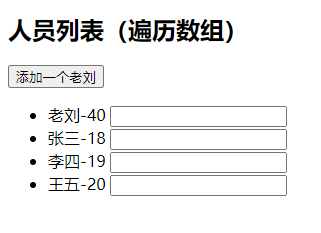

从表面效果来看，似乎也没有什么问题。接下来，我们在名字后面的输入框中输入对应行的名字后，再点击按钮，看看结果。结果如下图所示：


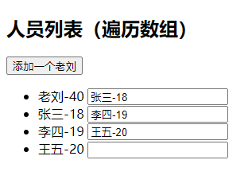

此时，我们就发现有问题了吧，输入框中的内容与姓名完全不对应了。造成这个的原因，就是我们在循环遍历时使用index作为key。更深层的原因，就涉及到了Vue中的虚拟DOM对比算法了。为了把这个问题说透，我这里用一张图来帮助大家理解。

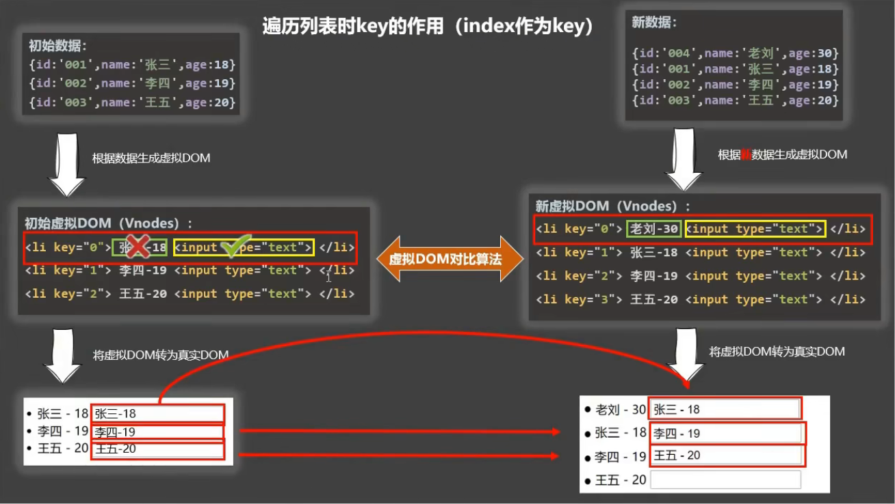

并不是说在遍历时使用index作为key就一定是错误的，我这里是为了演示问题才这样设计的（否则我也不会把新数据添加到数组前头了）。如果你对数据进行了破坏顺序的操作，就一定不要用index作为key了。

而最为稳妥的，就是使用唯一标识作为key。下面依然用一张图来帮助大家理解。


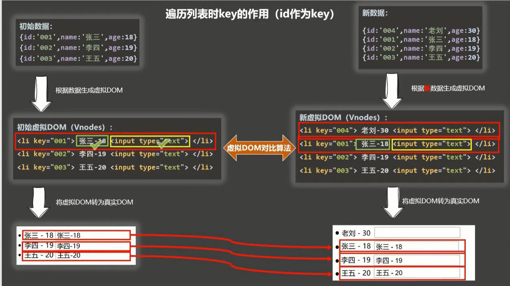

**总结一下：**

> 面试题：react、vue中的key有什么作用？（key的内部原理）
>
> 1. 虚拟DOM中key的作用：
>
> ​                    key是虚拟DOM对象的标识，当数据发生变化时，Vue会根据【新数据】生成【新的虚拟DOM】, 
>
> ​                    随后Vue进行【新虚拟DOM】与【旧虚拟DOM】的差异比较，比较规则如下：
>
> 2. 对比规则：
>
> ​                  (1).旧虚拟DOM中找到了与新虚拟DOM相同的key：
>
> ​                        ①.若虚拟DOM中内容没变, 直接使用之前的真实DOM！
>
> ​                        ②.若虚拟DOM中内容变了, 则生成新的真实DOM，随后替换掉页面中之前的真实DOM。
>
> ​                  (2).旧虚拟DOM中未找到与新虚拟DOM相同的key
>
> ​                        创建新的真实DOM，随后渲染到到页面。
>
> 3. 用index作为key可能会引发的问题：
>
> ​                      1. 若对数据进行：逆序添加、逆序删除等破坏顺序操作:
>
> ​                              会产生没有必要的真实DOM更新 ==> 界面效果没问题, 但效率低。
>
> 
>
> ​                      2. 如果结构中还包含输入类的DOM：
>
> ​                              会产生错误DOM更新 ==> 界面有问题。
>
> 4. 开发中如何选择key?:
>
> ​                      1.最好使用每条数据的唯一标识作为key, 比如id、手机号、身份证号、学号等唯一值。
>
> ​                      2.如果不存在对数据的逆序添加、逆序删除等破坏顺序操作，仅用于渲染列表用于展示，
>
> ​                        使用index作为key是没有问题的。


### 列表过滤

接下来我们实现一个人员列表过滤的功能，效果如下图所示。在输入框中输入关键字后，筛选出列表中符合的人员信息。

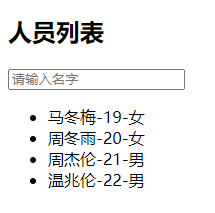

实现该功能，用`watch`是可以实现的，用计算属性`computed`也是可以实现的。下面我们就用这两种方式都实现一下。


html代码如下：

```html
<!DOCTYPE html>
<html>

<head>
	<meta charset="UTF-8" />
	<title>列表过滤</title>
	<script type="text/javascript" src="../js/vue.js"></script>
</head>

<body>
	<!-- 准备好一个容器-->
	<div id="root">
		<h2>人员列表</h2>
		<input type="text" placeholder="请输入名字" v-model="keyWord">
		<ul>
			<li v-for="(p,index) of filPerons" :key="index">
				{{p.name}}-{{p.age}}-{{p.sex}}
			</li>
		</ul>
	</div>
</body>


<script type="text/javascript">
	Vue.config.productionTip = false

	//用watch实现
	//#region 
	/* new Vue({
		el:'#root',
		data:{
			keyWord:'',
			persons:[
				{id:'001',name:'马冬梅',age:19,sex:'女'},
				{id:'002',name:'周冬雨',age:20,sex:'女'},
				{id:'003',name:'周杰伦',age:21,sex:'男'},
				{id:'004',name:'温兆伦',age:22,sex:'男'}
			],
			filPerons:[]
		},
		watch:{
			keyWord:{
				immediate:true,
				handler(val){
					this.filPerons = this.persons.filter((p)=>{
						return p.name.indexOf(val) !== -1
					})
				}
			}
		}
	}) */
	//#endregion

	//用computed实现
	new Vue({
		el: '#root',
		data: {
			keyWord: '',
			persons: [
				{ id: '001', name: '马冬梅', age: 19, sex: '女' },
				{ id: '002', name: '周冬雨', age: 20, sex: '女' },
				{ id: '003', name: '周杰伦', age: 21, sex: '男' },
				{ id: '004', name: '温兆伦', age: 22, sex: '男' }
			]
		},
		computed: {
			filPerons() {
				return this.persons.filter((p) => {
					return p.name.indexOf(this.keyWord) !== -1
				})
			}
		}
	}) 
</script>

</html>
```


### 列表排序

接下来，我们将上一个案例升级一下，加入排序功能，效果如下图所示：

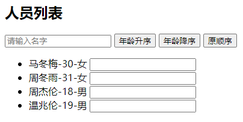


html代码如下：

```html
<!DOCTYPE html>
<html>

<head>
	<meta charset="UTF-8" />
	<title>列表排序</title>
	<script type="text/javascript" src="../js/vue.js"></script>
</head>

<body>
	<!-- 准备好一个容器-->
	<div id="root">
		<h2>人员列表</h2>
		<input type="text" placeholder="请输入名字" v-model="keyWord">
		<button @click="sortType = 2">年龄升序</button>
		<button @click="sortType = 1">年龄降序</button>
		<button @click="sortType = 0">原顺序</button>
		<ul>
			<li v-for="(p,index) of filPerons" :key="p.id">
				{{p.name}}-{{p.age}}-{{p.sex}}
				<input type="text">
			</li>
		</ul>
	</div>
</body>

<script type="text/javascript">
	Vue.config.productionTip = false

	new Vue({
		el: '#root',
		data: {
			keyWord: '',
			sortType: 0, //0原顺序 1降序 2升序
			persons: [
				{ id: '001', name: '马冬梅', age: 30, sex: '女' },
				{ id: '002', name: '周冬雨', age: 31, sex: '女' },
				{ id: '003', name: '周杰伦', age: 18, sex: '男' },
				{ id: '004', name: '温兆伦', age: 19, sex: '男' }
			]
		},
		computed: {
			filPerons() {
				const arr = this.persons.filter((p) => {
					return p.name.indexOf(this.keyWord) !== -1
				})
				//判断一下是否需要排序
				if (this.sortType) {
					arr.sort((p1, p2) => {
						return this.sortType === 1 ? p2.age - p1.age : p1.age - p2.age
					})
				}
				return arr
			}
		}
	})

</script>

</html>
```


### Vue监测数据改变的原理

在之前的案例中都讲到过，我们的数据都是配置在`data`里的，然后在模板中使用插值语法`{{name}}`来读取数据。一旦`data`里的数据发生变化，那么使用到相应数据的地方就会自动更新。那Vue是怎么知道数据被修改了呢？接下来我们就好好探讨下这个问题：`Vue到底是如何监视数据改变的`。


#### 引子

我们为什么一定要去了解这个Vue监测数据改变的原理呢，我如果不去深究，是不是也不影响我正常的写代码啊？其实我们这里讲一下这个原理，就是为了让大家能够知其所以然，避免以后出现这种：我们写了一个自己认为很正常的修改数据的代码，但Vue就是不认、就是监测不到数据更改了的尴尬情况。

真的有这种情况吗？真的有。接下来我就来演示一下。上代码：

```html
<!DOCTYPE html>
<html>

<head>
	<meta charset="UTF-8" />
	<title>更新时的一个问题</title>
	<script type="text/javascript" src="../js/vue.js"></script>
</head>

<body>
	<!-- 准备好一个容器-->
	<div id="root">
		<h2>人员列表</h2>
		<button @click="updateMei">更新马冬梅的信息</button>
		<ul>
			<li v-for="(p,index) of persons" :key="p.id">
				{{p.name}}-{{p.age}}-{{p.sex}}
			</li>
		</ul>
	</div>
</body>

<script type="text/javascript">
	Vue.config.productionTip = false

	const vm = new Vue({
		el: '#root',
		data: {
			persons: [
				{ id: '001', name: '马冬梅', age: 30, sex: '女' },
				{ id: '002', name: '周冬雨', age: 31, sex: '女' },
				{ id: '003', name: '周杰伦', age: 18, sex: '男' },
				{ id: '004', name: '温兆伦', age: 19, sex: '男' }
			]
		},
		methods: {
			updateMei() {
				//更新马冬梅的信息
			}
		}
	})

</script>

</html>
```

点击`更新马冬梅的信息`按钮时，调用`updateMei()`方法来修改这个人的信息。


首先我们采用`第一种写法`：

```javascript
updateMei() {
    this.persons[0].name = '马老师'
    this.persons[0].age = 50 
    this.persons[0].sex = '男'
}
```

运行之后，我们发现数据确实发生变化了。也就是说，这种方法是奏效的，Vue也是认可并且是能够监测到数据改变的。


然后我们采用`第二种写法`：

```javascript
updateMei() {
    this.persons[0] = {id:'001',name:'马老师',age:50,sex:'男'}
}
```

执行之后，效果如下图所示：

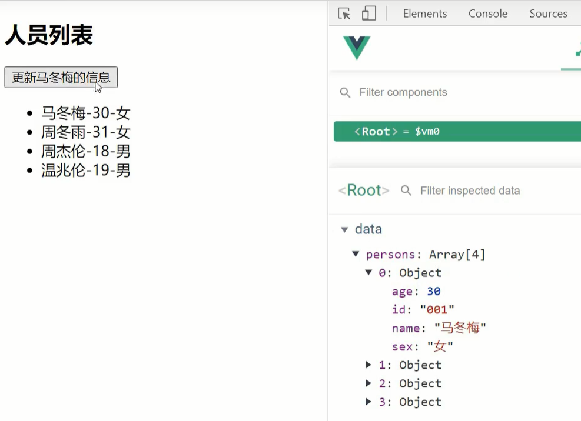

从Vue开发者工具中，我们发现数据并没有发生改变。但实际上，数据是发生改变了，但是Vue并没有监测到，所以页面上以及Vue开发者工具中都没有发生变化。怎么验证数据确实已经改变了呢？很简单，我们打印下vm上的数据就知道了，如下图所示：

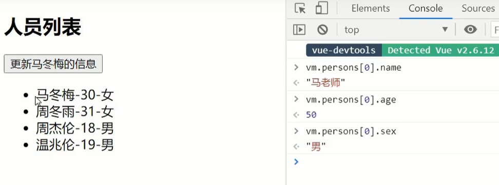

这就让我们很迷惑了呀，到底是怎么回事啊？明明数据改变了，怎么Vue没有监测到呢？


所以我们就很有必要了解下Vue监测数据改变的原理了。

#### 原理

我们先准备好一个案例，代码如下：

```html
<!DOCTYPE html>
<html>
	<head>
		<meta charset="UTF-8" />
		<title>Vue监测数据改变的原理</title>
		<!-- 引入Vue -->
		<script type="text/javascript" src="../js/vue.js"></script>
	</head>
	<body>
		<!-- 准备好一个容器-->
		<div id="root">
			<h2>学校名称：{{name}}</h2>
			<h2>学校地址：{{address}}</h2>
		</div>
	</body>

	<script type="text/javascript">
		Vue.config.productionTip = false //阻止 vue 在启动时生成生产提示。

		const vm = new Vue({
			el:'#root',
			data:{
				name:'尚硅谷',
				address:'北京'
			}
		})
	</script>
</html>
```

之前我们在讲数据代理的时候说过（看下图），我们将数据放到`data`中，Vue其实是做了一个类似于`vm._data = data`这样收集数据的事。但是在做这个收集数据之前，Vue其实还做了一个加工data的事情。


我们怎么证明Vue先对data做了一些加工呢？

首先我们看下图，左侧蓝色部分就是我们写的data中的数据，右侧红色部分，就是Vue收集到的数据_data。

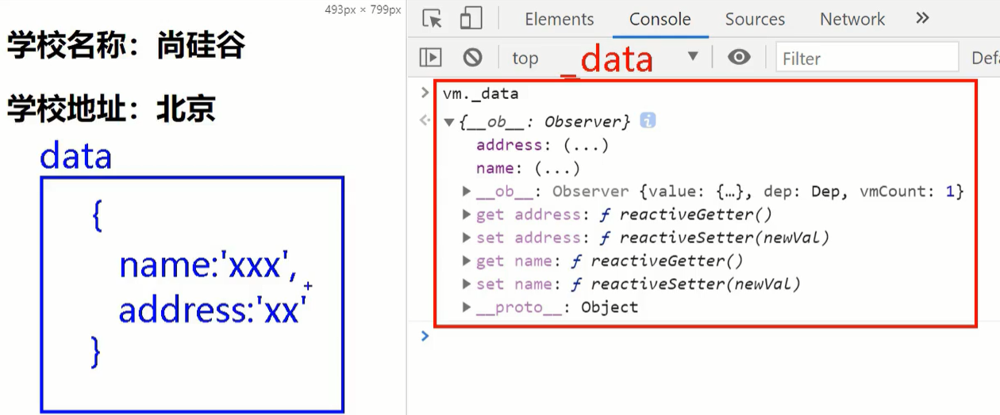

如果Vue只是做了一个`vm._data = data`这样收集数据的事，那`vm._data`中的数据是不是应该与data中的数据一模一样。通过上图的对比，很显然是不一样的。

通过观察Vue收集到的数据_data，我们发现`vm._data`除了把原来data中的数据收集到了，还多了一些setter和getter方法，Vue应该确实对数据做了一些加工。而且通过对比，你没有觉得，**其实所谓的加工，就是把你data里所写的每一组key-value，都形成了getter、setter的写法。**

接下来，我们将整个流程补充完整，加上第三步，也就是在前两步之后，**当data中有数据发生改变时，Vue就会监测到，然后重新解析模板，重新解析模板就会生成新的虚拟DOM，然后新旧虚拟DOM对比，然后就是更新页面啊，一整套流程是不是就通了。**整个流程可以参考下图：

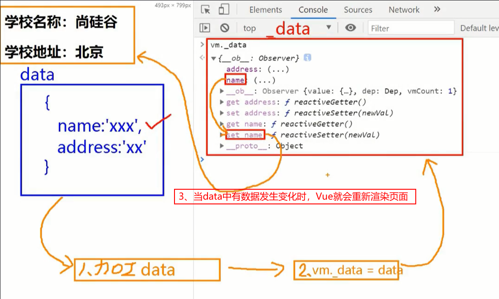


在上面的案例中，Vue之所以能够监测到name和address的改变，就是靠getter和setter的。

从以上的分析中我们知道，我们原始的data数据中仅仅只有数据name和address，而经过Vue加工后的`vm._data`中name和address都有了对应的getter和setter，所以说Vue`加工data`这步是非常关键的。

那么Vue到底是做了什么加工呢？我们通过观察开发者工具中的name的getter和setter方法，发现其后面写着reactiveGetter和reactiveSetter。其实Vue是将这些数据做了响应式的。


## 收集表单数据

## 过滤器

## 内置指令与自定义指令

## Vue实例生命周期