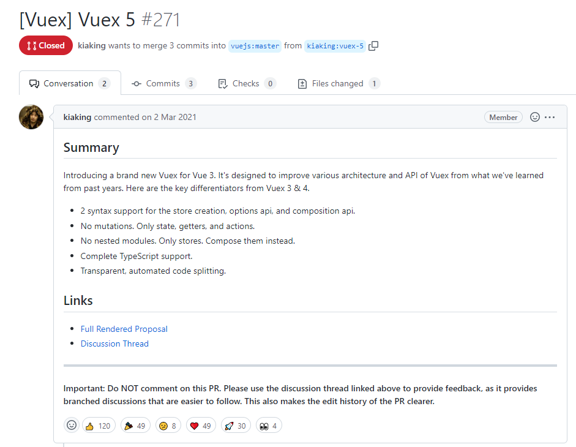
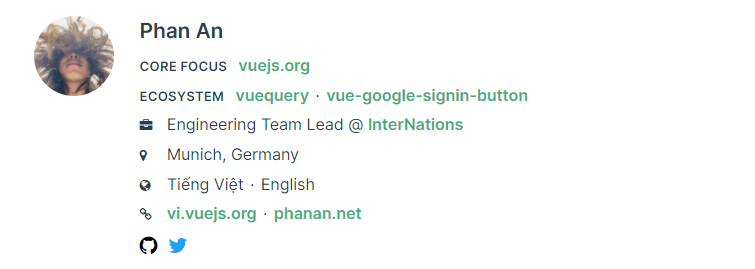

# Pinia

> 一个全新的用于Vue的状态管理库
>
> 下一个版本的Vuex，也就是Vuex 5.0
>
> Pinia已经被纳入官方账户下了，https://github.com/vuejs/pinia
>
> [Pinia官网](https://pinia.vuejs.org/)


## 1.介绍

Pinia最初是一个实验，目的是在2019年11月左右重新设计Vue状态管理在Composite APl上的样子，也就是下一代Vuex。

- 之前的vuex主要服务于Vue 2，选项式API
- 如果想要在Vue 3中使用Vuex，需要使用它的版本4
  - 只是一个过渡的选择，还有很大的缺陷
- 所以在Vue3伴随着组合式API诞生之后，也设计了全新的Vuex: Pinia，也就是Vuex 5



> 提案链接: [https://github.com/vuejs/rfcs/pull/271](https://github.com/vuejs/rfcs/pull/271)

- Vue 2和 Vue 3都支持
  - 除了初始化安装和SSR配置之外，两者的API都是相同的
  - 官方文档中主要针对Vue3进行说明，必要的时候会提供Vue2的注释
- 支持Vue DevTools
  - 跟踪actions、mutations 的时间线
  - 在使用容器的组件中就可以观察到容器本身
  - 支持 time travel更容易的调试功能
  - 在 Vue 2中 Pinia使用Vuex的现有接口，所以不能与Vuex一起使用
  - 但是针对Vue 3中的调试工具支持还不够完美，比如还没有time-travel调试功能
- 模块热更新
  - 无需重新加载页面即可修改您的容器。
  - 热更新的时候保持任何现有状态
- 支持使用插件扩展Pinia功能
- 相比 Vuex有更好完美的TypeScript支持
- 支持服务端渲染

### 1.1. 核心概念

Pinia 从使用角度和之前的 Vuex几乎是一样的，比Vuex更简单了。


在Vuex中有四个核心概念：

- State
- Getters
- Mutations
- Actions

在Pinia中：

- State
- Getters
- Actions：同步异步都支持


Store(如 Pinia)是一个保存状态和业务逻辑的实体，它不绑定到您的组件树。换句话说**，它承载全局state**。它有点像一个始终存在的组件，每个人都可以读取和写入。它有三个核心概念。


- state 类似组件的`data`，用来存储全局状态

```javascript
{
    todos : [
        { id: 1，title: '吃饭'，done: fa1se },
        { id: 2，title: '睡觉', done: true },
        { id: 3，title: '打云牧', done: false }
    ]
}
```


- getters：类似组件的`computed`，根据已有的state封装派生数据，也具有缓存的特性

```javascript
doneCount() {
    return todos.filter(item => item.done).length
}
```


- actions：类似组件的`methods`，用来封装业务逻辑，同步异步都可以
  - 在Vuex中同步操作使用 `mutations`，异步操作使用`actions`，太麻烦！！！

> 提示：Pinia中没有`mutations`

### 1.2.基本示例

就这是在 API 方面使用 Pinia 的样子（请务必查看[入门](https://pinia.vuejs.org/introduction.html#basic-example)以获取完整说明）。

你首先创建一个store：

```javascript
// store/counter.js
import { defineStore } from "pinia";

// defineStore 调用后返回一个函数，调用该函数获得 Store 实体
export const useCounterStore = defineStore("counter"，{
  // state: 返回对象的函数
  state: ()=> {
      return { count: 0 }
  },
  // could also be defined as
  // state: () => ({ count: 0 })
  actions: {
      increment() {
          // 在Vuex实现需要两步  1.定义mutations 2.提交mutations
          this.count++
      }
  }
});
```

然后在组件里面使用它：

```typescript
// 导入 Store， 使用自己的路径
import { useCounterStore } from '@/stores/counter'

export default {
  setup() {
	// 调用函数 获得Store
    const counter = useCounterStore()

    counter.count++
    // with autocompletion ✨
    counter.$patch({ count: counter.count + 1 })
    // or using an action instead
    counter.increment()
  },
}

```

您甚至可以使用函数（类似于组件`setup()`）为更高级的用例定义 Store：

```javascript
export const useCounterStore = defineStore('counter', () => {
  const count = ref(0)
  function increment() {
    count.value++
  }

  return { count, increment }
})
```

如果不熟悉`setup()`Composition API，别担心，Pania 也支持类似 [Vuex的 map Helpers](https://vuex.vuejs.org/guide/state.html#the-mapstate-helper)。您以相同的方式定义Stores，使用`mapStores()`, `mapState()`, 或`mapActions()`：

```javascript
const useCounterStore = defineStore('counter', {
  state: () => ({ count: 0 }),
  getters: {
    double: (state) => state.count * 2,
  },
  actions: {
    increment() {
      this.count++
    }
  }
})

const useUserStore = defineStore('user', {
  // ...
})

export default {
  computed: {
    // other computed properties
    // ...
    // gives access to this.counterStore and this.userStore
    ...mapStores(useCounterStore, useUserStore)
    // gives read access to this.count and this.double
    ...mapState(useCounterStore, ['count', 'double']),
  },
  methods: {
    // gives access to this.increment()
    ...mapActions(useCounterStore, ['increment']),
  },
}
```

你将在核心概念中找到每个map Helpers的更多信息。


### 1.3.Pinia vs Vuex

Pina试图尽可能接近 Vuex 的理念。它旨在测试 Vuex 下ー次迭代的提案，并且取得了成功，因为我们目前有一个针对 Vuex 5 的开放式RFC，其API与 Pinia 使用的API非常相似。请注意，Pinia的作者(Eduardo)是 Vue.js 核心团队的一员，并积极参与 Router 和 Vuex 等API的设计。我个人对这个项目的意图是重新设计使用全局 Store 的体验，同时保持 Vue平易近人的哲学。我让 Pania 的API与 Vuex 一样接近，因为它不断向前发展，使人们可以轻松地迁移到 Vuex，甚至在未来融合这两个项目（在 Vuex 下）。


关于版本问题：

- Vuex 当前最新版本是4.x
  - Vuex 4 用于 Vue 3
  - Vuex 3 用于 Vue 2

- Pinia 当前最新版本是2.x

  - 既支持 Vue 2 也支持 Vue 3

  - 可以认为就是 Vuex 5，因为它的作者是官方的开发人员，并且已经被官方接管了


Pinia API 与 Vuex≤4 有很大不同，即:

- 没有`mutations` 。mutations被认为是非常冗长的。最初带来了devtools集成，但这不再是问题。
- 不再有模块的嵌套结构。您仍然可以通过在另一个store 中导入和使用store来隐式嵌套store，但Pinia通过设计提供扁平结构，同时仍然支持store之间的交叉组合方式。您甚至可以拥有store的循环依赖关系。
- 更好 `typescript`支持。无需创建自定义的复杂包装器来支持TypeScript，所有内容都是类型化的，并且API的设计方式尽可能地利用TS类型推断。
- 不再需要注入、导入函数、调用它们，享受自动补全!
- 无需动态添加stores，默认情况下它们都是动态的，您甚至不会注意到。请注意，您仍然可以随时手动使用store来注册它，但因为它是自动的，所以您无需担心。
- 没有命名空间模块。鉴于store 的扁平架构，“命名空间" store是其定义方式所固有的，您可以说所有stores都是命名空间的。


Pinia就是更好的Vuex，建议在你的项目中可以直接使用它了，尤其是使用了 TypeScript 的项目。


### 1.4. 关于名字

Pinia（发音/ peenya/为英语）是最接近pina（西班牙语中的 pineapple）的词，它是一个有效的包名。菠萝实际上是一组独立的花朵，它们结合在一起形成多种水果。与 stores类似，每家 store 都是独立诞生的，但最终都联系在一起。它也是一种原产于南美洲的美味热带水果。

### 1.5. 关于作者

[认识 Vue.js 开发团队](https://v3.cn.vuejs.org/community/team.html)




## 2.快速入门

### 2.1. 安装

使用你喜欢的包管理器来安装 Pinia ：

```shell
yarn add pinia
# or with npm
npm install pinia
```

> 提示：如果你的应用程序使用 Vue 2，你还需要安装组合式 api 包：`@vue/composition-api`。如果你在使用  Nuxt，那么你应该遵循[这些说明](https://pinia.vuejs.org/ssr/nuxt.html)。

如果你使用的是 Vue CLI，你可以试试这个[非官方插件](https://github.com/wobsoriano/vue-cli-plugin-pinia)。

### 2.2. 初始化配置

创建一个 pinia（根存储）并将其传递给应用程序：

Vue 3：

```javascript
import { createPinia } from 'pinia'

app.use(createPinia())
```


如果你使用的是 Vue 2，你需要安装一个插件并将 created 注入 `pinia`到应用程序的根目录：

```typescript
import { createPinia, PiniaVuePlugin } from 'pinia'

Vue.use(PiniaVuePlugin)
const pinia = createPinia()

new Vue({
  el: '#app',
  // other options...
  // ...
  // note the same `pinia` instance can be used across multiple Vue apps on
  // the same page
  pinia,
})
```


## 3. 定义和使用 Store

定义 Store

```typescript
import { defineStore } from 'pinia'

// 参数1：容器的ID， 必须唯一，将来 Pinia 会把所有的容器挂载到根容器
// 参数2：选项对象
export const useStore = defineStore('main', {
  // other options...
})
```


使用 Store

```typescript
import { useStore } from '@/stores/counter'

export default {
  setup() {
    const store = useStore()

    return {
      // you can return the whole store instance to use it in the template
      store,
    }
  },
}
```


## 4. State

### 4.1. 定义State

创建 `src/store/index.ts`

```javascript
import { defineStore } from 'pinia'

// 参数1：容器的ID， 必须唯一，将来 Pinia 会把所有的容器挂载到根容器
// 参数2：选项对象
// 返回值: 一个函数，调用得到容器实例
export const useMainStore = defineStore("main", {
    // id: 'main', // 此处也可定义id
    // 类似组件data，用来存储全局状态的
    // 1. 必须是函数：为了在服务端渲染的时候避免交叉请求导致的数据状态污染
    // 2. 必须是箭头函数，为了更好的 TS 类型推导
    state: () => {
        return {
            count: 100,
            foo: "bar",
            arr: [1,2,3]
        }
    }
})
```

### 4.2. 获取 state

```vue
<template>
	<div>{{ mainStore.count }}</div>
</template>

<script lang="ts" setup>
    import { useMainStore } from '@/store'

    const mainStore = useMainStore()
</script>
```

结合 computed 获取

```javascript
const count = computed(() => mainStore.count)
```

state 也可以使用解构，但使用解构会使其失去响应式，这时候可以用 Pinia 的 **storeToRefs**。

```javascript
import { storeToRefs } from 'pinia'

// 错误的写法,会丢失数据响应式
const { count } = mainStore  

// 正确的写法
const { count } = storeToRefs(mainStore)
```

### 4.3. 修改state

方式一：最简单的方式

```javascript
mainStore.count++;
mainStore.foo = "yunmu"
```

方式二：如果要修改多个数据，建议`$patch`批量更新

```javascript
mainStore.$patch({
	count: mainStore.count + 1,
	foo: "yunmu",
	arr: [...mainStore.arr, 4]
})
```

方式三：更好的批量更新的方式 `$patch`一个函数

```javascript
mainStore.$patch(state => {
	state.count++
	state.foo = "yunmu"
	state.arr.push(4)
})
```

方式四： 逻辑比较多可以封装到`actions`处理

```javascript
mainStore.changeState(10)
```


```javascript
import { defineStore } from 'pinia'

export const useMainStore = defineStore('main'， {
  state: () => {
    return {
      count: 100,
      foo: "bar",
      arr: [1,2,3]
    }
  },
  // 类似组件的 mthods, 封装业务逻辑，修改state
  actions: {
      // 不要使用箭头函数修改action,会导致this指向丢失，因为箭头函数绑定的是外部this
      changeState(num: number) {
          // 通过this可以访问state里面的数据进行修改
          this.count += num
          this.foo = "yunmu"
          this.arrr.push(4)
          // 同样也可以使用 this.$patch({}) 或 this.$patch(state => {})
      }
  }
})
```

## 5. Getters

```javascript
import { defineStore } from 'pinia'
import { otherState } from "@/store/otherState.js";

export const useMainStore = defineStore('main'， {
  state: () => {
    return {
      count: 100,
      foo: "bar",
      arr: [1,2,3]
    }
  },
  // 类似组件的 computed, 用来封装计算属性，有缓存的功能
  gettters: {
      // 函数接受一个可选参数 state 状态对象
      countPlus10(state) {
          console.log('countPlus调用了')
          return state.count + 10
      }
      // 如果getters 中使用了this不接受state参数，则必须手动指定返回值的类型，否则无法推导出来
       countPlus20(): number{
          return this.count + 10
      }
      
       // 获取其它 Getter， 直接通过 this
      countOtherPlus() {
          return this.countPlus20;
      }

      // 使用其它 Store
      otherStoreCount(state) {
          // 这里是其他的 Store，调用获取 Store，就和在 setup 中一样
          const otherStore = useOtherStore();
          return otherStore.count;
      },
      
  }
})
```

组件使用

```javascript
mainStore.countPlus10
```


## 6. Actions

### 6.1. 异步action

action 支持 async/await 的语法，轻松应付异步处理的场景。

```javascript
export const useUserStore = defineStore('user', {
    actions: {
        async login(account, pwd) {
            const { data } = await api.login(account, pwd)
            return data
        }
    }
})
```

### 6.2. action 间相互调用

action 间的相互调用，直接用 this 访问即可。

```javascript
 export const useUserStore = defineStore('user', {
  actions: {
    async login(account, pwd) {
      const { data } = await api.login(account, pwd)
      this.sendData(data) // 调用另一个 action 的方法
      return data
    },
    sendData(data) {
      console.log(data)
    }
  }
})
```

在 action 里调用其他 store 里的 action 也比较简单，引入对应的 store 后即可访问其内部的方法了。

```javascript
// src/store/user.ts
import { useAppStore } from './app'
export const useUserStore = defineStore('user', {
    actions: {
        async login(account, pwd) {
            const { data } = await api.login(account, pwd)
            const appStore = useAppStore()
            appStore.setData(data) // 调用 app store 里的 action 方法
            return data
        }
    }
})
```

## 7. 数据持久化

插件 pinia-plugin-persist 可以辅助实现数据持久化功能。

#### 1.安装

```shell
npm i pinia-plugin-persist
```

#### 2.使用

```javascript
// src/store/index.ts
import { createPinia } from 'pinia'
import piniaPluginPersist from 'pinia-plugin-persist'

const store = createPinia()
store.use(piniaPluginPersist)

export default store
```

在对应的 store 里开启 persist 即可

```javascript
export const useUserStore = defineStore('user', {
 // 开启数据缓存，数据默认存在 sessionStorage 里，并且会以 store 的 id 作为 key。
  persist: {
    enabled: true
  },
  state: () => {
    return {
      name: 'yunmu'
    }
  }
})
```

#### 3.自定义 key

- 你也可以在 strategies 里自定义 key 值，并将存放位置由 sessionStorage 改为 localStorage。

```javascript
persist: {
  enabled: true,
  strategies: [
    {
      key: 'userInfo',
      storage: localStorage,
    }
  ]
}
```

#### 4.持久化部分 state

- 默认所有 state 都会进行缓存，你可以通过 paths 指定要持久化的字段，其他的则不会进行持久化。

```javascript
state: () => {
  return {
    name: 'yunmu',
    age: 18,
    gender: '男'
  }  
},
// 只持久存储name和age到localStorage
persist: {
  enabled: true,
  strategies: [
    {
      storage: localStorage,
      paths: ['name', 'age']
    }
  ]
}
```

## 8. Pinia实战案例

### 1.需求说明

- 商品列表
  - 展示商品列表
  - 添加到购物车
- 购物车
  - 展示购物车商品列表
  - 展示总价格
  - 订单结算
  - 展示结算状态

### 2.创建启动项目

```shell
npm init vite@latest

Need to install the following packages:
	create-vite@1atest
ok to proceed? (y)
√ Project name: ... shopping-cart
√ select a framework: > vue
√ select a variant: > vue-ts

scaffo1ding project in c:\Users\yun\Projects\pinia-examp1es\shopping-cart. . .
Done. Now run:

    cd shopping-cart
    npm insta11
    npm run dev
```

### 3.页面模板

```vue
<!-- src/App.vue -->
<template>
  <div>
    <h1>Pinia - 购物车示例</h1>
    <hr />
    <h2>商品列表</h2>
    <ProductList />
    <hr />
    <ShoppingCart />
  </div>
</template>

<script setup lang="ts">
import ProductList from "./components/ProductList.vue";
import ShoppingCart from "./components/ShoppingCart.vue";
</script>

<style lang="scss" scoped></style>
复制代码
<!-- src/ProductList.vue -->
<template>
  <ul>
    <li>商品名称 - 商品价格<br /><button>添加到购物车</button></li>
    <li>商品名称 - 商品价格<br /><button>添加到购物车</button></li>
    <li>商品名称 - 商品价格<br /><button>添加到购物车</button></li>
  </ul>
</template>

<script setup lang="ts"></script>

<style lang="scss" scoped></style>
复制代码
<!-- src/ShoppingCart.vue -->
<template>
  <div class="cart">
    <h2>你的购物车</h2>
    <p><i>请添加一些商品到购物车</i></p>
    <ul>
      <li>商品名称 - 商品价格 × 商品数量</li>
      <li>商品名称 - 商品价格 × 商品数量</li>
      <li>商品名称 - 商品价格 × 商品数量</li>
    </ul>
    <p>商品总价：xxx</p>
    <p><button>结算</button></p>
    <p>结算成功 / 失败</p>
  </div>
</template>

<script setup lang="ts"></script>

<style lang="scss" scoped></style>
```

### 4.数据接口

```typescript
// src/api/shop.ts
export interface IProduct {
  id: number;
  title: string;
  price: number;
  inventory: number;
}

const _products: IProduct[] = [
  { id: 1, title: "苹果12", price: 600, inventory: 3 },
  { id: 2, title: "小米13", price: 300, inventory: 5 },
  { id: 3, title: "魅族12", price: 200, inventory: 6 },
];

// 获取商品列表
export const getProducts = async () => {
  await wait(100);
  return _products;
};

// 结算商品
export const buyProducts = async () => {
  await wait(100);
  return Math.random() > 0.5;
};

async function wait(delay: number) {
  return new Promise((resolve) => setTimeout(resolve, delay));
}
```

### 5.展示商品列表

```typescript
// src/store/products.ts
import { defineStore } from "pinia";
import { getProducts, IProduct } from "../api/shop";
export const useProductsStore = defineStore("products", {
  state: () => {
    return {
      all: [] as IProduct[], // 所有商品列表
    };
  },
  getters: {},
  actions: {
    async loadAllProducts() {
      const result = await getProducts();
      this.all = result;
    },
  },
});
```


```vue
<!-- ProductList.vue -->
<template>
  <ul>
     <li v-for="item in productsStore.all" :key="item.id">
      {{ item.title }} - {{ item.price }}￥ - 库存{{ item.inventory }}<br />
       <button>添加到购物车</button>
    </li>
  </ul>
</template>

<script setup lang="ts">
import { useProductsStore } from "../store/products";
const productsStore = useProductsStore();

// 加载所有数据
productsStore.loadAllProducts();
</script>

<style lang="scss" scoped></style>
```

### 6.添加到购物车

```typescript
// src/store/cart.ts
import { defineStore } from "pinia";
import { IProduct, buyProducts } from "../api/shop";
import { useProductsStore } from "./products";

// 添加quantity类型并且合并IProduct除了inventory，最终数据 {id, title, price, quantity}
type CartProduct = {
  quantity: number;
} & Omit<IProduct, "inventory">;

export const useCartStore = defineStore("cart", {
  state: () => {
    return {
      cartProducts: [] as CartProduct[], // 购物车列表
    };
  },
  getters: {},
  actions: {
    addProductToCart(product: IProduct) {
      console.log("addProductToCart", product);
      // 检查商品是否有库存
      if (product.inventory < 1) {
        return;
      }
      // 检查购物车是否已有该商品
      const cartItem = this.cartProducts.find((item) => item.id === product.id);

      if (cartItem) {
        // 如果有则商品数量 + 1
        cartItem.quantity++;
      } else {
        // 如果没有则添加到购物车列表
        this.cartProducts.push({
          id: product.id,
          title: product.title,
          price: product.price,
          quantity: 1, // 第一次添加到购物车数量就是 1
        });
      }
      // 更新商品库存 引入另一个store
      // product.inventory--; 不建议这么做，不要相信函数参数，建议找到源数据修改
      const productsStore = useProductsStore();
      productsStore.decrementProduct(product);
    },
  },
});
```


```typescript
// src/store/products.ts
actions: {
    async loadAllProducts() {
      const result = await getProducts();
      this.all = result;
    },
    // 减少库存
    decrementProduct(product: IProduct) {
      const result = this.all.find((item) => item.id === product.id);
      if (result) {
        result.inventory--;
      }
    },
},
```


```vue
<!-- ProductList.vue -->
<template>
  <ul>
    <li v-for="item in productsStore.all" :key="item.id">
      {{ item.title }} - {{ item.price }}￥ - 库存{{ item.inventory }}<br />
      <button @click="cartStore.addProductToCart(item)" :disabled="!item.inventory">添加到购物车</button>
    </li>
  </ul>
</template>

<script setup lang="ts">
import { useProductsStore } from "../store/products";
import { useCartStore } from "../store/cart";

const productsStore = useProductsStore();
const cartStore = useCartStore();

// 加载所有数据
productsStore.loadAllProducts();
</script>

<style lang="scss" scoped></style>
```


```vue
<!-- ShoppingCart.vue -->
<template>
  <div class="cart">
    <h2>你的购物车</h2>
    <p><i>请添加一些商品到购物车</i></p>
    <ul>
      <li v-for="item in cartStore.cartProducts" :key="item.id">
        {{ item.title }} - {{ item.price }}￥ × 数量{{ item.quantity }}
      </li>
    </ul>
    <p>商品总价：xxx</p>
    <p><button>结算</button></p>
    <p>结算成功 / 失败</p>
  </div>
</template>

<script setup lang="ts">
import { useCartStore } from "../store/cart";
const cartStore = useCartStore();
</script>

<style lang="scss" scoped></style>
```

### 7.展示购物车总价

```typescript
// src/store/cart.ts
getters: {
    // 总价
    totalPrice(state) {
      return state.cartProducts.reduce((total, item) => {
        return total + item.price * item.quantity;
      }, 0);
    },
  },
```

```vue
<!-- ShoppingCart.vue -->
<p>商品总价：{{ cartStore.totalPrice }}</p>
```

### 8.购物车案例完成

```js
// src/store/cart.ts
import { defineStore } from "pinia";
import { IProduct, buyProducts } from "../api/shop";
import { useProductsStore } from "./products";

// 添加quantity类型并且合并IProduct除了inventory，最终数据 {id, title, price, quantity}
type CartProduct = {
  quantity: number;
} & Omit<IProduct, "inventory">;

export const useCartStore = defineStore("cart", {
  state: () => {
    return {
      cartProducts: [] as CartProduct[], // 购物车列表
      checkutStatus: null as null | string, // 结算状态
    };
  },
  getters: {
    // 总价
    totalPrice(state) {
      return state.cartProducts.reduce((total, item) => {
        return total + item.price * item.quantity;
      }, 0);
    },
  },
  actions: {
    addProductToCart(product: IProduct) {
      console.log("addProductToCart", product);
      // 检查商品是否有库存
      if (product.inventory < 1) {
        return;
      }
      // 检查购物车是否已有该商品
      const cartItem = this.cartProducts.find((item) => item.id === product.id);

      if (cartItem) {
        // 如果有则商品数量 + 1
        cartItem.quantity++;
      } else {
        // 如果没有则添加到购物车列表
        this.cartProducts.push({
          id: product.id,
          title: product.title,
          price: product.price,
          quantity: 1, // 第一次添加到购物车数量就是 1
        });
      }
      // 更新商品库存 引入另一个store
      //   product.inventory--;
      const productsStore = useProductsStore();
      productsStore.decrementProduct(product);
    },
    async checkout() {
      const result = await buyProducts();
      this.checkutStatus = result ? "成功" : "失败";
	  // 清空购物车
      if (result) {
        this.cartProducts = [];
      }
    },
  },
});
```


```vue
<!-- ShoppingCart -->
<p><button @click="cartStore.checkout">结算</button></p>
<p v-show="cartStore.checkutStatus">结算{{ cartStore.checkutStatus }}</p>
```


谢谢观看，本文部分引自：[新一代状态管理工具，Pinia.js 上手指南 - 掘金 (juejin.cn)](https://juejin.cn/post/7049196967770980389)
