# 77款免费可商用字体大合集

原文地址：[https://uiiiuiii.com/software/353176.html?b#post_download](https://uiiiuiii.com/software/353176.html?b#post_download)

想用心仪的字体还怕侵权？来优优教程网为你解决困扰！

优优教程网字体频道坚持提供优质的免费可商用字体，让各位打工人放心下载使用，这篇文章小编为大家整理了包括黑体、宋体、圆体、楷体、创意字体、书法字体、手写字体、卡通字体、字体合集在内的九种分类共79款字体，一次下载任你挑选！

## 黑体

### [思源黑体](https://uiiiuiii.com/software/241611.html)

思源黑体属于无衬线黑体，支持繁体中文、简体中文、日文及韩文，并且各有 7 种字体粗细（ExtraLight、Light、Normal、Regular、Medium、Bold 和 Heavy）。完全支持繁体中文、简体中文、日文和韩文，还包括来自我们颇受欢迎的 Source Sans 字体家族的拉丁文、希腊文和西里尔文字形。

### [OPPO Sans](https://uiiiuiii.com/software/243434.html)

字体采用全新骨架，中宫自然舒适，结构稳定，字形舒展，奉行简洁真实，把握更多细节，并针对移动端进行了像素级优化，长时间阅读也不会感到累。“简洁真实”是 OPPO 追诉的品牌美学，简化笔画，在提高屏幕显示的阅读体验的同时，也能够释放 OPPO 现代化科技美感。把握更多的细节处理，例如去除出脚，让 OPPO Sans 看起来更加简洁、干净。

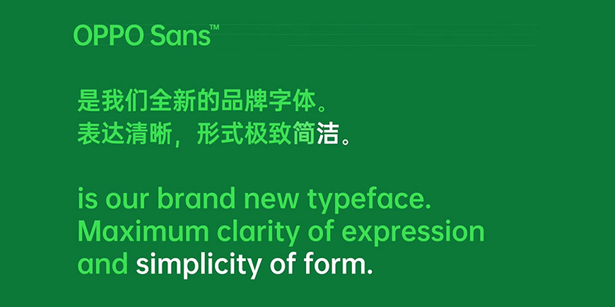

### [阿里巴巴普惠体](https://uiiiuiii.com/software/243760.html)

阿里巴巴惠普体属于无衬线黑体，共收录了 5 种字重（Light、Regular、Medium、Bold 和 Heavy），116,895 个全形汉字，西文字体 Alibaba Sans 共 7,205 个拉丁字母（2 种风格、共 11 种字重），覆盖 172 个语种（覆盖大部分欧语国家）。

### [优设标题黑](https://uiiiuiii.com/software/239653.html)

「优设标题黑」是优设与字由在 2019 年底联合发布的优设首款免费可商用[中文字体](https://uiiiuiii.com/itag/中文字体)，是一款适用于标题的倾斜黑体。这款字体的设计初衷是为了帮助设计师们减少在这类型标题字设计上耗费的时间和精力，也为了给读者更好的阅读体验。这是一款兼具速度与力量感的倾斜黑体标题字体，整体字形粗壮沉稳，非常适用于各类品牌广告和产品包装设计的标题上。这款字体包括 6763 个汉字和字符，支持简体中文。

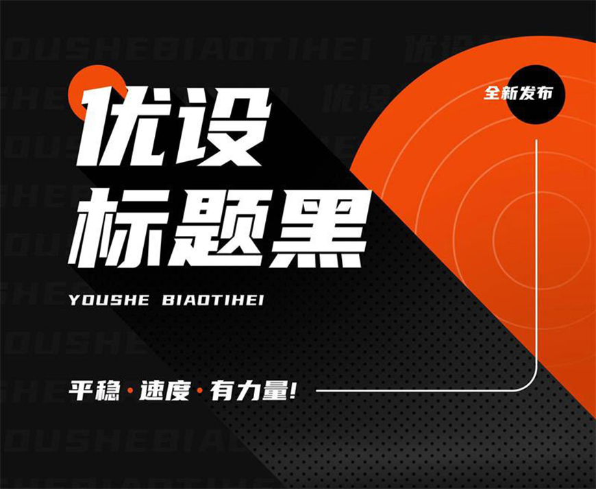

### [霞鹜新晰黑](https://uiiiuiii.com/software/350508.html)

「霞鹜新晰黑」是一款衍生于 IPAex ゴシック的简体中文黑体字型。这是一款基于 IPAex 黑体的中文开源字体，是将日本写法的字体改造成简体中文写法的尝试。本字体尝试在 IPAex 黑体和霞鹜晰黑原有字形的基础上，将其改造成中国大陆的标准字形，更加适合中国大陆用户的需求。

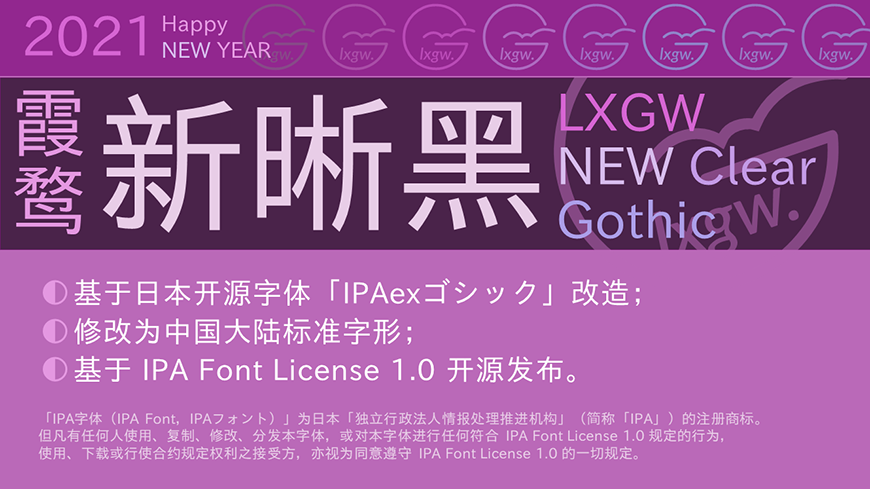

### [仓耳与墨](https://uiiiuiii.com/software/327109.html)

本字体基于中华人民共和国 GB2312-80 字符集汉字部分标准，TrueType 格式，共收容汉字 6763 个，英文及标点等常用字符 245 个。「仓耳与墨」含有五个字重，随着笔画粗细的变化，字体笔画的组合和形态都有所改变，整体形态也各不相同，可以互相搭配，应用范围较广。

### [江城正义体](https://uiiiuiii.com/software/313813.html)

该字体含中文简体及英文字符共 6763 个，含繁体字符 6865 个。含有五个字重，字重的不同改变给字体带来了不同的视觉效果，同时也扩大了字体的适用范围。该字体在改造过程中将思源黑体的横向笔画进行减细处理，纵向笔画进行增粗处理，得到类似粗宋风格字体，削减横笔的粗细，使字体看上去更具现代感。

### [卓健橄榄简体](https://uiiiuiii.com/software/315956.html)

该套字体含有共计 7050 个中文汉字，52 个英文字母，139 个阿拉伯数字及常用标点符号。「卓健橄榄简体」整体接近方形，长宽比例约为 1:1，使得字体在视觉效果上方正稳重，大小相同且方正规范的字形让字体更利于排版。该字体在设计的构思上细致精巧、别出心裁，将重心上移，使得字体更具时尚感。

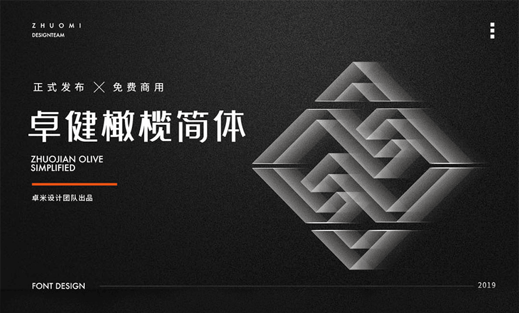

### [975朦胧黑体](https://uiiiuiii.com/software/313821.html)

975 朦胧黑体是作者@落霞孤鹜基于思源黑体边角朦胧化处理的一款免费商用字体。这款字体是在 975 黑体的基础上，内外边角加上圆角效果，使其有一种朦胧感。该字体含中文简体及英文字符共 6763 个，含繁体字符 4808 个。

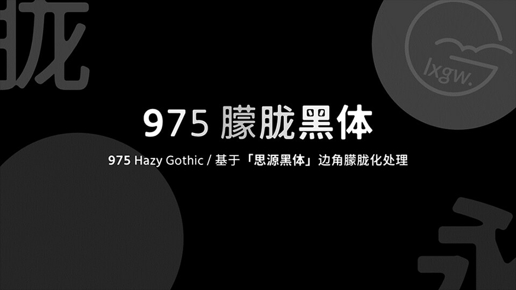

### [江城尖刃黑](https://uiiiuiii.com/software/313803.html)

该字体含中文简体及英文字符共 6762 个，含繁体字符 4807 个。江城尖刃黑最大的特点是在狮尾福腿黑体 SC 的基础上将突刺三角放大，使其更加尖锐显眼，这一特点使得字体有着更强的视觉表现力，展现出尖锐感、锋利感，也使得字体具有更好的辨识度。

### [站酷文艺体](https://uiiiuiii.com/software/301333.html)

「站酷文艺体」设计新颖，尤其在笔画的处理上别出心裁，通过字形、细节的变化让整体视觉呈现简洁有力、清新淡雅的效果。笔画减少或去掉了弧度，相应进行直角或者圆角的变化处理，使字体几何感增强，突出了简洁的字体有力的字体特点。

### [站酷酷黑体](https://uiiiuiii.com/software/285082.html)

「站酷酷黑体」的笔画极富设计感，整体气质独特，稳重又不失活力。在细节的处理上，该字体在笔画首尾端加入小三角，在保证识别度的前提下提高字体辨识度，使字体个性鲜明，结构独特。

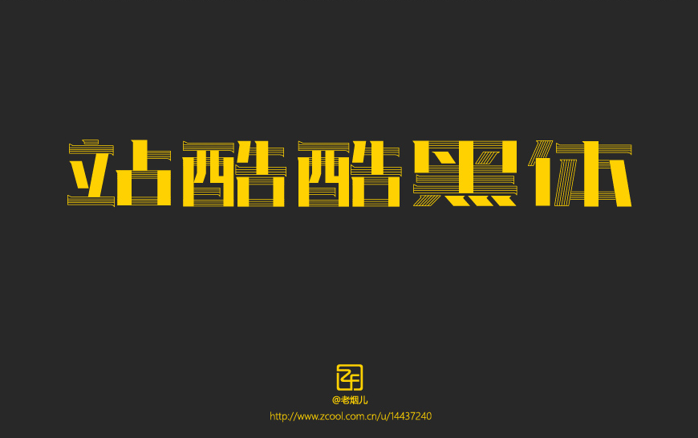

### [站酷高端黑](https://uiiiuiii.com/software/281461.html)

「站酷高端黑」由站酷网“汉字百人舞计划”出品，全部字形以众包的形式由分散在全国的 79 名设计师分别完成。笔画简洁、明朗、果断、有力，笔势节奏鲜明而富有气势。该字体的笔画横线右端均保持了同一形式、同一角度数的倾斜设计使字体个性鲜明，结构独特。

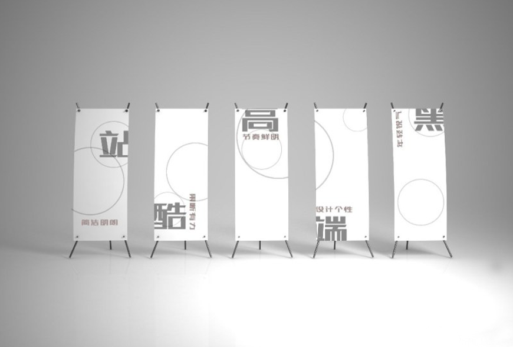

### [思源真黑体](https://uiiiuiii.com/software/251204.html)

「思源真黑体」是基于思源黑体由 Adobe 和 Google 共同开发的一种字体，于 2014 年 7 月发布。思源真黑体在保留了思源黑体的优雅以及高可读性特色的同时，也在思源黑体的基础上对细节上做出了很多的调整与变化，使得整套字体看起来更加锐利清晰，更适用于大量文字阅读显示、代码编程、[排版](https://uiiiuiii.com/itag/排版)、打印等。

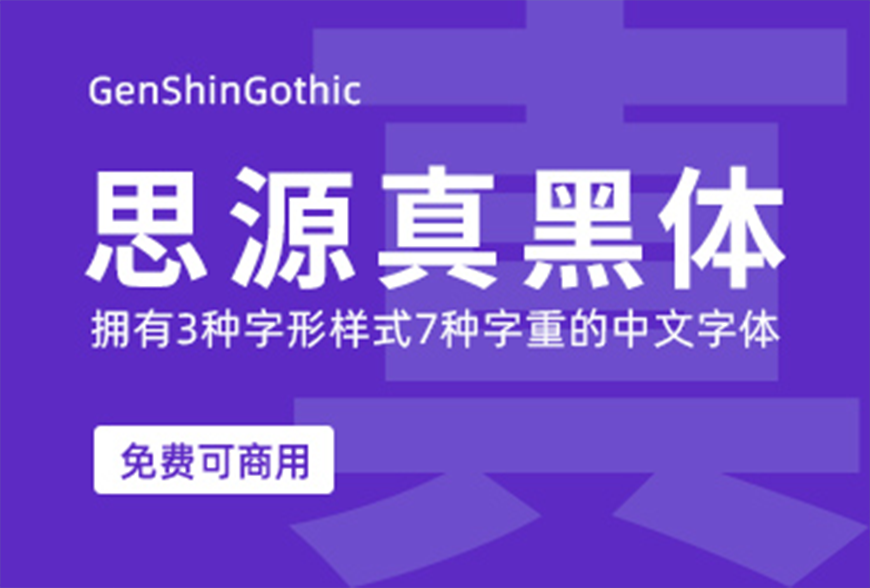

### [未来荧黑](https://uiiiuiii.com/software/244939.html)

未来荧黑是一个基于思源黑体、Fira Sans 和 Raleway 的开源字体项目，支持简体中文、繁体中文与日文。相比于思源黑体，未来荧黑的造型更加简明现代，版面效果清新轻快。未来荧黑的中宫与字面更加收敛，重心在字重之间经过了重新配置；笔画细节上处理得更加干练，简洁而平直化。

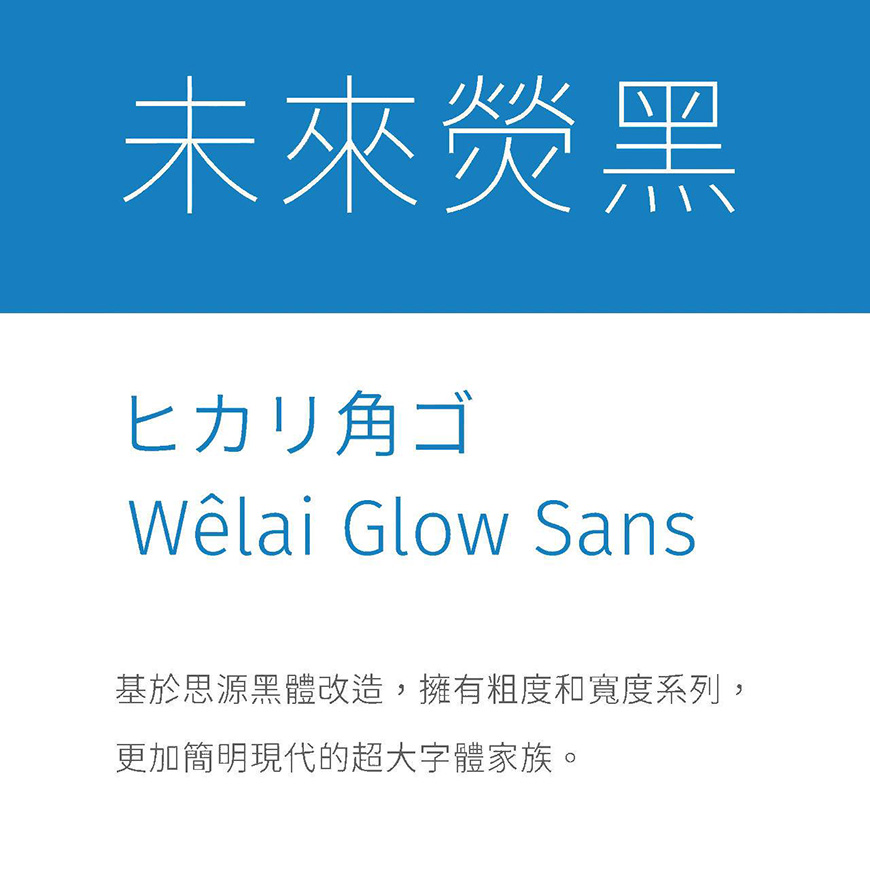

 

 

## 宋体

### [思源宋体](https://uiiiuiii.com/software/245696.html)

思源宋体属于衬线字体，支持简体中文、繁体中文、日语和朝鲜语，拥有 7 种字重，且每一种都有 65,535 个字形，设计一致性将有助于获得更好的视觉美感。该字体还包含多个西方字形，支持拉丁语、希腊语和西里尔文脚本，这些字形均来源于 Source Serif。

### [字体圈欣意吉祥宋](https://uiiiuiii.com/software/350518.html)

字体圈欣意吉祥宋是字体圈推出的第三款免费可商用字体，这是一套宋体风格的标题字，风格整体偏圆润古风，这套字涵盖国家 GB2312 编码标准的 6763 个中文字符，52 个英文字符，10 个阿拉伯数字，若干个标点符号，按需添加若干生僻字，共 7000 余字符。

### [一点明体](https://uiiiuiii.com/software/314600.html)

「一点明体」的前身是刻石录明体，一点明体依照传承字形标准化文件《传承字形部件检校表》的推荐字形标准制作，力求遵从字理，展现传承汉字构字的科学系统。「一点明体」中的简体字部分传承旧字形，与我们平时常用的简体字字形上有较多差别。这一特点既不会影响阅读。又使得字体文艺复古气息大幅提升。

### [装甲明朝体](https://uiiiuiii.com/software/250309.html)

装甲明朝体是由开源字体「思源宋体」改版而来，加入破坏效果使其最接近可读状态，横线和点变得超极细，上点变得更加硬朗，具有极大的张力。字型适合使用于军事或偏向阳刚的设计。

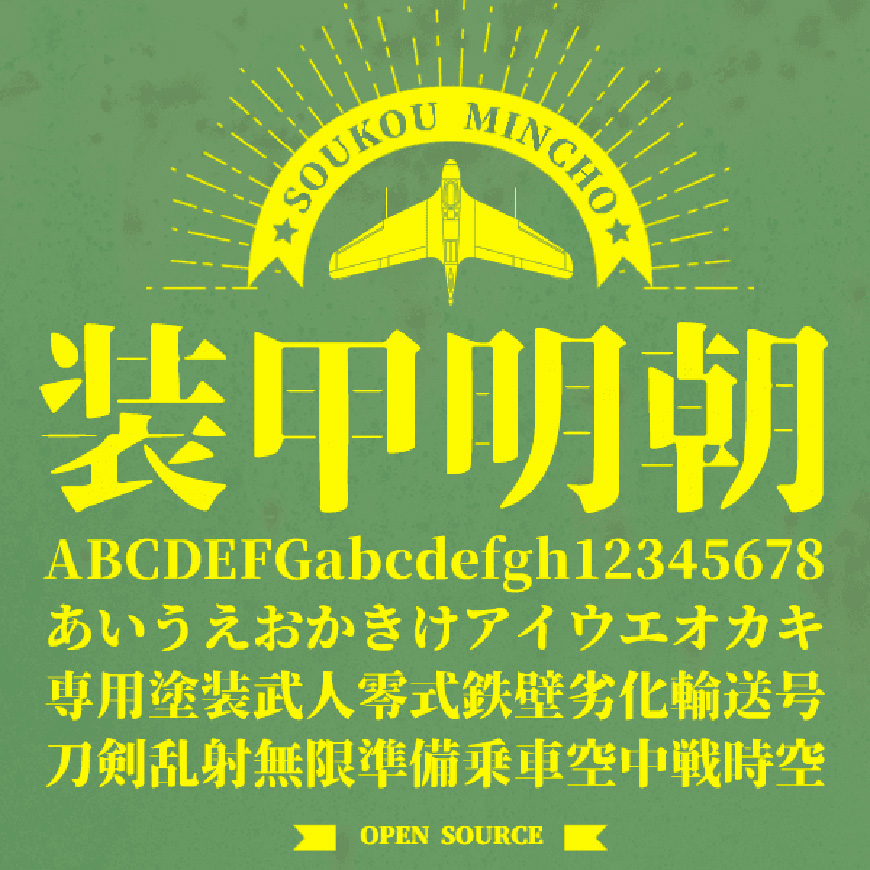

### [黄令东齐伋体](https://uiiiuiii.com/software/261894.html)

「黄令东齐伋体」是基于思源宋体改造而成的免费可商用字体，在字体风格上很像知名的康熙字典体，无论是简体还是繁体都基本上不会缺字。摘自明代木版印刷书籍《凌閔刻本》，采用半自动计算机视觉和 OCR 制作而成的一款字体，共收容 21236 个字符。

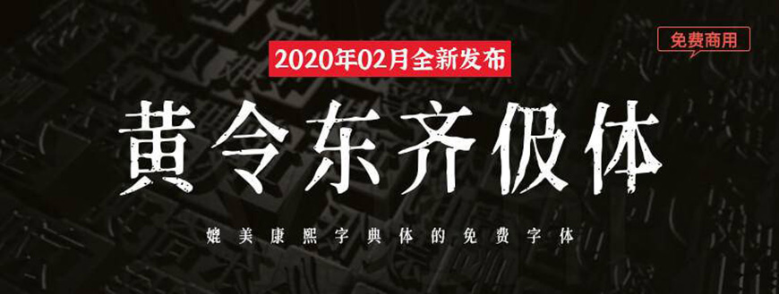

## 圆体

### [优设好身体](https://uiiiuiii.com/software/302249.html)

与《优设标题黑》沉稳有力兼具速度感的思路不同，《优设好身体》的整体气质偏向圆柔纤细，设计上更加富有亲和力和现代感，2 套字体互为补充，可以覆盖绝大多数的设计场景。以圆体字形为基础，通过瘦高的字面，偏向几何的曲线，让字体具有亲和力和时尚感。

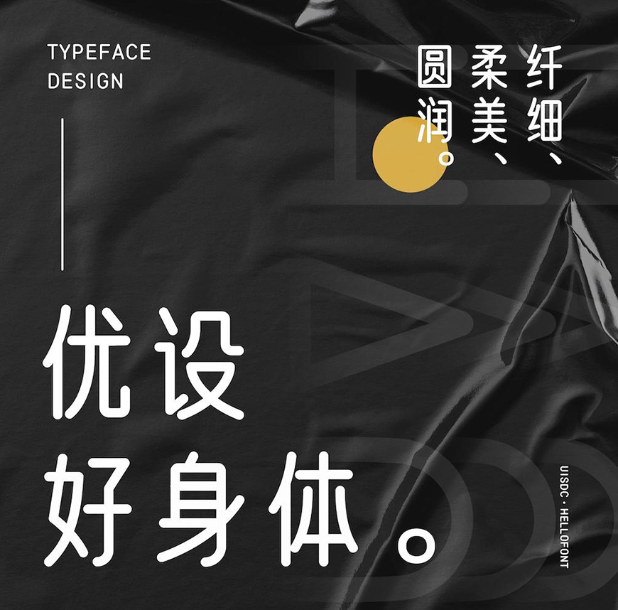

### [江城圆体](https://uiiiuiii.com/software/332146.html)

「江城圆体」作者刘鹏基于源泉圆体把一些中国台湾地区习惯的字形进行简体化修正并进行发布。含有汉字以及附加其他英文字体和阿拉伯数字共 6763 个。6 个字重，字重最小时，看不清笔画始末端头的圆润，字体轻盈干净，方正规矩；随着字重的逐渐增大，字体的圆润感慢慢凸显出来，整体字形也更加饱满可爱。

### [仓耳舒圆体](https://uiiiuiii.com/software/327118.html)

「仓耳舒圆」含有五个字重，随着笔画粗细的变化，字体笔画的组合和形都有所改变，整体形态也各不相同，可以互相搭配，应用范围较广。本字体基于中华人民共和国 GB2312-80 字符集汉字部分标准，TrueType 格式，共收容汉字 6763 个，英文及标点等常用字符 245 个。

### [猫啃网糖圆体](https://uiiiuiii.com/software/306458.html)

「猫啃网糖圆体」是“jf open 粉圆”的简体增补版本，初心是可以基于粉圆字形补全简体字形以方便大陆的小伙伴能愉快地使用该字体。传承字字形标准参考了原 open 粉圆的字形与民间传承字形组织「一点字坊」的《传承字形校检表》，而简化字部分的旧字形设计则参考了简体字制定新字形标准前的铅字字形进行设计。

### [资源圆体](https://uiiiuiii.com/software/261398.html)

「资源圆体」是由国内设计师 Cyano Hao 以思源黑体为基础改造而成的圆体字体。对简体字体的支持较好，基本不会发生缺字的情况。包含 7 个字重，收纳字符数 30887 个，字形数 31032 个，可以满足大部分设计需求。由思源黑体直接改造变圆，同时保留着字体的脚。

### [Open粉圆字体](https://uiiiuiii.com/software/251864.html)

「jf open 粉圆字体」中汉字基于 Kosugi Maru（小杉圆体），英文基于 Verala Round。open 粉圆体在小杉圆体原日文字体的基础上，额外设计了 1,477 个中国台湾地区的常用字、注音符号以及汉语拼音，并修订排版设定，以适应汉字的使用需求。更改进了灰度质量，让你的排版更美丽！

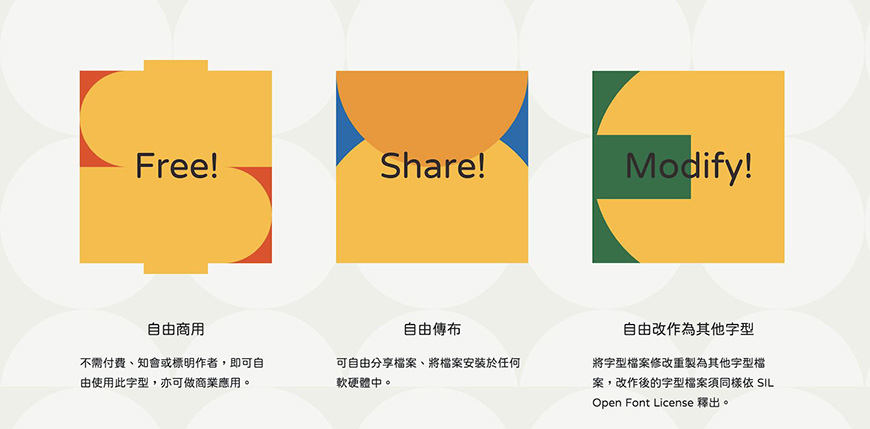

## 楷体

### [方正楷体](https://uiiiuiii.com/software/252097.html)

方正楷体是方正字库里面的一款经典字体，它的结构秀丽匀称，笔画圆润柔和，横竖笔画的粗细变化不大，用笔细劲又多轻重对比，轻巧自然，整体效果非常出色。其风格秀美空灵，适用于文化类的宣传设计，以及商业类品牌的广告和产品包装设计。

### [江西拙楷体](https://uiiiuiii.com/software/258001.html)

「江西拙楷体」是设计师黄煜臣发布的一套免费可商用字体。该字体由黄煜臣一人手写并制作，共收容字符数 6248 个，字形数 6260 个。这是一套手写楷体，相比电脑中标准化制作的楷体，这套字体每个字的笔画是没有统一标准的，每个笔画都带有一些书写的痕迹，具有手写的自然美感。

### [杨任东竹石体](https://uiiiuiii.com/software/258650.html)

杨任东竹石体是一款可商用的手写字体，字体整体简洁明了，大方，支持中文简体、英文字母、数字符号等格式，适合应用于艺术设计、平面宣传设计、网页设计、书籍印刷等领域。工整秀丽，字母排序井然有序，造就韵律独特的篇章。

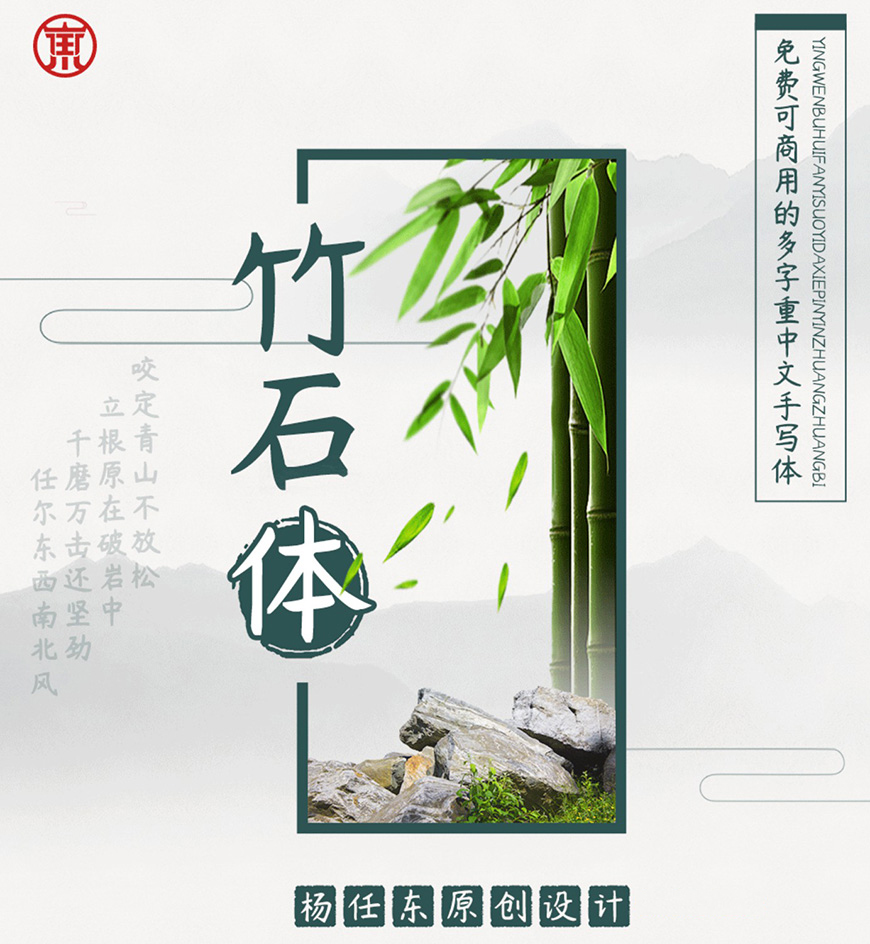

## 像素字体

### [像素Sliver](https://uiiiuiii.com/software/335700.html)

「像素 Sliver」是一款主要用于游戏项目的像素字体，Silver 在字体中内置了 TRC 和 Lotcheck 兼容的 gamepad 按钮，还有完整的键盘和鼠标提示。字体重心下移，改变字体笔画形状，让字体下侧呈直线对齐，使得字体可爱独特，卡通感满满。

### [Unifont点阵黑](https://uiiiuiii.com/software/335661.html)

「unifont 点阵黑」是一个 Unicode 字体，其中，近二万八千字是中日韩(Cjk)的表意文字。「unifont 点阵黑」作为像素黑体，与「中文像素字体」相比，去掉了衬线，使字体整体更加简洁干净。同时，仔细观察字体，可以发现字体的重心下移，同时笔画更加紧凑，相同字号下，字形尺寸也相对较小。

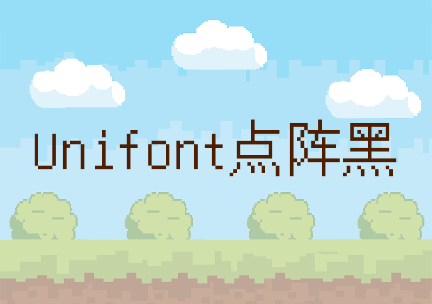

### [点点像素体](https://uiiiuiii.com/software/335677.html)

「点点像素」是基于文泉驿项目所创建的一种点阵字体衍生而来的。它们是文泉驿点阵宋体经矢量化之后，通过变形、美化而得到的。「点点像素」是一组基于 GPL 2.0 协议开源发布的中文像素艺术字体，每种字体均支持超过 22000 个 Unicode 字形，覆盖 GBK 编码中的全部简繁体汉字。

### [中文像素字体](https://uiiiuiii.com/software/335640.html)

该字体共含有 6000 多个字符，使用 HZK16 字模制作，字体尺寸为 16×16 像素，作者推荐使用 12 字号比较合适。字形的处理上，重心偏高，字体中宫也较为松散，更利于阅读，文字较多是阅读起来相对其他像素字体会较为容易。

## 创意美术字体

### [江城月湖体](https://uiiiuiii.com/software/332163.html)

该字体含有汉字以及附加其他英文字体和阿拉伯数字共 6763 个，简体和繁体都基本上不缺字。含有三个字重，随着字重的减小，字体的横竖对比更加鲜明。该字体的鲜明特点在于将笔画横向拉宽，纵向压细，横竖对比使得字体更具活力。同时，该字体将字体统一向右倾斜 10 度，坡度自然美观，使得字体更具动感。

### [江城知音体](https://uiiiuiii.com/software/332154.html)

「江城知音体」最大的特点在于将字体横向笔画进行减细处理，而对横向笔画进行增粗处理，这一改动让字体充满灵气和活力，特点鲜明。该字体含有三个字重，字重越小越能看出来横竖笔画的粗细对比，而字重最大时，横竖笔画的对比则不太明显。

### [站酷仓耳渔阳体](https://uiiiuiii.com/software/327074.html)

本字体基于中华人民共和国 GB2312-80 字符集汉字部分标准，TrueType 格式 和 OpenType 两种格式，共收容汉字 6763 个，英文及标点等常用字符 251 个。含有五个字重，这其中不仅是笔画粗细的变化，字体气质和笔画形态都进行了改变，不仅让字体富有变化便于使用，同时也扩大了字体的适用范围。

### [峰广明锐体](https://uiiiuiii.com/software/302471.html)

「峰广明锐体」明朗锋锐，挺拔端正，笔画摒弃部分原笔画，进行创新重造，字体新潮时尚不失端正。该字体将部分左下角转折改为圆角，使字体减少呆板的感觉，更加具有活力。

### [站酷小薇LOGO体](https://uiiiuiii.com/software/300103.html)

「站酷小薇 LOGO 体」的字体笔画在设计上大胆尝鲜，简略了某些原本字体的造型，创新前卫，偏旁部首做了与字标 LOGO 类似的变形，结构简洁大方，同时字体稍作变形，在结构上更耐人寻味，极大提高了字体的辨识度和适用范围。笔画粗细对比明显，转折硬朗，使字体个性明显，十分干练，在情绪的表达上更加强烈，视觉效果也随之提高。

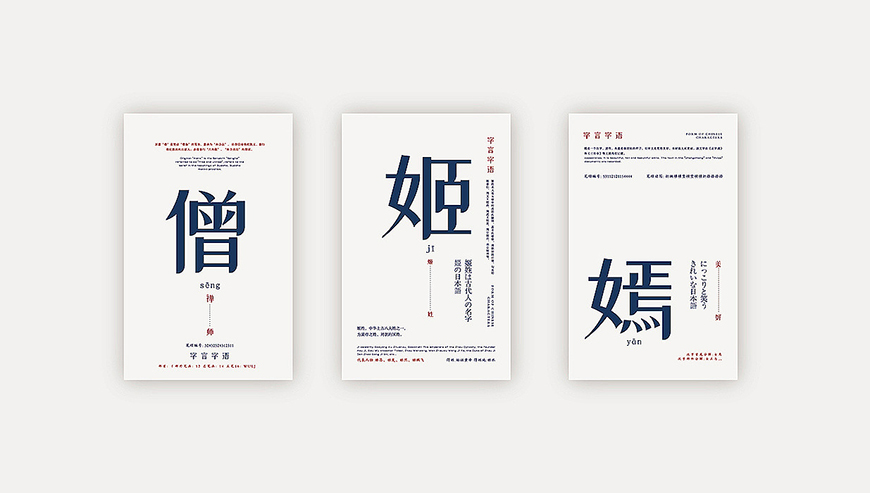

### [字体传奇特战体](https://uiiiuiii.com/software/279480.html)

「字体传奇特战体」是一款微设计变形的字库，整体字形采用横细竖粗的设计风格，结构严谨、规范、干净、整洁。在笔画的制作上，在横线右端使用倾斜进行修饰，竖线右上角的尖角也进行了细微的变形，细节处理极具特色、不失严谨。

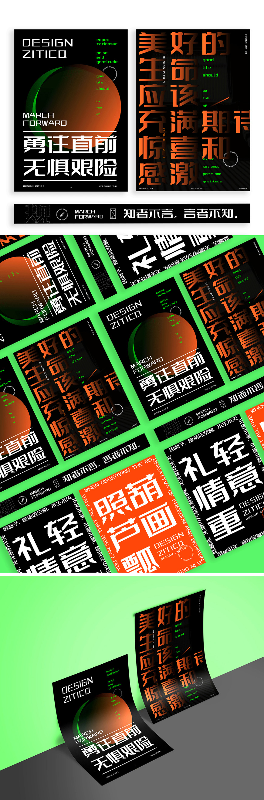

### [仓耳非白](https://uiiiuiii.com/software/327100.html)

本字体基于中华人民共和国 GB2312-80 字符集汉字部分标准，TrueType 格式，共收容汉字 6763 个，英文及标点等常用字符 245 个。在字节的处理上，该字体将原本字形中带有钩的笔画进行变化，将原本圆滑的笔画改为锋利的尖角，或将钩笔画去掉，改为极细的线条，使整体风格更加搭配，使得结构方正，笔形简洁、利落。

### [仓耳小丸子](https://uiiiuiii.com/software/327050.html)

「仓耳小丸子」的横竖笔画对比非常鲜明，这让字体如同名字一样可爱俏皮，充满童趣活泼，也使字体具有更强的视觉冲击力。与其他黑体相比，该字体上下的横笔画没有按照常规方式进行对齐，而是将下方的横进行右移，这个别出心裁的小细节让字体更加富有变化，鲜明独特，有种手写体的可爱拙感融入其中。

### [胡晓波男神体](https://uiiiuiii.com/software/256864.html)

「胡晓波男神体」将拐角连接处进行平滑圆润处理，使得字体更具活力感和灵动感。在边角处进行斜角处理，使得横竖笔画对比强烈，更具视觉冲击力和表现力。提、撇走向规律，角度统一，同时将边缘整齐化处理，更利于排版处理。

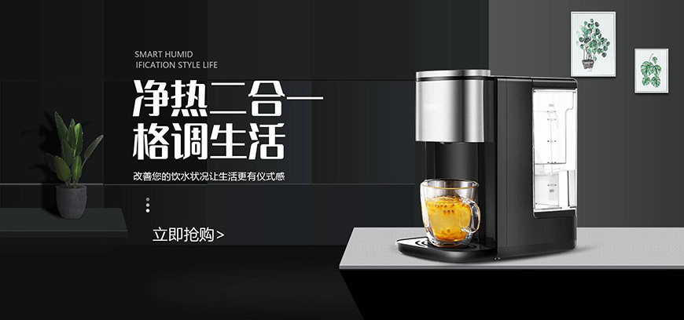

### [胡晓波真帅体](https://uiiiuiii.com/software/257957.html)

「胡晓波真帅体」将宽高比例设置为 6:9，笔划纤瘦等宽，使得字型外观上较为瘦长，同时将重心向上提高，更具文艺气息。本字体共收容字符数 7424 个，字形数 7412 个。

### [庞门正道标题体](https://uiiiuiii.com/software/246159.html)

「庞门正道标题体」有着非常方正的字体表现力，整体字形笔画均衡，风格现代，字体方中带圆，边角设计的有棱角也有弧度，给人非常折中的感觉，适用于品牌标题、电商广告等应用场景中。

### [站酷庆科黄油体](https://uiiiuiii.com/software/247912.html)

这是一款由个人设计师郑庆科推出的一款字体，共收容汉字 9181 个，英文及标点等常用字符 814 个。字型创新，线条圆润。笔划的每一个直角，都被处理成了半径为 4pt 的圆角。在设计中遵循笔划简化但不省略的原则，笔划角度尽量为垂直角度。字体部首的右下角均为 45°缺角，提高了字体视觉中心，并有效的解决了一些字体因笔划交叉而导致字体阅读困难的毛病。

### [锐字真言](https://uiiiuiii.com/software/245532.html)

这是一款全免费、高品质、可商用的黑体无衬线，电脑中文简体字体。该字体包含 7653 个中文、字母、 符号和数字，字体工整，适用性广泛。线条粗壮有力，字形大方得体，整体内外空间布局均匀。笔触浑厚有力，笔画曲折有度，字形个性鲜明，刚柔并济，落笔简洁有序，给人以遒劲有力、端正凝练的感受。

### [庞门正道轻松体](https://uiiiuiii.com/software/273347.html)

「庞门正道轻松体」字体的笔画的粗细对比明显，且某些笔画两端宽度不同，变化多端但又有规律的组合让字体表现出灵动活泼的气质。每个字符的高度以及宽度并不是完全统一的，会因为字符的笔画多少以及复杂程度有些许的变化，使字体在可爱轻松的风格中带着一些文艺气息。

## 书法字体

### [庞门正道真贵楷体](https://uiiiuiii.com/software/345305.html)

「庞门正道真贵楷体」由庞门正道的父亲庞真贵老先生，于 76 岁高龄历时 9 个月书写制作而成，中间经过了复杂且繁琐的重写、修改、完善等，使得字体效果更适合商业使用。保留了毛笔书写过程中留下的手写痕迹，在起笔、收笔、转折处会有明显的毛笔的痕迹，这使得字体更加接近手写的自然，有一种天然的质朴感。

### [正风毛笔字体](https://uiiiuiii.com/software/345297.html)

「正风毛笔字体」含有五个字重，字重越小，笔画的粗细对比也会更加明显，字重大则更加有力。原本的衡山毛笔行书字体放在 Regular 字重里，通过程序自动产生 ExtraLight、Light、Medium、Bold 等新的字重，Light 字重是把原本的衡山毛笔行书微微调细一点点，在 ExtraLight 的字重里，可能会因为笔划太细造成某些笔画消失。

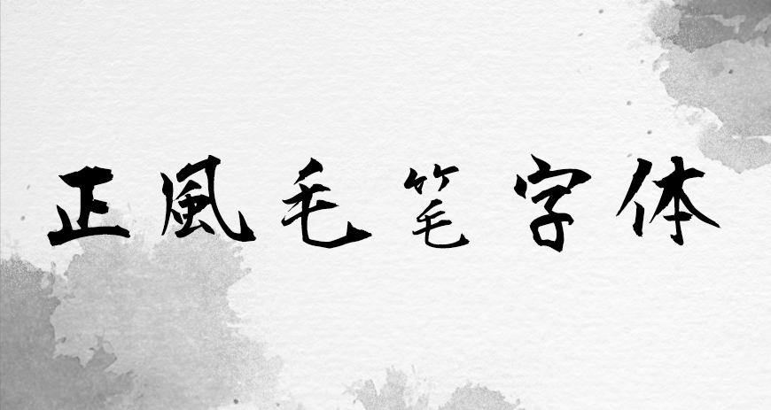

### [庞门正道粗书体](https://uiiiuiii.com/software/327014.html)

「庞门正道粗书体」撇笔画的结尾处没有像大多数书法字体一样，有一个尖锐锋利的收笔，而是戛然停顿，留下齐平的斜角，让字体力量感十足。该字体的笔画中，包括起笔、收笔、转折的地方，都能看到毛笔纹理，这样的手写痕迹让字体更加自然质朴，富有手写体的韵味。

### [演示夏行楷](https://uiiiuiii.com/software/293192.html)

「演示夏行楷」笔画灵动连贯，笔画拐角处平滑流畅，使这款手写字体在不失手写字体流畅感的同时，多了一分衔接上的灵动感。同样作为楷体，该字体字形较小、间距稍调大，更好地展现出舒展延伸的字体特点。

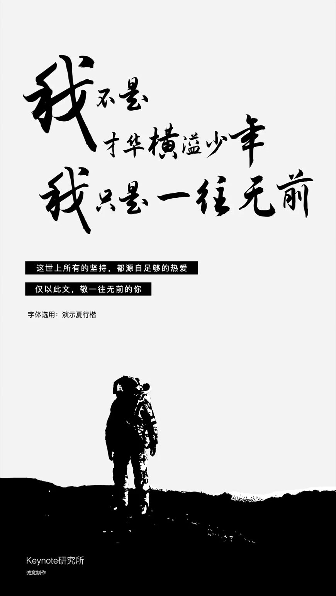

### [演示春风楷](https://uiiiuiii.com/software/292449.html)

「演示春风楷」笔画整洁分明，结构清晰，没有连笔，相对于其他楷体，更利于阅读和识别。该字体在细节处有着手写体的自然痕迹，不够流畅和完美的笔画恰巧使它多了一分自然的拙朴感。同样作为楷体，「演示春风楷」的大小和间距适中，既能很好地展现字体的笔画舒展，又不会给阅读造成很大困难。

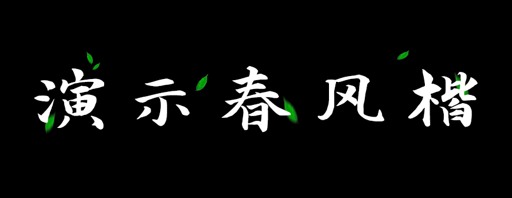

### [演示秋鸿楷](https://uiiiuiii.com/software/293201.html)

「演示秋鸿楷」笔画更加曲折有力，转折处相对其他楷体更加锋利，使这款楷体多了一分朴实稳重。同时，在笔画的处理上，该字体干净利落，笔画分明规整，更加利于识别和阅读，使字体更加端正规矩。

### [演示悠然小楷](https://uiiiuiii.com/software/286662.html)

「演示悠然小楷」整体形态工整规范、干净利落。笔画分明，结构清晰，没有过度的连笔和飞白，对阅读识别更为友好。小楷字形较小，天然拥有更大的字间距，即便作为长段文字使用，阅读上也不会有太大视觉压力。

### [演示佛系体](https://uiiiuiii.com/software/249234.html)

字体一眼看去是繁体字的风格，然而某些笔画与现代的简体繁体并不相同。事实上，「演示佛系体」许多写法与小篆类似。小篆保留了更早一个世代的特殊写法，可以说是我国历史上第一款全国普及的官方字体。纪老先生从 2000 多年前的大众字体中提取基因，植入了这款字体中，让它更加古典而厚重。

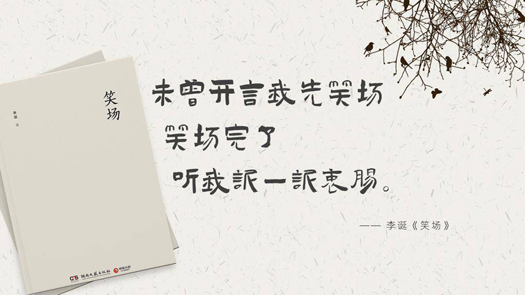

### [鸿雷板书简体](https://uiiiuiii.com/software/248979.html)

鸿雷板书简体属于全手写字体，字体形态优美舒展，整体非常的大气，极具古风古韵的文化气息。可以应用于需要体现韵味感和中国传统风格的包装设计、[海报设计](https://uiiiuiii.com/itag/海报设计)、Banner 设计中。

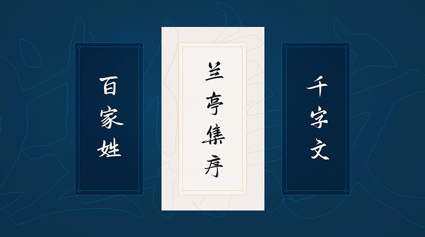

## 卡通手写字体

### [Tanugo手写体](https://uiiiuiii.com/software/345325.html)

「Tanugo 手写体」是基于「马克笔手绘体」的更新版而制作的字体。保留了原字体的特征，保持亲切性的同时，更容易使用、容易阅读。这是一款以可爱的类型设计为目标而制作的字体。该字体收录了平假名、片假名、字母数字、符号、到 JIS 第二水准的汉字以及移动 IBM 扩展汉字(共计 7000 字以上)。

### [清松手写体](https://uiiiuiii.com/software/341307.html)

「清松手写体」是作者游清松在稿纸上用原子笔手写，透过“守写字”网站产生出初稿字型档，再字体软件制作加工而成的手写字型。字体有着明显且自然的手写痕迹，在笔画首尾处会有明显的收笔带来的圆角；在笔画交接处会有粘连在一起的效果。

### [梅干手写体](https://uiiiuiii.com/software/338282.html)

「梅干手写体」是日本设计师“toga”先生创建的免费商用手写字体，精心书写的圆字非常容易阅读，非常适合休闲可爱风格的设计。最大的特点在于手写，所以字体中很多笔画都带着手写的朴拙感，比如某些笔画不是笔直而是微微倾斜，某些笔画结尾收笔处有小小的拐角等，可爱休闲的感觉瞬间提升。

### [沐瑶软笔手写体](https://uiiiuiii.com/software/306437.html)

「沐瑶软笔手写体」风格特色鲜明，在笔画和字形的处理上都有明显的手写痕迹，字体可爱风趣不失活泼。在手写的情况下，字体笔画的粗细并不会完全相同，运笔也不是特别的平直顺畅，单证室由于这一特点，使得字体有更加可爱朴素的拙感。

### [悠哉字体](https://uiiiuiii.com/software/302023.html)

「悠哉字体」是一款基于 Y.OzFont 的手写风格的字体。利用原字体中已有的笔划和部件，通过拼接和调整造出新字（必要时自己用鼠标写出部件）。整体形状稍偏瘦长，整洁干净，透露出文艺娴静的感觉，适用范围较广。字面缩小至原来的 95%，略微增大字与字之间的宽度，阅读更加舒适。

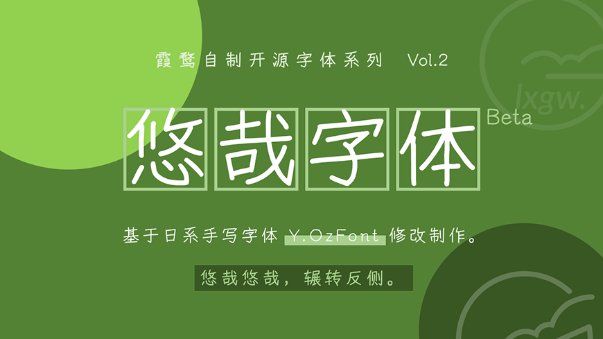

### [阿朱泡泡体](https://uiiiuiii.com/software/295899.html)

「阿朱泡泡体」笔画随意放松，富于变化。字体中的“口”字用不规则的圆形代替，像极了小孩子随手画的泡泡，让字体更加可爱童趣中不失活泼。去掉了所有尖锐的折角，使用圆润的弧形代替，让字体整体风格更加统一，不同的偏旁部首对于弧形有不同的表现形式，富有趣味。

### [贤二体](https://uiiiuiii.com/software/289369.html)

「贤二体」起笔收笔锋利且粗细对比明显，笔画笨拙微带曲线感，带有自然的笔锋效果，更具手写体的韵味。该字体字形偏长， 每个字的宽窄并不统一，使字体多了一分活泼灵动。字体的组合结构松散，重心不稳，达到诙谐幽默，惹人喜爱的效果。

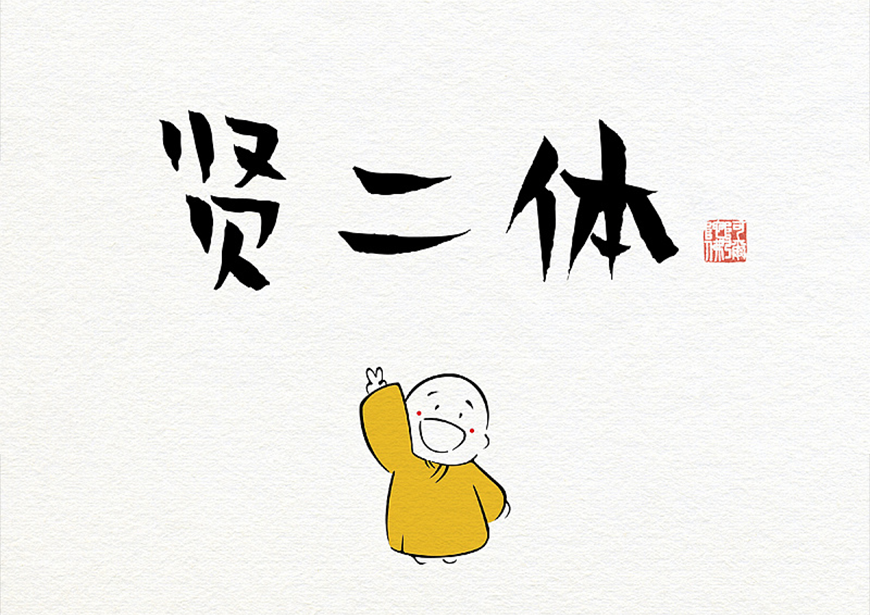

### [素材集市康康体](https://uiiiuiii.com/software/273643.html)

「素材集市康康体」是一款萌系可爱手写风格中文字体，字库共 2623 个汉字和字符，能够满足正常书写使用。字体每个笔画的粗细相同，两端圆润饱满，凸显可爱风格。虽是手写字体，笔画分明没有细小的连接，使字体更加清新俏皮。

### [沐瑶随心手写体](https://uiiiuiii.com/software/264034.html)

沐瑶随心手写体是一款非常清秀的手写字体，圆润的字型给人一种亲切随和的感觉，十分具有艺术感。这并不是一款严肃的字体，而是随心的书写。字体本身是基于 GB2312-80 标准，共含有 6763 个汉字和数字符号。

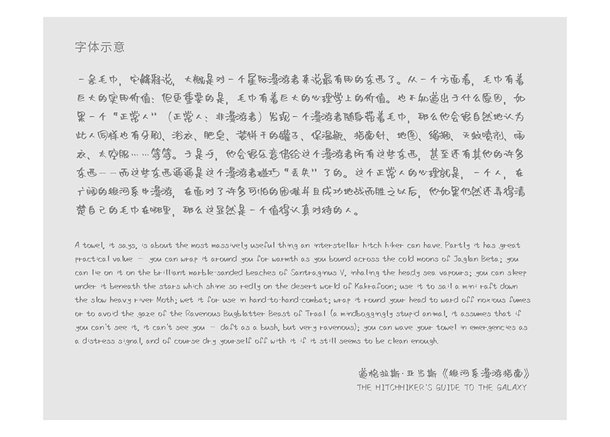

### [寒蝉手拙体](https://uiiiuiii.com/software/252266.html)

「寒蝉手拙体」笔意和结构独特创新，发掘出了手写字体的手拙之美，将手写体的独特风格完美呈现。字体流畅洒脱的笔画以及独特的视觉效果带来了它不可替代和独特的价值。本字体基于中华人民共和国 GB2312-80 字符集标准，采用 TrueType 和 OpenType 两种格式，共收容字形 7586 个。

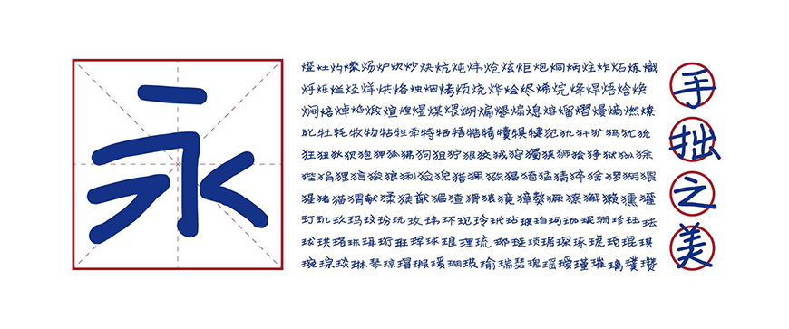

### [胡晓波骚包体](https://uiiiuiii.com/software/257981.html)

「胡晓波骚包体」的整体字形圆润饱满，线条粗壮有力，结合灵动快捷运笔，体现不一般的活力感，萌趣可爱的造型也带来特殊的视觉表现力。本字体共收容字符数 7429 个，字形数 7465 个。

### [猫猫朋友体](https://uiiiuiii.com/software/341299.html)

「猫猫朋友体」(日文名：にゃしぃフレンズ)免费商用日系手写字体。这款字体就像游戏《艦隊これくしょん -艦これ-》中的道具“二周年纪念卷轴”上的字体的感觉。为了不出意外，这款猫猫朋友体是一个字一个字精心制作而成的。

### [拾陆字濑户2.0](https://uiiiuiii.com/software/317440.html)

「拾陆字濑户 2.0」是由公众号【拾陆字】在「全濑 Pro」的基础上重新完善制作的，并向全社会发布免费可商用。此次增补字符总数 3800 余个，并非用相似字形增补，而是直接手工生成。此版本应该是目前全网字库最齐全的濑户 2.0。

### [摩登小方体](https://uiiiuiii.com/software/306466.html)

「摩登小方体」将笔画进行几何化处理，减少字体的弧形笔画，并将玩去的弧度改为尖锐的折角，这使字体更加方正锐利，特点鲜明。该字体笔画粗细适中且较为相同，在运笔的过程中，宽度逐渐有细微的变化，是的字体在锐利之中更加稳重有力，不会枯燥单调，也让字体更具辨识度。

### [胖胖猪肉体](https://uiiiuiii.com/software/298333.html)

「胖胖猪肉体」(日文名: にくまるフォント )是基于 M+ FONTS 改造的字体，而 M+ FONTS 是日本一款免费开源的字体，所以该字体可以免费使用于任何场景，包括商用。「胖胖猪肉体」笔画较粗，同宽，同时将笔画首尾进行圆润处理，使得字体显得笨拙可爱，特色鲜明。

### [包图小白体](https://uiiiuiii.com/software/295611.html)

「包图小白体」创新地为字体本身设置为描边和阴影风格，让字体自带艺术属性。在字形笔画上去除了折笔的弧形，换之以平直的笔画，使字体更加简洁直白，也增添了一分童趣。采用 GB2312 编码，共收容 7707 个字符，包含 6763 个简体汉字、110 个大写字母、139 个小写字母、102 个数字、95 个标点符号、其他特殊类符号 288 个、其他字母 210 个（包含日文平假名片假名）。

### [站酷快乐体](https://uiiiuiii.com/software/248288.html)

站酷快乐体是一款可爱有趣、活泼俏皮的个性字体，轻松和简单的字体风格，无论是笔画结构，还是笔画粗细，都是灵活的。根据字体的形式特点，站酷快乐体适合用于比较欢乐的主题设计，可以很方便地应用在网页标题、促销主题、产品包装等场景中。

## 手写字素材

### [30 组 2021 新年春节手写字大礼包（免费可商用）](https://uiiiuiii.com/software/342351.html)

优优邀请训练营字体课的 @字小行 老师，给大家准备了一组新年主题的手写字素材，全部是 1920*1080px 的 PSD 格式，并且这组字体素材 使用完全免费！可以用于任何的商业用途！

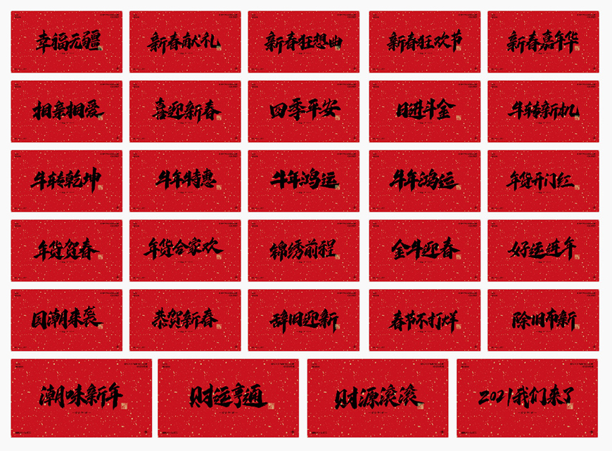

### [圣诞字体大合集（含中英文）](https://uiiiuiii.com/software/339026.html)

吐血整理了中文、英文一共 70 款圣诞字体，分为免费可商用、个人免费不可商用 2 个类型，全部都分类打包好了！祝各位打工人早早完成工作~在温馨欢乐的圣诞节畅快干饭！

### [50款万圣节字体大合集（含中英文）](https://uiiiuiii.com/software/319616.html)

超有看头的万圣节是一波商家们抢占市场、抢夺眼球的好时机！作为“打工人”的你，眼前是否有一堆“鬼畜”工作！今天，小编为大家整理了 50 款超全超棒的万圣节字体，希望你可以早点完成工作，和家人朋友们一起“鬼混”吧！

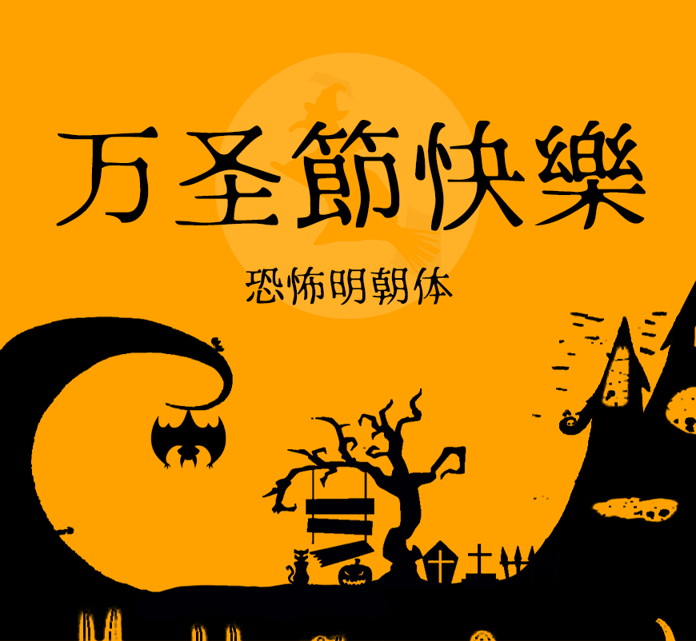

### [国庆节中秋节免费字体礼包 – 刘兵克工作室](https://uiiiuiii.com/software/302008.html)

该套字体是由设计师刘兵克组织工作室以及设计成员：李买，高晗，周登恒，刘志明制作而成。里面有字形设计，也有书法字体，每一个字体，都保留了设计步骤，一方面方便大家根据工作需要做出修改，另一方面，每一个步骤，可以算是一个小小的设计教程，这是此次分享的特别之处。

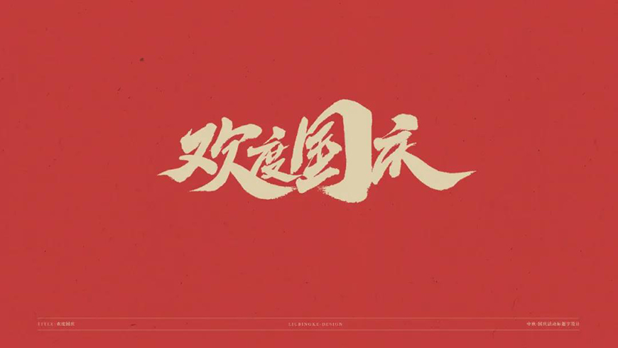

以上就是优优教程网现有的所有字体啦~后面我们也会持续不断地进行更新和改进，还请大家在下方留下宝贵的意见和建议，我们一起成长！

## 附件下载

| 文件名             | 文件大小 | 提取码 | 下载来源                                                     |
| ------------------ | -------- | ------ | ------------------------------------------------------------ |
| 免费可商用字体合集 | 2.92Gb   | txfu   | [ 百度云盘](https://pan.baidu.com/s/1eHcMNcs5Yi6K6YhoxCY26Q) |