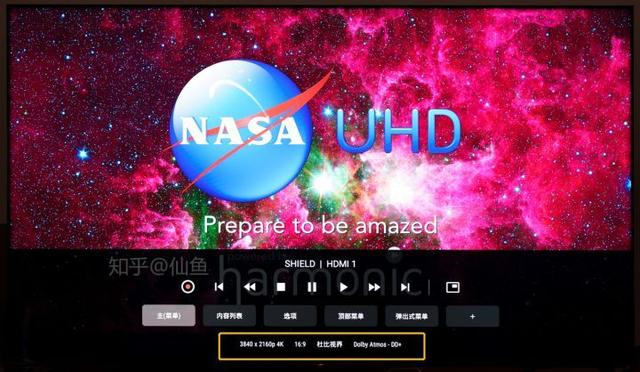

# 电影文件名的小科普

对于刚刚入影音坑的萌新来说，估计都会被各种资源站里面电影的一长串文件名搞晕：WEB-DL、BluRay、DDP、X265这些都是什么意思？

杜比视界和杜比全景声又是哪两个关键词？

其实要弄懂这些，只要掌握下面的这张图就可以了：

如果你还有兴趣了解的更详细些，那么请往下看。

## 1、分辨率

目前我们能看到的一般只有1080P和2160P两种，分别对应HD和4K UHD。如果你现在正在使用4K电视，推荐首选2160P；

不过要注意的是，部分老电影，例如星爷的《功夫》，还有《无间道》三部曲目前没有出UHD 4K蓝光碟，所以网上资源基本都是1080P；

## 2、电影来源

目前常见的有3种，WEB-DL、BluRay-REMUX、BDRIP。

WEB-DL应该是现在最常见的，片源来自奈飞、迪士尼、HBO-MAX等海外流媒体平台，最高码率可达17Mb左右，一部2小时的电影体积在15GB以上，音轨则以杜比全景声为主（ddp内核）；

BluRay-REMUX是以蓝光碟片源，去掉蓝光碟内不需要的花絮和音轨压制而成，一般来说对片源和主要音轨没有压制，所以整体码率可达80Mb左右，内涵的音轨也是无损次世代环绕。

而BD-RIP就是蓝光压制，这个情况就比较多了。根据压制组的特色，码率从几兆到几十兆都有，大家可以根据电影文件大小来判断。

## 3、音频编码

音频编码常见的有DDP 5.1、DDP 5.1(Atmos)、dd5.1、dts5.1、dts-hdma、dtsX、AAC等等。

**3.1 AAC/FLAC/LPCM**

AAC编码一般都为立体声（也有部分含多声道），码率从128Kbps到640kbps不等，一般来说看到AAC就说明这部片子视频和音频码率都比较低。

在有些片子上，我们还能看到FLAC音轨。FLAC格式在音乐中使用比较多，码率在800Kb左右，播放器解码后其实就是PCM格式；

另外，还会见到LPCM格式，无损的多声道PCM格式，基本上是原汁原味的。

**3.2 DD 5.1**

dd 5.1是最基础的Dolby digital 5.1环绕声，一般都是比较老的片子上才会使用；

**3.3 DDP 5.1(ATMOS)**

ddp 5.1的全称为Dolby Digital Plus。经常与WEB-DL同时出现，因为海外流媒体平台的杜比全景声都采用ddp 5.1内核，码率一般为640Kb或者是768Kb，如果你有全景声功放或者回音壁的话，已经可以体验全景声效果了。

这里需要注意下，如果电影文件名里ddp 5.1后还跟着atmos，那么肯定支持杜比全景声；如果仅有ddp 5.1，那么可能支持全景声，也可能不支持。

**3.4** **TrueHD**

杜比TrueHD是无损次世代音轨，码率较高，所以只会出现在蓝光资源中。因为无损格式的杜比全景声使用TrueHD内核，所以当文件名中只有TrueHD时，可能可以点亮全景声，也可能只是传统的无损环绕声；

**3.5** **dts家族**

dts因为码率较高，所以也没有流媒体片源会采用（索尼Bravia Core除外），dts片源都是DVD或者蓝光碟片源。

dts 5.1为最基础的5.1环绕声，码率固定为1536Kb；

dts-HDMA为dts版本的无损次世代音轨，最高码率可到37Mb；

dtsX为dts版本的全景声，中文名叫做临镜音，内核是dts-hdma音轨，所以码率一般都非常高。

## 4、视频编码

视频编码其实也是视频的压缩算法，常见的有H264（avc）、H265（hevc）和AV1;

H264编码往往与1080P一同出现，压缩率较低；

H265编码是4K视频标准编码之一，UHD蓝光碟、奈飞迪士尼等4K视频均采用H265编码。

H265压缩率比较高(相对于H264来说)，实现相同的清晰度，H265可能只需要H264一半的码率即可。

另外，还有AV1编码。

AV1是谷歌牵头搞的4K/8K视频编码，苹果，奈飞，微软等一众大厂搞的开源格式，不用授权，完全免费。

目前AV1格式的视频还是相对较少的，可能过两年后会大批量铺开。

## 5、SDR/HDR/杜比视界

**5.1 SDR(8bit）**

SDR是相对HDR而言的，一般都是8BIT位宽的片源。

**5.2 HDR（10bit）**

HDR是高动态范围的意思，简单来讲就是能让画面对比度更大，容纳更多的信息，从而让画面的暗部和亮部细节更加丰富。

HDR需要10bit位宽，所以也被称为HDR10。顾名思义，所有的HDR片子肯定都是10bit的。

**5.3 动态HDR（杜比视界和HDR10+）**

HDR10是静态HDR标准，一部电影使用都是用同一种画面和亮度方案，而杜比视界和HDR10+都是动态HDR标准，每一帧画面都可以用不同的亮度和色彩映射方案。

杜比视界在电影文件名中一般以“dv”出现，只有播放器和显示设备同时支持杜比视界才能显示正确色彩，见下面的两张图。

不支持杜比视界时，色彩会偏紫偏绿：

电视和播放器支持杜比视界，色彩就正常了：

三星主导的HDR10+跟杜比视界类似，都是ST2094标准下的一个子集，不过片源较少。

一般来说采用联发MT9950或者9970芯片的电视，杜比视界/HDR10+/HLG等格式都是支持的（索尼除外），像飞利浦电视就是HDR格式通吃的。

另外还要注意一点，绝大多数的投影仪都是最多支持到HDR10，杜比视界和HDR10+都没办法正确播放。